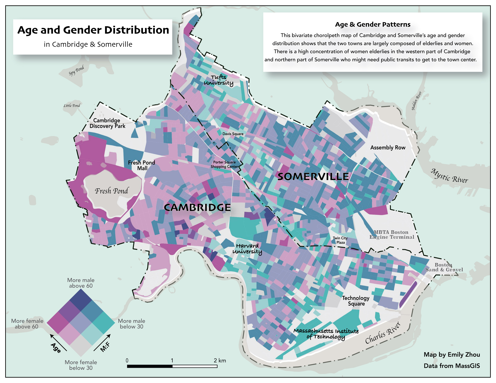
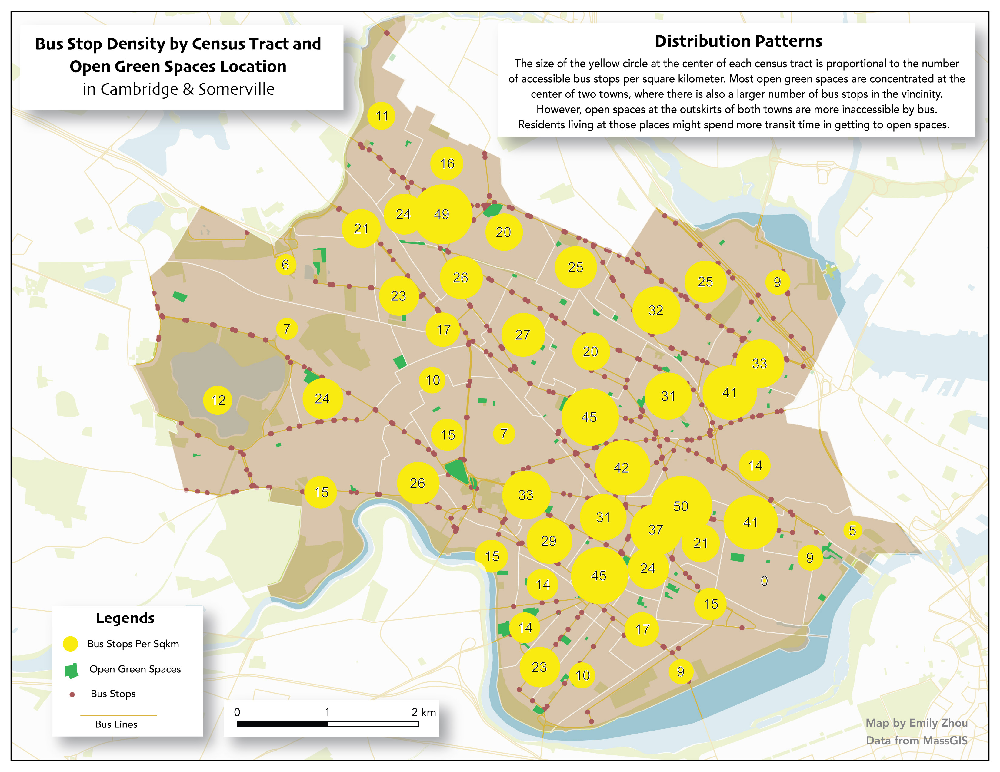

## Overview

When you get groceries, run errands, or visit your friends and family, you are participating in a living, dynamic series of networks. Although the pandemic has changed our understanding of the geography of work, our lives are and have always been bound by location.

For some members of society, the way they inhabit these networks is ​*chosen​*-a college graduate moves to an apartment near a new job, an aging parent retires and moves closer to family. But many members of society do not have this agency—a young person is forced to move in with family when they can’t pay the rent,  a retiree must move to a less desirable place to ensure proper medical attention.

**Agency**, in short, is a social phenomenon, but it is a geographic one too. Whether chosen or inherited, this agency (or lack of it) is created by cultural, political, and personal narratives. The tension between members of the same community can often be ascribed to competing or incongruous narratives. The planner, town manager, architect, urban designer, developer—all are working to create a future in which people may have some level of agency. *But ​which ​people? How is each section of the community advantaged or disadvantaged?* (Meader, 2021)

This mapping exercise investigates the structure of transportation for a community in Massachusetts. After an initial series of investigations, I created two visuals that seek to illustrate how the agency of certain community members could be better served​.

## Big Ideas

**Technical​** —​ Valhalla, QNEAT, Self-Intersect, QGIS to Illustrator, layer management.
**Conceptual​** —​ Network distance, vector overlay, thematic representation, color scheme symbology.

## Softwares

- [QGIS 3.10](https://qgis.org/en/site/forusers/download.html)
- [Adobe Illustrator](https://www.adobe.com/products/illustrator/free-trial-download.html)

## Data

- All vector data were downloaded from [MassGIS](https://www.mass.gov/get-massgis-data).
- The arieals were downloaded from [EarthExplorer](https://earthexplorer.usgs.gov/).
- The tabular crash data were downloaded from [MassDOT](https://apps.impact.dot.state.ma.us/cdp/home).

## Maps

