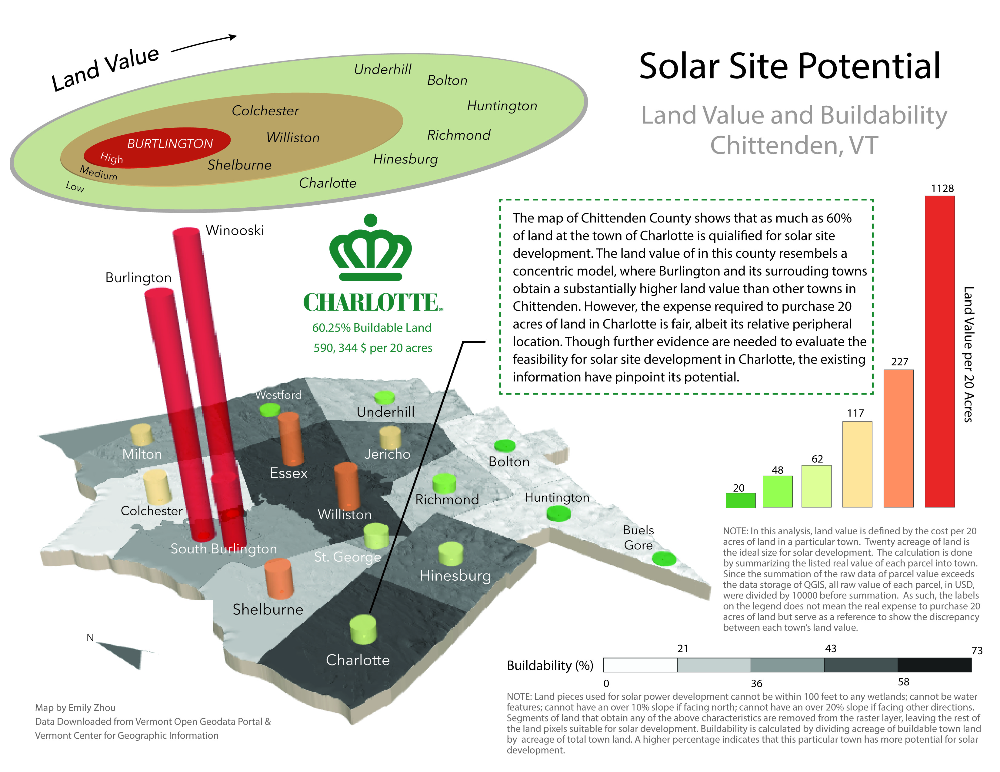

## Overview

What is land worth? How do towns make money? Our income taxes go to the federal and sometimes to state governments, our sales taxes normally go to the state—but in New England, our schools, fire stations, plowing services, and other municipal benefits are funded by towns and municipalities. Land, land value, and land ownership are the lifeblood of local government. In New England, unlike other places in the world, land use is determined almost exclusively by a majority vote at the local scale. This means us, as residents, can attend and vote in town meetings with or without owning land. People who own land must not only pay for their privilege to do so, but they must abide by the town’s land use codes and ordinances which are agreed to by a majority vote in each town. That does not mean that these zoning ordinances are easily created or abolished, but the theory is that they should be *dynamic systems that reflect the long-term desires of the resident population as a whole (Meader, 2021).*

This mapping exericse investigate the interplay between the physical landscape, landcover, landuse, and development potential in Chittenden County, Vermont. After an initial series of investigations, I created two visualizations meant to provide context for a hypothetical development company, illustrating the place best suited to develop solar power.

## Big Ideas

**Technical**​ — Slope, Aspect, Raster Calculator, Zonal Statistics, QGS2threeJS.  
**Conceptual**​ — Overlay and classifications within the raster data model, data type, logical statements.

## Softwares

- [QGIS 3.10](https://qgis.org/en/site/forusers/download.html)
- [Adobe Illustrator](https://www.adobe.com/products/illustrator/free-trial-download.html)

## Data

- All data for this exercise were downloaded from the ​[Vermont Open Geodata Portal](https://geodata.vermont.gov/)​ and the [​Vermont Center for Geographic Information​](https://vcgi.vermont.gov/).

## Maps

