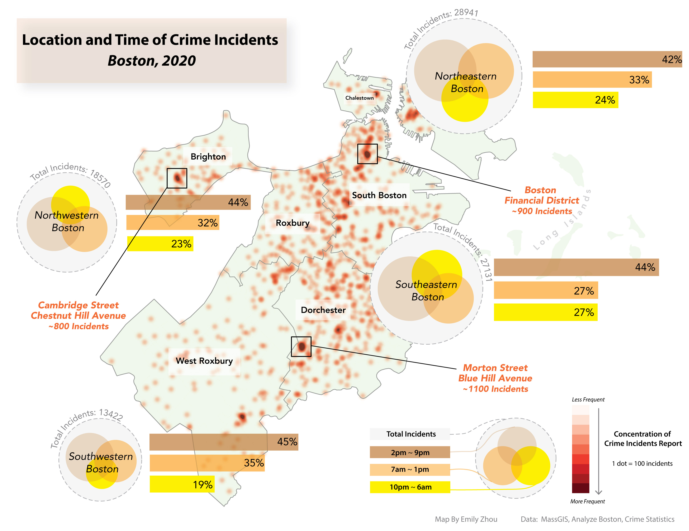
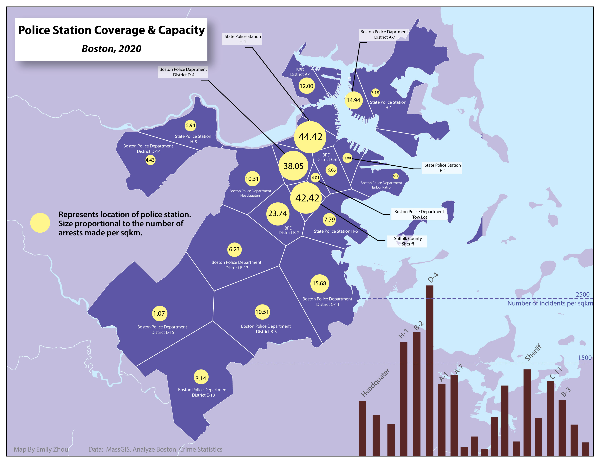
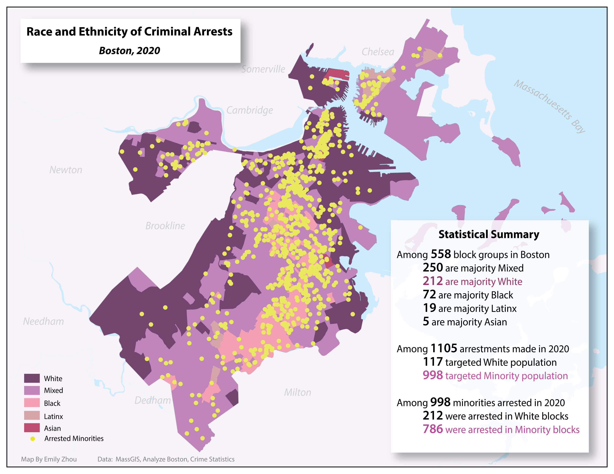

## Overview

Many mapping exercises I have done previously looked at systems that have physical and/or measurable manifestations. This means that the intangible​ concepts visualized relate directly to ​tangible ​phenomena. For instance, “accessibility” was visualized using isochrones in a network analysis; “environmental assets” were quantified using co-occurrences of polygons; and “sustainable development potential” was analyzed using a set of terrain, environmental, and economic criteria. *But what about the people that inhabit these systems? How do they interact with the built environment and the laws that define the structure of society?*

More specifically: **is it possible to visualize “justice” (or “injustice”)?** The datasets to investigate these topics will undoubtedly be affected by the biases of the systems that generate them. Similar to how crash data record ​documented​ “crashes,” or how census data represent ​reported (or estimated) ​“populations”—a crime dataset may well only represent the “instances” in which an officer on duty believes or interprets a crime to have been committed. And what about the enforcement of an unjust law? Or the targeted enforcement of particular laws over others? Or the questionable interpretation of a law or department policy? There are very, very few datasets that attempt to measure these questions specifically, and the subject is too complex to address in one short unit. So, if we don’t have the tools, materials, or depth of experience to statistically demonstrate justice or injustice, then where does that leave us? Fortunately, we can examine, investigate, and illuminate the datasets we ​do ​have; and we can look for patterns. Sometimes the patterns themselves reveal a phenomenon that could not be seen otherwise; when these patterns are brought to light, they can act to influence further investigation (Meader, 2021).

In this mapping exericse, I looked at police incident reports and arrest statistics for Boston for the years: 2016-2020, and arrests for 2020 alone. Subsequently, I made three visualizations hoping to tell a story about ​the nature of reported crime and/or law enforcement in Boston. You may find [here](1026assets/workflow.pdf) the workflow I created that help me work through the visuals and [here](1026assets/week4pre.pdf) the presentation slides I used during the class.

## Big Ideas

**Technical​** — Import Tabular Information, Joins, Heatmap, Animation Plug-In, Mapbox.  
**Conceptual​** — Designing a work-plan, spatiotemporal data, creating dynamic visuals.

## Softwares

- [QGIS 3.10](https://qgis.org/en/site/forusers/download.html)
- [Adobe Illustrator](https://www.adobe.com/products/illustrator/free-trial-download.html)

## Data

- All crime related data for this mapping exericse were downloaded from [​Analyze Boston](https://data.boston.gov/group/public-safety)​ and ​[Crime Statistics](https://www.mass.gov/crime-statistics).
- All vector data downloaded from [MassGIS](https://www.mass.gov/get-massgis-data).

## Maps

