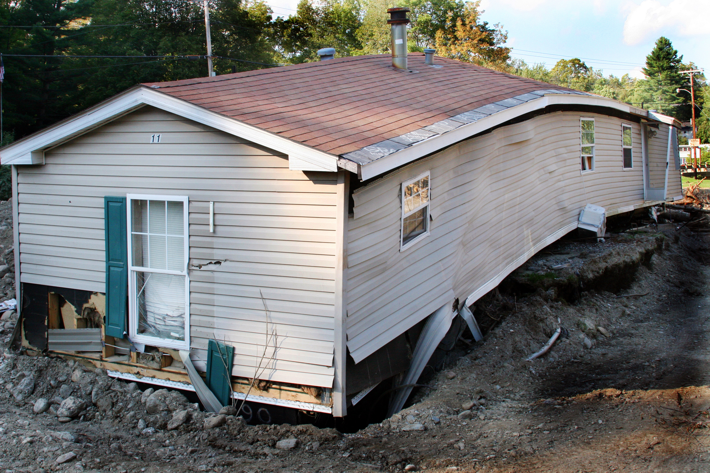
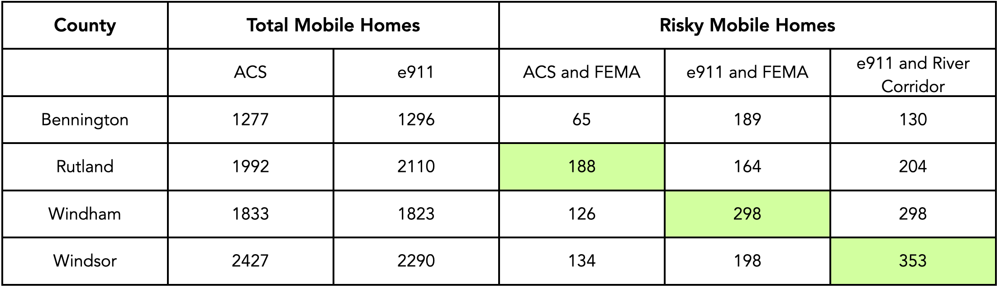
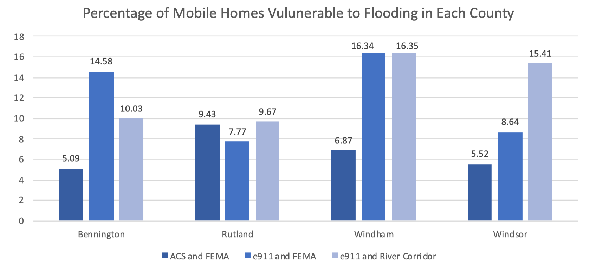
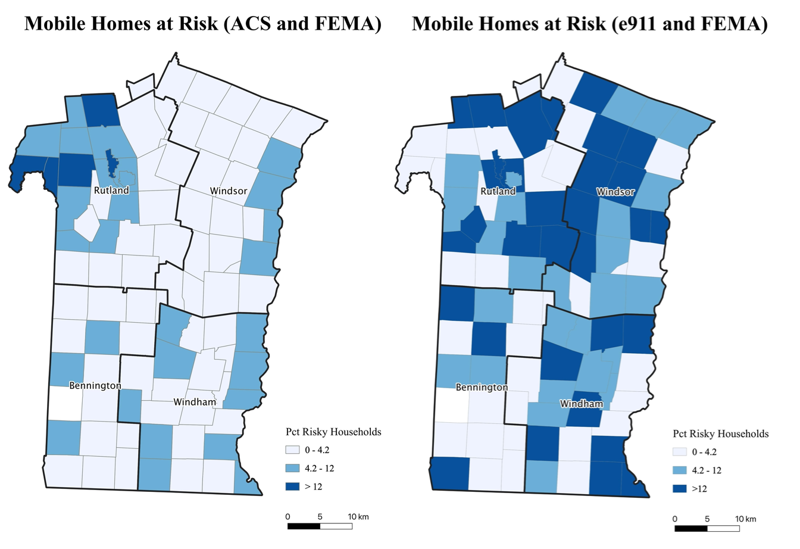
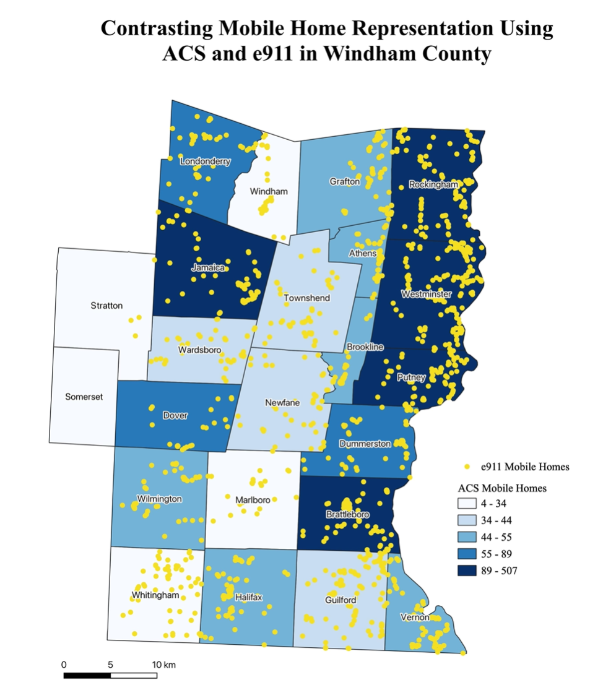
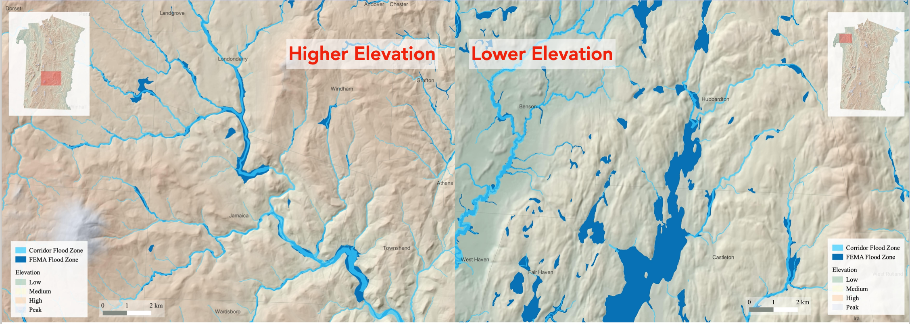
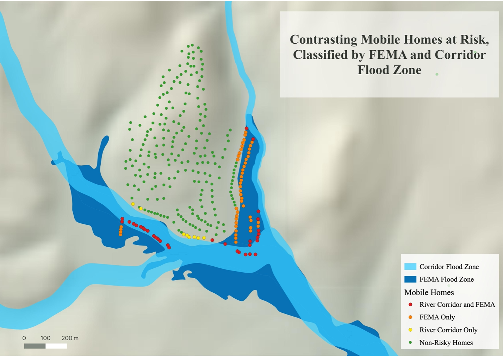
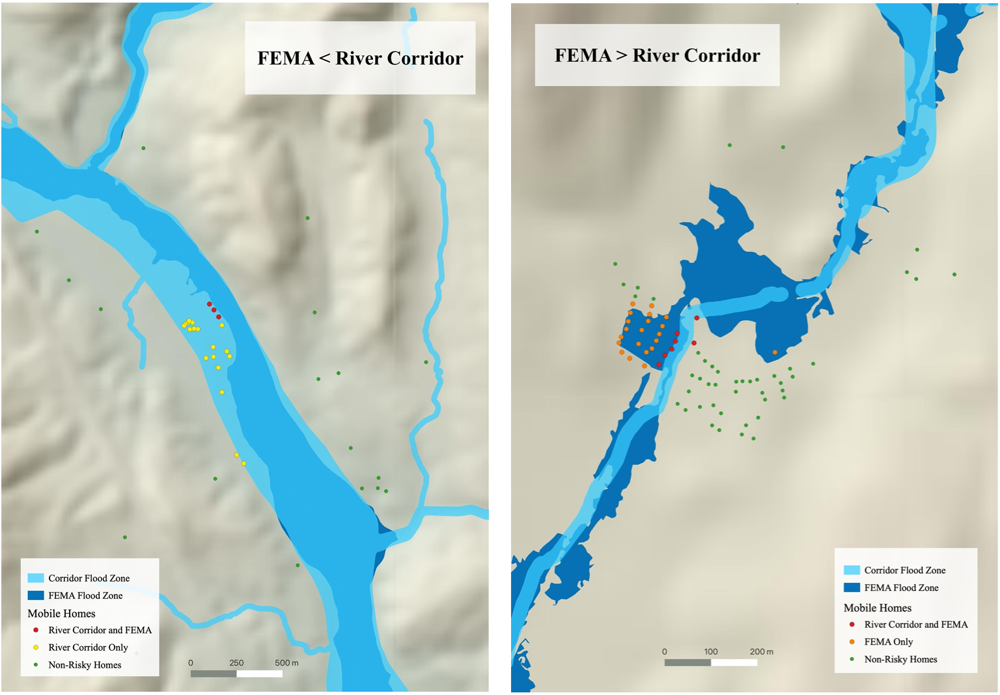
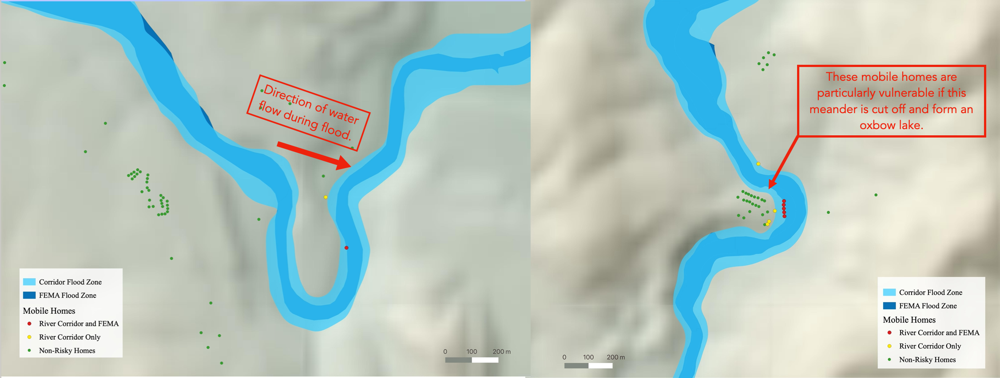
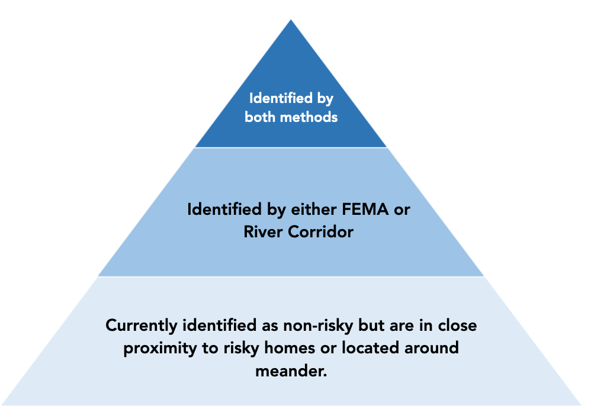

## Overview

Accurate assessment of risk is an essential prerequisite for effective response to any natural disaster. Unfortunately, we are living through a disastrous pandemic in part because of a widespread *failure to gather sufficient data and to accurately assess and communicate risk (Holler 2020)*.

[Tropical Storm Irene](https://en.wikipedia.org/wiki/Hurricane_Irene) exemplifies how inadequate assessment and response to risk exacerbate the effect of natural hazards. The storm inundated Vermont with unprecedented rainfall on August 28 and 29 of 2011. The storm destroyed 480 bridges and 960 culverts, causing $350 million in road damage and cutting off road access to 13 mountain communities. The most affected people were living in mobile homes. Indeed, at least 130 mobile homes were destroyed and an additional 300 severely damaged.

In Vermont, there are two different ways of assessing risk of flood damage in Vermont: one by FEMA (Federal Emergency Management Association) and one by the Vermont River Program. The former estimates flood risk in terms of inundation from rising water levels in stable river channels. FEMA hydrologists estimate the region of land potentially flooded by a 1% flood based on existing channels and require residents with mortgages in that region to purchase flood insurance. The latter takes into account the effect of smaller stream and fluvial erosion during flood since the most damaging flooding in Vermont is caused by the erosion of riverbanks as the river channel widens or migrates to form new channels.

The following mapping exercise and GIS analysis identify mobile houses vulnerable to flood in four counties in Vermont using three different approaches. Firstly, it analyzed exposure to flood risk using the American Community Survey Data provided in block group and FEMA zones, assuming mobile homes are evenly distributed within block groups. Secondly, it analyzed exposure to flood risk using e911 data and FEMA zones: mobile homes are considered to be at risk if any part of the buffer is in a 100-year FEMA flood zone. Finally, it analyzed the exposure to flood risk using e911 data and river corridors. The purpose of this analysis is to learn how to **assess the management of vulnerability to natural hazards in the context of housing and flood risk as well as to contrast different ways of flood risk representation, learning how uncertainty arise in the process of GIS analysis**.

See [here](120assets/essayrevision_emilyzhou.pdf) for the full report of this analysis.

## Data
- All vector data were downloaded [Vermont Open Geodata Portal](https://geodata.vermont.gov/)
- The census data were obtained from US Census [American Community Survey 2014-2018](https://www.census.gov/programs-surveys/acs)

## Vulnerability of Counties to Flood Events

**Table one** provides an overview of the data sources used in this analysis. Mobile home data is collected from American Community Survey and e911 point data. These two types of data differs in the number of mobile homes and their accuracy to identify those that are risky. The flood zone used in this analysis is determined by Federal Emergency Management Association and Vermont River Corridors program. These two approaches also differ greatly in their focus of identifying areas prone to flood risk. As such, the result for total number of risky mobile homes is different across all three combinations of analyses.

**Figure one** shows that mobiles homes in Windham and Windsor counties are more vulnerable. The results also imply how flood risks could be exaggerated or undermined with different methods. For example, analysis using ACS and FEMA data only identified 5% of mobile homes in Bennington to be risky, but e911 and FEMA data combined identified 15% of risky mobile homes. Similarly, whereas analysis using e911 and FEMA data identified 5.5% of risky mobile homes in Windsor county, River Corridor identified as much as 15.5%. Therefore, whether ACS is less accurate in counting mobile homes or River Corridor is more accurate in drawing flood zones requires more examination.

## ACS and e911 Data in Identifying Mobile Homes

**Figure two** compares the percentage of mobile homes identified as risky in each town using ACS and e911 mobile home data and FEMA 100-year flood zone. The darker colored towns demonstrate a greater vulnerability of mobile homes to flood damage, which is greater in Windsor and Windham counties. Each method has identified certain towns to be riskier than the other method. Yet, method using e911 point data identifies substantially more towns to have higher percentage of risky mobile homes than ACS overall, which indicates that ACS has underestimated the flood risks.

**Figure three** zooms into Windham county to contrast how ACS and e911 data have differed from each other in representing mobile homes. It can be seen that mobile homes are randomly distributed in each town while the analysis using ACS data assumed that mobile homes are evenly distributed across space, which generates inaccuracies. For instance, while ACS identifies the number of mobile homes in Whitingham town to be less than 34, e911 identifies far more than that. This suggests a limitation of using re-aggregated data: findings obtained from one set of areal units are not necessarily valid for areal units with different shapes. As such, e911 data is more accurate as it specifically pinpoints the location of the mobile home rather than averaging the data to fit into different statistical areas.

## FEMA and River Corridor in Identifying Flood Zones

**Figure four** compares the flood zones outlined by FEMA and River Corridor Program at different elevations. Both analyses identified areas prone to flooding that are omitted by the other. It shows that FEMA identifies substantially more flood zones in low-lying areas while River Corridor identifies more flood zones in mountainous areas. In particular, River Corridor seems to be better at outlining smaller streams. Though FEMA has undermined smaller streams, it is more accurate in identifying flood zones in mountain valleys.

**Figure five** shows how the use of different methods could lead to different identification of risky mobile homes. In this particular map, FEMA identifies more risky mobile homes than River Corridor, but there are also a certain number of mobile homes omitted by FEMA but identified by River Corridor. This suggests that neither method is effective enough to be used alone in disaster management. In addition, this map reveals a limitation of current approach to risk identification. Since mobile houses are in close proximity to each other, if one mobile home were prone to flood risk, it is unlikely that other mobile houses nearby, though identified by neither FEMA nor River Corridor, would completely be unaffected by flood water.

**Figure six** projects southern Vermont on larger scale. It shows that there are places where FEMA identifies more mobile homes as well as places where River Corridors identifies more. As such, the best way to locate flood zones is to combine the FEMA and River Corridor methods and develop a more holistic analysis to evaluate the vulnerability of mobile houses.

**Figure seven:** It is important to note that flood risks are not static but changes over time based on changing topography. Another limitation of both methods is that mobile houses located in close proximity to a wide meander should also be considered as risky, although they might not fall exactly into the flood zone. This is because river flows while carving away a curve in the riverbank. Over time, this curve become more pronounced due to continuous erosion and hydraulic actions. During flood season, when the amount of rainwater exceeds the threshold of riverbank, the wide meander is likely to be cut off, affecting mobile non-risky mobile houses along the riverbank, as exemplified by these two maps.

## Synthesis and Evaluation

Vulnerability is higher in Windham and Windsor counties in Southern Vermont and lower in Bennington and Rutland counties. For Windham county in particular, as much as 13% of mobile homes are considered risky on average. This county should therefore be prioritized in reducing vulnerability and increasing preparedness to flood events.

To accurately identify mobile homes prone to flood risks, *local officials should use e911 point data to locate mobile homes and a combination of FEMA and River Corridor methods to identify flood zones.* This is because using re-aggregated ACS data would systematically underestimate flood risk and using FEMA or River Corridor method alone would either omit small streams at higher elevation or underestimate the flood zones in low-lying river valleys. On top of that, because mobile homes locate in proximity to each other, it is essential to draw another buffer zone around risky mobile homes and identify those mobile homes in their vicinity that are also likely to be affected. Further, it is also important for local officials to re-measure flood zones on a regular basis because of changing topography and be aware of the potential risks of mobile homes located around wide meanders.

Officials can thus develop a hierarchy to better classify risks and prioritize disaster reliefs: the first and the riskiest category of mobile homes being those identified by both FEMA and River Corridor, the second category being mobile homes identified by either FEMA or River Corridor, and the third category being mobile homes that are currently identified as non-risky but are in close proximity to risky homes or located around meanders.
