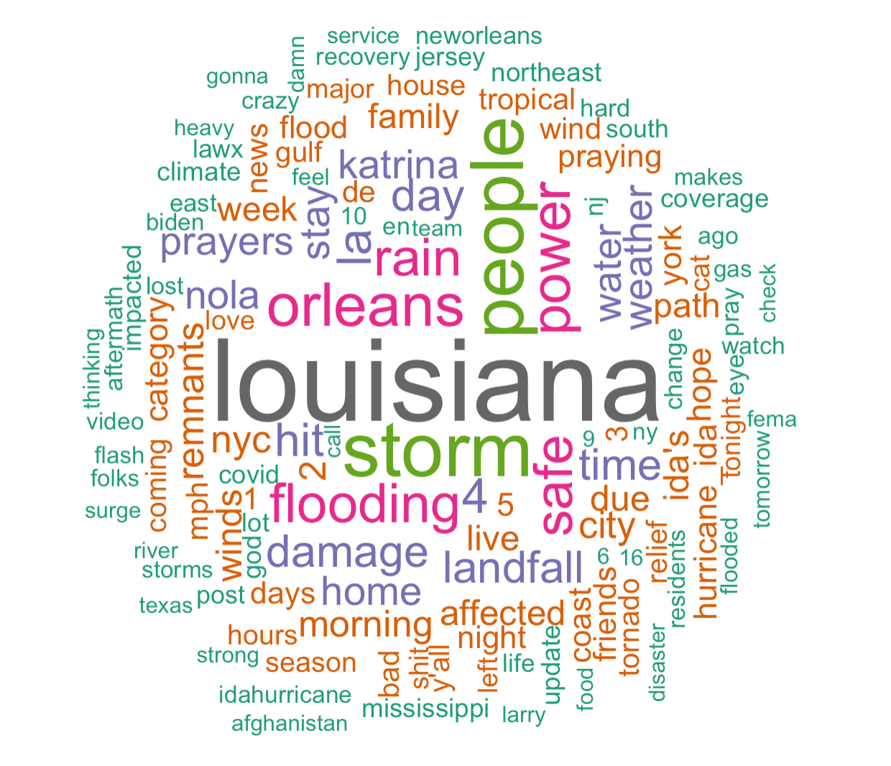
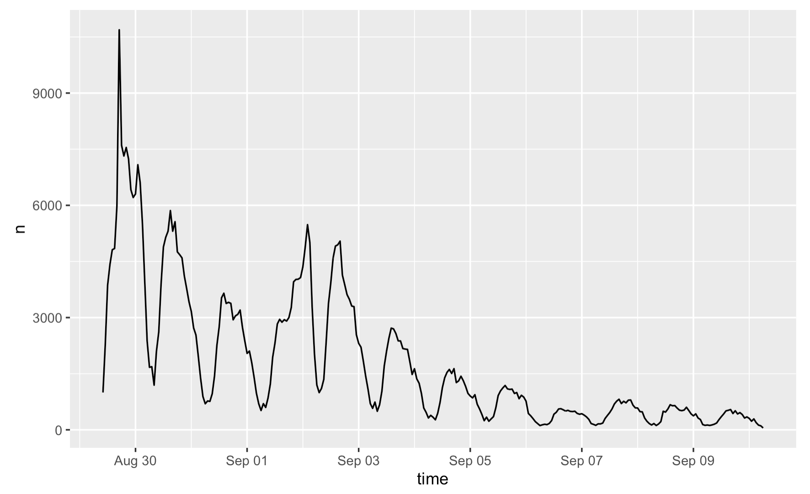
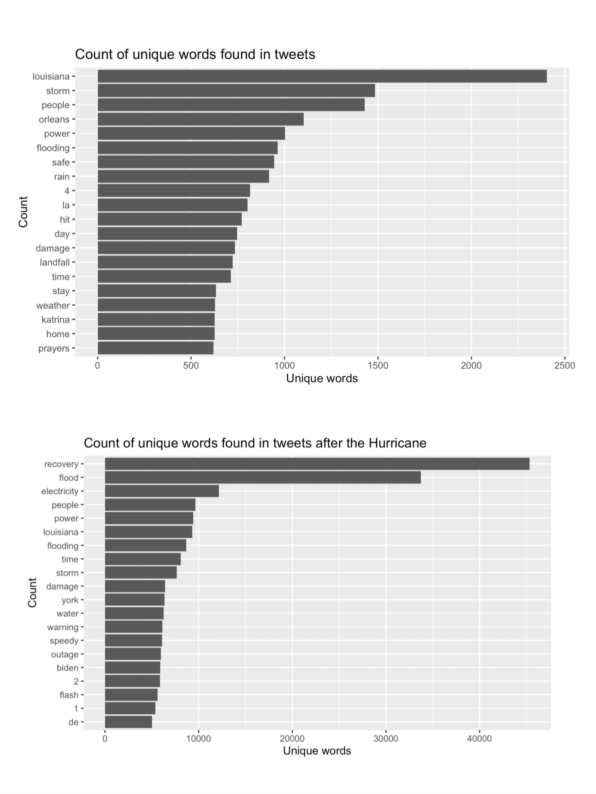
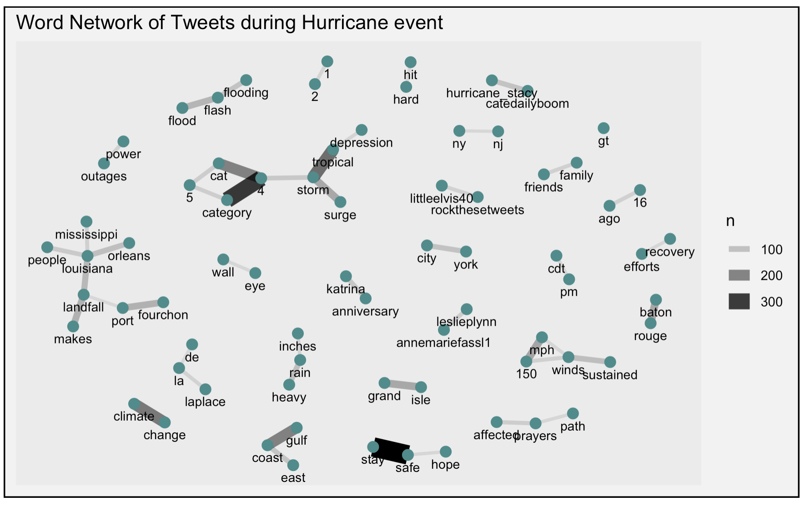
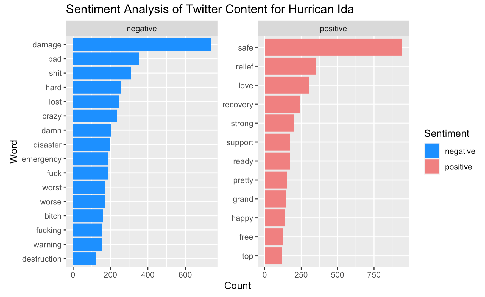
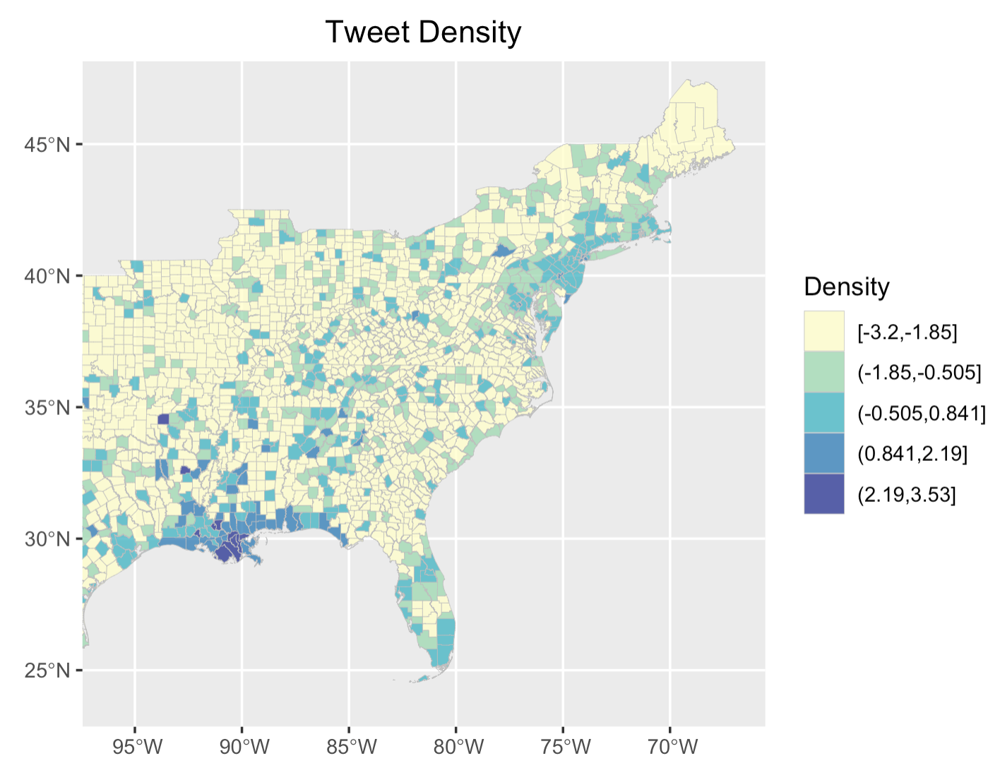
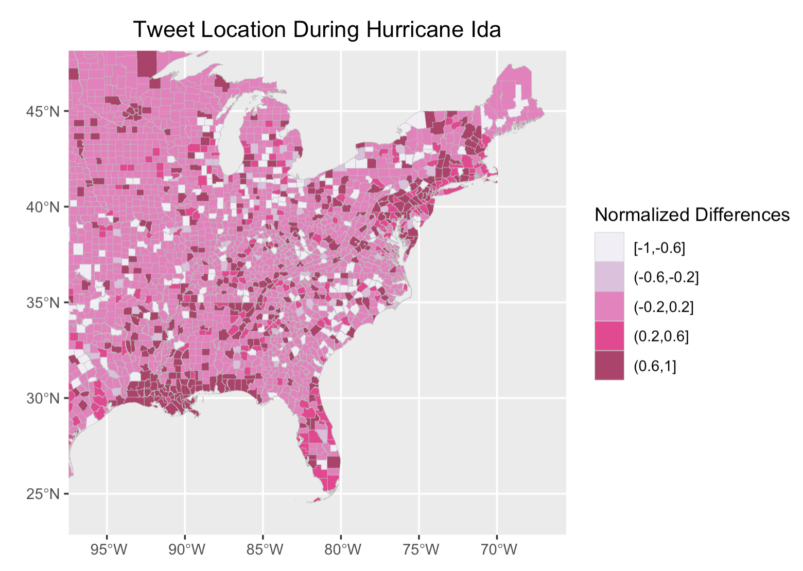
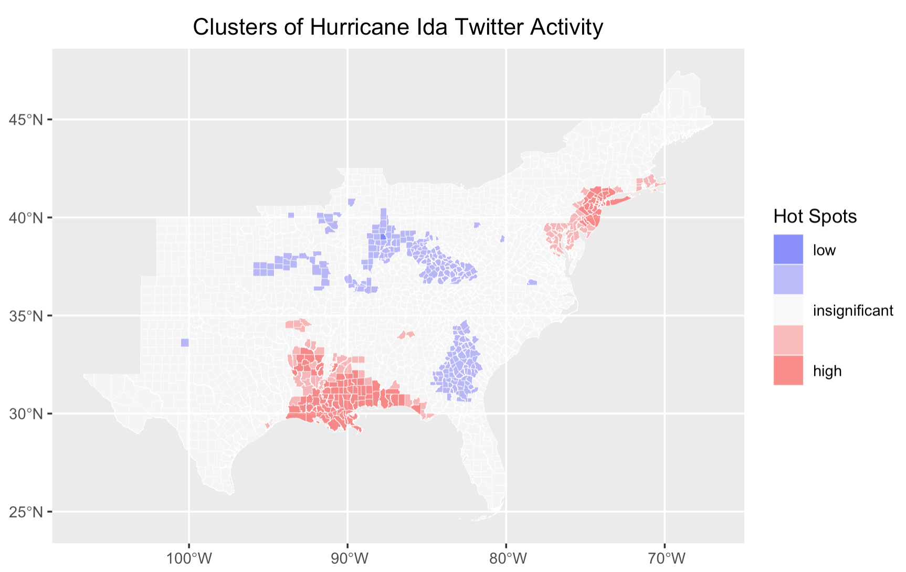
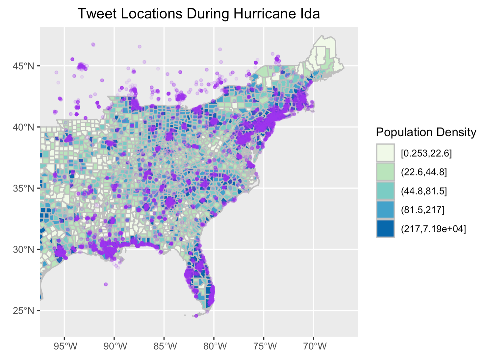
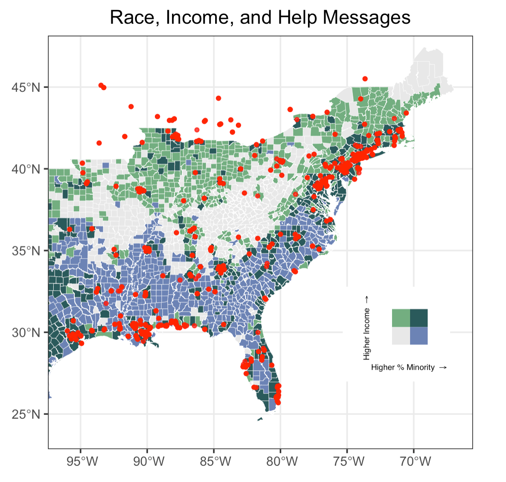

Emily Zhou, Middlebury College

Created 2021-11-26 | Last Updated 2021-12-12

**Replication of**: Spatial, Temporal, and, Content Analysis of Twitter for Wildfire Hazards

**Original Study by**: Wang, Z., X. Ye, and M. H. Tsou. 2016. Spatial, temporal, and content analysis of Twitter for wildfire hazards. Natural Hazards 83 (1):523–540. [DOI:10.1007/s11069-016-2329-6.](https://link.springer.com/article/10.1007%2Fs11069-016-2329-6)

**First Replication Study**:  Sharpie vs. Hurricane Dorian on Twitter

**First Replication Material Available at**: [OR-Dorian](https://github.com/GIS4DEV/OR-Dorian)

**Second Replication Study**: Spatial, Temporal, and Sentiment Analysis of Twitter for Hurrian Ida

**Second Replication Material Available at**: [OR-Dorian-RP Repository](https://github.com/emilyzhou112/OR-Dorian-RP)

**Useful Links**: [Ethics of Big Data](https://link.springer.com/article/10.1007%2Fs10708-014-9597-z), [Uncertainty Analysis](https://www.tandfonline.com/doi/full/10.1080/00045608.2012.700616), [Twitter API](https://developer.twitter.com/en/docs/twitter-api/v1/tweets/search/api-reference/get-search-tweets)



## Introduction

The rapid development of information technology in the 21st century has allowed people to engage with social media on smartphones and laptops much more easily and efficiently. Yet, in addition to the platforms it creates for better communication and networking, another key benefit of social media is the metrics that can be gathered, analyzed, and used to make operational and strategic decisions. In the context of academic research, crowed-sourced/volunteered geographic information (VGI), such as Twitter data, has proven to be an innovative and reliable data source for researchers to acquire data on human behaviors and spatial/temporal characteristics on issues of their interest.

In 2016, Wang et al, who is interested in studying human’s response and awareness to natural hazards, conducted an analysis of Twitter data for [wildfires](https://en.wikipedia.org/wiki/2016_California_wildfires) in California. Throughout the study, they have found twitter data an asset in revealing opinions/emotions, enhancing situational awareness, and developing disaster management relief. Their findings demonstrate that twitter data can characterize the wildfire across space and over time, and thus are applicable to provide useful information on disaster situations. On top of that, the content analysis shows that people have strong geographical awareness during wildfire hazards and are interested in communicating situational updates, which serves as a valuable primary source to consult when it comes to the implementation of disaster relief plan.

More recently, the study is replicated by Professor Holler using twitter data to study the response to [Hurricane Dorian](https://en.wikipedia.org/wiki/Hurricane_Dorian) on the Atlantic coast. This replication study analyzed the temporal and spatial characteristics of tweets distribution as well as the content of each individual tweet. It reveals that in spite of the trending news and social media content on twitter regarding a false narrative of risk, the tweets still clustered significantly along the real hurricane track.  To allow for further reproduction and replication, the code used for this study is compiled into a [R-Markdown document](https://github.com/GIS4DEV/OR-Dorian/blob/main/procedure/code/01-dorian.Rmd) and all other supplementary materials organized into a [GitHub repository](https://github.com/GIS4DEV/OR-Dorian). Re-running the entire study allows us to obtain a better understanding of Wang et al’s methodology and the type of analysis they performed on tweets.

Taking advantages of the code provided by Holler’s replication and the knowledge gained through re-analysis, the original study is further replicated to analyze the spatial distribution of Hurricane Ida tweets in September 2021. In addition to performing a temporal, spatial, and content analysis following the methodology of the original study, this replication study has made three major modifications. Since the disaster unfolds a longer period of time, multiple searches of twitter data during and after the hurricane was conducted so that the analysis is reflective of the disaster situation in recovery phase. It also performed a sentiment analysis on the content of the tweets queried during and after the hurricane to examine people’s attitude at different phases of the disaster. Eventually, it attempted to make fully use of the crowdsourced nature of twitter data and combine it with demographic data to locate vulnerable population. Details on how these additional steps are implemented is elaborated in the section below.

## Original Study Information

Wang et al’s original study uses Twitter search API to collect wildfire-related tweets.  The collection entails two phases: in the first phase, any tweets that contained either of the two keywords, fire or wildfire, were included while the second phase extracted wildfire tweets at specific locations: San Marcos and Bernadro. The temporal analysis is achieved through plotting the number of wildfire related tweets along the timeline from May 13, 2014 to May 22, 2014. The spatial analysis first visualized the distribution of geotagged fire and wildfire tweets and then the population density of each county in the areas of interest. One specific method that Wang et al used in their spatial analysis is the [kernel density estimation (KDE)](https://en.wikipedia.org/wiki/Kernel_density_estimation), which is used to detect hot spots of spatial point data. KDE imports the coordinates of tweets and exports a raster formatted map where each cell was assigned a value to represent the intensity level, where concentrated cells with intensive values are hotspots. Here, to deal with the impact of population, Wang applied a dual KDE to map the spatial patterns of tweets associated with two specific wildfires.

The content analysis used text mining for identifying important terms and term clusters in wildfire-related tweets taking advantage of the `tm` package in R ver 3.1.2. After cleaning the raw tweets to remove URLs and stop words and convert a word’s different morphological variants to the word’s base form, the results were first visualized in a bar plot showing the frequency of words to check their variation in importance. Then, to identify the conversational topics related to wildfire, Wang employed k-means clustering methods to identify clusters where terms appeared in the same group, where terms appeared frequently in the same document were grouped into one cluster. This was organized into a table format.


## First Replication Study

Holler’s replication study followed Wang et al’s methods but instead searches for tweet content with keywords `hurricane, dorian, or sharpiegate`. In this replication study, several modifications were made to Wang’s original study. In the content analysis section, instead of visualizing term clusters, Holler chose to map word association. This was done by separating tweets into individual tokens and count the frequency of word-pair occurrence. Using the `ggraph` function, the product is a word network of tweets where the space between words indicates their association. In the spatial analysis section, Holler first combine the population density map and tweet point location map onto a single layout: population density is mapped with a choropleth and overlayed with point data of tweets. A tweet density map is also created based on the number of tweets per 10000 population as a way to visualize tweet clusters.

Then, Holler modified the methodology for normalizing tweet data by creating a normalized tweet difference index (NDTI) and subsequently used this methodology to test for spatial clustering/hotspot mapping with the [Getis-Ord statistics](https://pro.arcgis.com/en/pro-app/latest/tool-reference/spatial-statistics/h-how-hot-spot-analysis-getis-ord-gi-spatial-stati.htm). The concept of NDTI is in analogous to [normalized difference vegetation index (NDVI)](https://gisgeography.com/ndvi-normalized-difference-vegetation-index/) used in remote sensing, which quantifies vegetation by measuring the difference between near-infrared (which vegetation strongly reflect) and red light (which vegetation absorbs) on a scale that ranges from -1 to 1. Here, we could simply interpret counties assigned with a NDTI closer to one has a higher number of hurricane-related tweets.

## Materials and Methods

Our replication study on Hurricane Ida follows the same methodology as Wang and Holler’s work and used the follow data:  

- Tweets that contain the word `hurricane` or `Ida`, searched on `02-Sept-2021`
- Tweets that contain the word `hurricane` or `Ida`, searched on `05-Sept-2021`
- Tweets that contain the word `hurricane` or `Ida`, searched on `10-Sept-2021`
- Tweets that contain the word `Ida` or `flood` or `electricity` or `recovery` or `outage`, searched on `10-Sept-2021`
- Baseline tweets without any text filter for the same geographic region, searched after hurricane season.
- Geometry of counties obtained from [US census bureau](https://www.census.gov/geographies/mapping-files/time-series/geo/carto-boundary-file.html) using the census API.
- Demographic characteristics of these counties from [ACS2019](https://www.census.gov/programs-surveys/acs/data.html) via the census API.

In order to access these data, a [Twitter Developer](https://developer.twitter.com/en) account is required to query data from Twitter’s search API. In this analysis, these data were searched and provided by Professor Holler. A census API is also required to obtain the geometries and demography of selected counties.  After loading the libraries and importing necessary data specified above, there are two steps still need to be done for the analysis to run. This includes:

**Combine the results of the first three searches** so that could we have one single table that contain all the tweets from throughout the entire time span of Hurricane Ida. Note that the `dplyr::union` function in R only takes two arguments, which means that we need to combine the data twice to get a single table we want.

```r
tevent_raw <- dplyr::union(tevent_raw1, tevent_raw2)
tevent_raw <- dplyr::union(tevent_raw, tevent_raw3)
```

**Process geographic data in tweets** by filtering out tweets where the place type is null and adding a lat and long field to the data frame taking advantage of the location information of each tweet. Doing so would allow us to map out the spatial distribution of tweets on a cartographic layout.

```r
tevent <- tevent_raw %>%
  lat_lng(coords = c("coords_coords")) %>%
  subset(place_type == "city" | place_type == "neighborhood" | place_type == "poi" | !is.na(lat)) %>%
  lat_lng(coords = c("bbox_coords"))

tdcontrol <- tdcontrol_raw %>%
  lat_lng(coords = c("coords_coords")) %>%
  subset(place_type == "city" | place_type == "neighborhood" | place_type == "poi" | !is.na(lat)) %>%
  lat_lng(coords = c("bbox_coords"))
```

After preprocessing, analyses across different dimensions (temporal, spatial, contextual) were ran using a [modified R script](https://github.com/emilyzhou112/OR-Dorian-RP/blob/main/procedure/code/01-dorian.Rmd) based on Professor Holler’s R code in his Dorian analysis. The fllowing section serves to briefly illustrate each analysis, please find the full version of code linked on top of this report.

### Temporal Analysis

The temporal analysis was ran using the raw twitter data. It plots the number of tweets on an hourly basis throughout the entire time span of Hurricane Ida.

```r
tevent_tweets_by_hour <- ts_data(tevent_raw, by = "hours")
ts_plot(tevent_raw, by = "hours")
```

### Content Analysis

The content analysis was ran using the combined data of the first three searches as well as the fourth search. Both data sets need to be pre-processed by removing URLs, stop words, and any fancy formatting. We first plot the 20 most frequently used word on both data sets and then a word network diagram indicating the association between words following Wang and Holler’s approach. The word network diagram requires us to separate words into individual tokens and count the frequency of occurrence in the format of word pairs.

```r
# remove urls, fancy formatting
tevent_text <- tevent %>%
  select(text) %>%
  plain_tweets()
tevent_text4 <- tevent_raw4 %>%
  select(text) %>%
  plain_tweets()

# parse out words from tweet text
tevent_words <- tevent_text %>% unnest_tokens(word, text)
tevent_words4 <- tevent_text4 %>% unnest_tokens(word, text)

data("stop_words")
stop_words <- stop_words %>%
  add_row(word = "t.co", lexicon = "SMART") %>%
  add_row(word = "hurricane", lexicon = "Search") %>%
  add_row(word = "ida", lexicon = "Search") %>%
  add_row(word = "hurricaneida", lexicon = "Search")

# delete stop words from tevent_words with an anti_join
tevent_words <- anti_join(tevent_words, stop_words, by="word")
tevent_words4 <- anti_join(tevent_words4, stop_words, by="word")

```

```r
tevent_word_pairs <- tevent_text %>%
  mutate(text = removeWords(tolower(text), stop_words$word)) %>%
  unnest_tokens(paired_words, text, token = "ngrams", n = 2) %>%
  separate(paired_words, c("word1", "word2"), sep = " ") %>%
  count(word1, word2, sort = TRUE)
```

### Sentiment Analysis

One other popular way of analyzing text data is to perform sentiment analysis to get a sense of what emotions are conveyed by the text. This is particularly relevant in our context of dealing with hazard-related tweets as people frequently tweet about their emotions and attitudes towards the disaster relief plan and their own experience of the disaster. Learning about one’s sentiment of a natural hazard is particularly useful as it contributes to our knowledge of the hazard from a new dimension.  Just like there are different stop word lexicons, there are different sentiment lexicons; we used `bing` here, which assigns sentiments of "positive" vs. "negative".  We first joined the sentiments to each word in tweets, and then grouped the words to summarize their count. For sentiment words that appeared more 120 times in tweets, we visualized their frequency of occurrence on a bar plot, where the color represents their assigned sentiment.

```r
sentiments <- get_sentiments("bing")

ida_sentiment <- tevent_words %>%
  inner_join(sentiments)

ida_sentiment %>%
  group_by(word) %>%
  summarise(num = n()) %>%
  filter(num > 120) %>%
  left_join(sentiments)
```

### Spatial Analysis

For the spatial analysis, we mapped the tweets’ point location and population density. Then, we spatially joined tweets into each county and summarize the total number of tweets per county. The counties data set comes with the total population of each county, which we can use to calculate the tweet density per 10000 population in each county. As we perform the spatial join of event tweets into each county, we also need to join our baseline tweets, summarize their counts, and calculate the `NTDI` index. This index is a dimension index that we use to describe the differences between the presence and absence of Ida-related tweets in each county.

```r
# join tweets to counties
tevent_sf <- tevent %>%
  st_as_sf(coords = c("lng", "lat"), crs = 4326) %>% # make point geometries
  st_transform(4269) %>% # transform to NAD 1983
  st_join(select(counties, GEOID)) # spatially join county GEOID to each tweet

tevent_by_county <- tevent_sf %>%
  st_drop_geometry() %>% # drop geometry
  group_by(GEOID) %>% # group by county using GEOID
  summarise(event_tweets = n()) # count tweets

counties <- counties %>%
  left_join(tevent_by_county, by = "GEOID") %>%
  mutate(
    event_tweets = replace_na(event_tweets, 0),
    tweetrate = event_tweets / POP * 10000
  )
```

```r
# join control tweets to counties
tdcontrol_by_county <- tdcontrol %>%
  st_as_sf(coords = c("lng", "lat"), crs = 4326) %>%
  st_transform(4269) %>%
  st_join(select(counties, GEOID)) %>%
  st_drop_geometry() %>%
  group_by(GEOID) %>%
  summarise(ctrl_tweets = n())

counties <- counties %>%
  left_join(tdcontrol_by_county, by = "GEOID") %>%
  mutate(ctrl_tweets = replace_na(ctrl_tweets, 0))

counties <- counties %>%
  mutate(ntdi = (event_tweets - ctrl_tweets) / (event_tweets + ctrl_tweets)) %>%
  mutate(ntdi = replace_na(ntdi, 0))
```

### Mapping Hotspots

To perform the Hotspot Analysis, we need to calculate the [Getis-Ord Gi*](https://pro.arcgis.com/en/pro-app/latest/tool-reference/spatial-statistics/h-how-hot-spot-analysis-getis-ord-gi-spatial-stati.htm) statistics for each feature in the data set. The resultant [z-score](https://pro.arcgis.com/en/pro-app/latest/tool-reference/spatial-statistics/what-is-a-z-score-what-is-a-p-value.htm) (standard deviation) illustrates where features with either high or low values cluster spatially. The analysis looks at each feature within the context of neighboring features. To be a statistically hot spot, a feature will have a high value and be surrounded by other features with high values as well. This means that we need to compare all the local sum for a feature and its neighbors to the sum of all features. When the sum is very different from the expected local sum, then it is possibly a cluster of hot/cold spot.

As such, the two steps we need to perform before hot spot mapping is to create spatial weight matrix (which is similar to an [adjacency matrix](https://en.wikipedia.org/wiki/Adjacency_matrix) data structure), where each county and its neighboring counties are identified, and to get Ord G* statistic for hot and cold spots.

```r
# create spatial weight matrix
county_coords <- counties %>%
  st_centroid() %>% # convert polygons to centroid points
  st_coordinates() # convert to simple x,y coordinates to play with stdep
thresdist <- county_coords %>%
  dnearneigh(0, 110, longlat = TRUE) %>% # use geodesic distance of 110km
  include.self() # include a county in its own neighborhood (for G*)
thresdist # view statistical summary of the nearest neighbors
```

```r
# get Ord G* statistic
dwm <- nb2listw(thresdist, zero.policy = T)
# Get Ord G* statistic for hot and cold spots
counties$locG <- counties$tweetrate %>%
  localG(listw = dwm, zero.policy = TRUE) %>%
  as.vector()
# check summary statistics of the local G score
summary(counties$locG)
```

### VGI: Further Applications?

Analyzing tweets during natural hazards can indeed bring researchers with new insights into the way people becoming aware of, responding to, and recovering from disaster, but how could we make fully use of the information in those tweets to do more? When contextualizing the role of social media in natural hazard, one aspect I could think of is that people affected by the disaster would post their “HELP”  messages on social media to draw attention from the rescue team/local authorities. Is there a way that we could filter these posts and map them out to clearly identify “where do people need help”? On top of this, can we map out places where people are more vulnerable to natural hazards? In this case, areas where people are the most vulnerable to natural hazards and where the “HELP” messages are the densest should be of particular attention to the rescue team as well as local authorities to implement strategies for disaster relief.

This following modification to the original replication serves only as an initial attempt to map selected “HELP” tweets and vulnerable populations. The code is inspired by one of the projects Liam Smith and I have been working on in our data science course. There are a few concerns and uncertainty associated with this tryout and I will elaborate on them in the next section.

**First**, let’s select tweets that are potential “HELP” tweets. These tweets either include the word `help`, `emergency`, `flood`, or `water`.

```r
ida_help <- tevent %>%
  filter(str_detect(text, "help | flood | water | emergency"))
```

**Next**, let’s query our indicators for vulnerability, race and median income, for each county in the states of our interest based on the census metadata.

```r
var_10 <- load_variables(year = 2019,
                         dataset = "acs1")

counties_nogeom <- get_acs(geography = "county",
                           state = c("West Virginia","Virginia", "Vermont", "Tennessee", "South Carolina", "Rhode Island", "Pennsylvania", "Ohio", "North Carolina", "New York", "Arkansas", "Alabama", "New Jersey", "New Hampshire", "Missouri","Mississippi", "Massachusetts", "Maryland", "Maine", "Louisiana", "Kentucky", "Indiana", "Illinois", "Georgia", "Florida", "District of Columbia", "Delaware", "Connecticut", "Texas", "Oklahoma", "Kansas"),

                           variables = c("B01003_001", "B02001_002", "B02001_003", "B03001_003", "B02001_004", "B02001_005", "B06011_001"),

                           year = 2019,
                           geometry = FALSE)
```
The raw census data is not in the ideal format for it to be joined to the county’s geometry. We need to drop irrelevant columns, pivot the table, and rename the remaining columns before the join.  

```r
counties_nogeom <- counties_nogeom %>%
  select(-moe) %>%
  pivot_wider(names_from = variable, values_from = estimate)

counties_nogeom <- counties_nogeom %>%
  rename("popTotal" = "B01003_001",
          "white" = "B02001_002",
          "black" = "B02001_003",
          "latinx" = "B03001_003",
          "native" = "B02001_004",
          "asian" = "B02001_005",
          "medianIncome" = "B06011_001")
```

**Then**, join the census table to counties and create a new column to calculate the percentages of racial minorities in each county, which is the vulnerability indicator that we need to use for the mapping.

```r
counties <- left_join(counties, counties_nogeom, by = "GEOID")
counties <- counties %>%
  mutate(pctMinority = ((black + native + latinx + asian) / popTotal)*100)
```

Let’s explore how we could use a [bivariate choropleth](https://cran.r-project.org/web/packages/biscale/vignettes/biscale.html) to represent the two indicators of vulnerability. In this case, I used a dark grey to represent a higher percentage for minority population and a dark green for higher median income. Using `ggplot()`, we could simply add another point layer that represent the “HELP” tweets on top of our choropleth.

```r
data <- bi_class(counties, x = pctMinority, y = medianIncome, style = "quantile", dim = 2)

map <- ggplot() +
 geom_sf(data = data, mapping = aes(fill = bi_class), color = "white", size = 0.1, show.legend = FALSE) +
 bi_scale_fill(pal = "DkCyan", dim = 2) +
 labs( title = "Race, Income, and Help Messages") +
 geom_point(
   data = ida_help, aes(x = lng, y = lat),
   colour = "red", alpha = 0.8, size = 1) +
 theme_bw()
```

**Finally**, create a legend for this bivariate choropleth for the completeness of this map.

```r
legend <- bi_legend(pal = "DkCyan", dim = 2,
                    xlab = "Higher % Minority ",
                    ylab = "Higher Income ",
                    size = 5.5)
finalPlot <- ggdraw() +
    draw_plot(map, 0, 0, 1, 1) +
    draw_plot(legend, 0.6, 0.2, 0.2, 0.2)
```  


## Results and Discussions

The **temporal distribution** of Hurricane Ida related tweets declines steadily over time, with two major spikes in tweets happening on Aug 29th and Sep 2nd. This is probably because Hurricane Ida first hits the gulf coast of Louisiana on August 29, as a powerful Category 4 storm, which justifies the highest spike in the figures. Then, the hurricane moved across the northeastern states, weakening into a post-tropical cyclone, and dumped rainfall on New York, New Jersey, and Pennsylvania on Sep 1st, which resulted in a resurge of tweet activity on the following day.


*Figure 1: Temporal analysis of Hurricane Ida tweets*

Recalling from [Crawford and Finn](https://link.springer.com/article/10.1007%2Fs10708-014-9597-z) (2014)’s article on the challenges of using social and mobile data to understand disasters, the temporality of social media data creates a barrier for us to fully understand the impact of a disaster. The figure exemplifies how ontological limitation of VGI arise in our analysis: As we see how the number of tweets decreases over time here, the attention of the public is gone soon after the disaster, despite the fact the aftermath of Hurricane Ida covers a much longer time span.

The **content analysis** reveals that the most common words among the first three searches are “louisiana”, “storm”, “people”, “orleans”, “power”, and “flooding”, namely words that convey location information and describe the hurricane. Yet, when using the fourth search to make this bar plot, it appears that “recovery”, “electricity”, and “power” are new words that frequently occurred. The fourth search chose a different thematic coverage: though keywords such as “ida” and “flood” are still included, we have added “recovery” and “electricity” into the search. The fact that they became the most common words imply a shift in focus over time, suggesting that there was a rising interest in how areas have been affected and then recovered from the disaster after the hurricane has passed.


*Figure 2: Word frequency of Hurricane Ida tweets*

The word association diagram reiterates and supports these findings. “Tropical”, “storm”, and “surge”, “category”, and “4” are in the same word web that occur the most frequently, which are words that people used to describe the condition and magnitude of the hurricane. Likewise, “louisiana”, “people”, “orleans”, “mississippi” are in the same word web which refers to the pathway of the hurricane. One interesting finding is the high frequency of word-pair “stay” and “safe”, which suggests that people were spreading the message about their own/others well-being in the meantime of reporting the disaster.


*Figure 3: Word association of Hurricane Ida tweets*

An important note to make when interpreting the result of content analysis: as stated by Craw and Finn, researchers are often in a different context and location than those who were experiencing the crisis. This means that they would made inference from the tweet drawing upon their understanding and experience, which could introduce uncertainty into our analysis.

The **sentiment analysis** illustrates that the frequency of negative words far exceeds that of for positive words, which is not surprising in the context of natural hazards. The analysis also further informs us the attitude and emotions of people experiencing the disaster. The mostly used negative word is “damage”, suggesting that many are concerned about the damages caused by Hurricane Ida, whereas the mostly used positive word is “safe”, showing that people are worried about their own/others safety.


*Figure 4: Word sentiments of Hurricane Ida tweets*

This sentiment analysis also entails a few uncertainties. The categorization of positive or negative words is subjected to the context of which the word is used. Would words such as “strong”, “top”, “pretty” be positive when used to describe hurricane in all cases? Considering the possible use of phrases such as “strong wind”, “pretty bad storm”, or “top-level water”, we should be more critical when interpreting the result. Also, drawing from one of the points made by Crawford and Finn, the analysis of social media has been accused of paying attention to only the most sensational stories. It is totally reasonable that people tend to exaggerate their situation to seek for help during disaster, but we need to be cautious when deriving conclusions from sentiment analyses of any kind as they might entail uncertainty with respect to the magnitude and severity of the event.

In **spatial analysis**, the map of tweet density and tweet location demonstrates a higher prevalence of Ida-related tweets along the pathway of the hurricane, especially in Louisiana, where the hurricane first hit and caused the most devastating impact, followed by the northeast, where the hurricane hit a few days after.


*Figure 5: Tweet density for Hurricane Ida*


*Figure 6: Tweet location(normalized) for Hurricane Ida*

The hotspot map supports this finding, revealing two major hotspots as Hurricane Ida first affected Louisiana and then the northeast. Comparing the geographic extent of the two hotspots, it is likely evident that the hotspot centered as Louisiana covers a much wider spatial extent, implying that impact Ida has had in the south is much sever than in the northeast.


*Figure 7: Tweet hotspots for Hurricane Ida*

### VGI Applications

When replicating the map that visualizes the location of tweets along with population density, I noticed that tweets are more prevalent in counties with a higher population density. This is not an exciting finding as it is pretty intuitive that more populated county generates more tweets. Yet, this leads me to think about ways in which we could make this map more illustrative, informative, and most importantly, useful in the context of adapting to natural hazards. For example, could we identify where people appear to be more vulnerable to natural hazards and where people need help?


*Figure 8: Tweet locations and population density*

The inspiration of mapping “vulnerable population” comes from one of the reproduction analyses we did in class that models vulnerability in Malawi. Although the [original study](https://www.sciencedirect.com/science/article/abs/pii/S0143622814000058?via%3Dihub) for this reproduction analysis itself entails a myriad of uncertainties, the idea behind is good to learn from, which is to identity areas vulnerable to climate change so that development strategies could be planned. Applying the concept to this replication study, if we could identify populations more vulnerable to natural hazards, such as hurricane, we could subsequently use this information to take timely actions when those people are seeking help.

I chose the percentages of minority populations and median income as the two vulnerability indicators. Racial minorities and low-income communities are more vulnerable in this case because of their preparedness to hazard events and the resources available and accessible to them. Using `bi_class`, a R package that I really want to explore, my bivariate choropleth shows that counties that are colored in dark grey, meaning counties with a higher percentage of minority population and a lower median income, largely overlaps with the “HELP” tweet and are mostly concentrated in Louisiana and Florida, where Ida hit first. In addition, a number of counties with higher percentages of minority populations in the northeast, also contains a substantial number of “HELP” tweets. These counties should be of particular concerns to local authorities when developing strategies to alleviate the impact of hurricane.


*Figure 9: Vulnerable population and location of help messages*

Despite the useful information conveyed by this map, let’s discuss the uncertainties of this attempted approach of visualizing vulnerability drawing from Craw and Finn’s argument and Tate’s framework. **Firstly**, people seek for help in a variety of ways: some would directly type “help” in their tweets, others would describe the situation to show that they are in crisis. The “HELP” tweets looked for tweets that contain the words “help”, “emergency” (to seek help), or “flood”, “water” (to describe the situation), but it is unlikely that these search words would fully capture the help messages that people had posted. The inclusion of tweets that contain these words but are not “HELP” messages introduce noise into the analysis. **Secondly**, [Tate](https://www.tandfonline.com/doi/full/10.1080/00045608.2012.700616) articulated in his article that the measure of vulnerability is an extremely complicated and subjected process. The use of only two indicators only roughly captures the region’s vulnerability to hurricane. **Thirdly**, Craw and Finn also note that social media is not a representative sample of people’s experience during a crisis. It is more skewed to younger, wealthier, more urban, and racial majority group. This leads to a problematic emergency imaginary as population that are the most vulnerable to hazards are the impoverished and racial minorities that are underrepresented on social media. That is to say, the “HELP” tweets selected might not be posted by vulnerable population. The fact that a “HELP” tweet is within a county with a higher percentage minorities and lower median income only increase its likelihood of being posted by vulnerable population. And **lastly**, there’s ethical and privacy concern that complicates uncertainty. The “HELP” tweets are mapped using real-time location data, and this information is collected without informed consent from the sender. As many of those tweets fall into counties categorized as more vulnerable to natural hazard, if we were to protect of the privacy of these population, is there an alternative/better way of conveying the information without publicly displaying the point data?

## Conclusions

In conclusion, social media in the context of studying natural hazards is more about the “sociology” and “psychology” rather than the “technology”. This replication study corroborates Holler’s replication and Wang’s original work by demonstrating the possibilities and capacities of using VGI to better understand and gain a humanistic perspective of hazard events. Through temporal, spatial, and content analysis of Hurricane Ida, we are further convinced by this replication study that the interest in hazards gradually fades away, despite that the effect of hazard is long-lasting; The topics that people tweet most often are centered around describing the strength, location, and severity of the disaster; Tweets tend to concentrate in areas that are most severely affected by the disaster. On top of that, sentiment analysis reveals that negative words far exceed positive words when people speak about a hazard event and the mapping of content-specific tweets with vulnerable population opens up new possibilities to make use of social media data. Meanwhile, as we walk through each individual steps of the study, we are also becoming aware of the limitations of twitter data and the ubiquity of uncertainty that accumulates and propagates along with the study.
