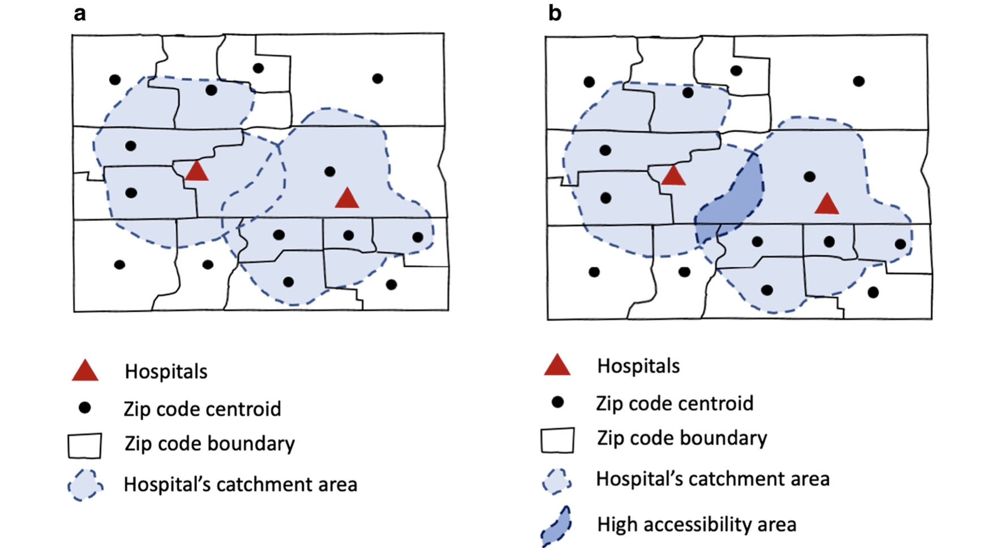
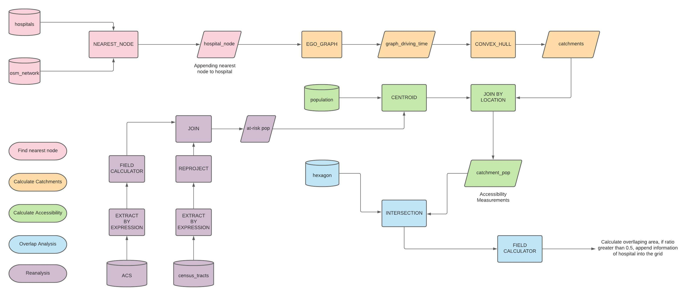
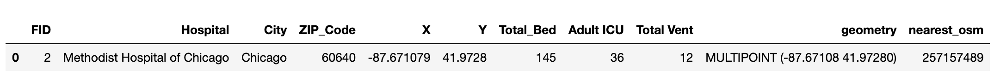
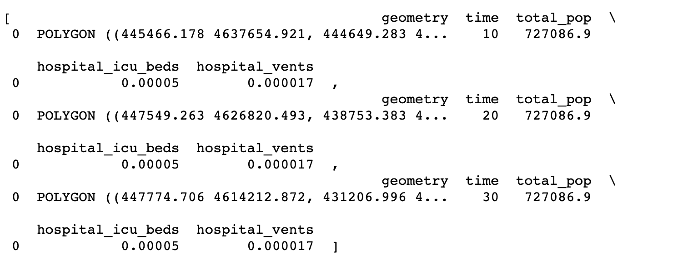
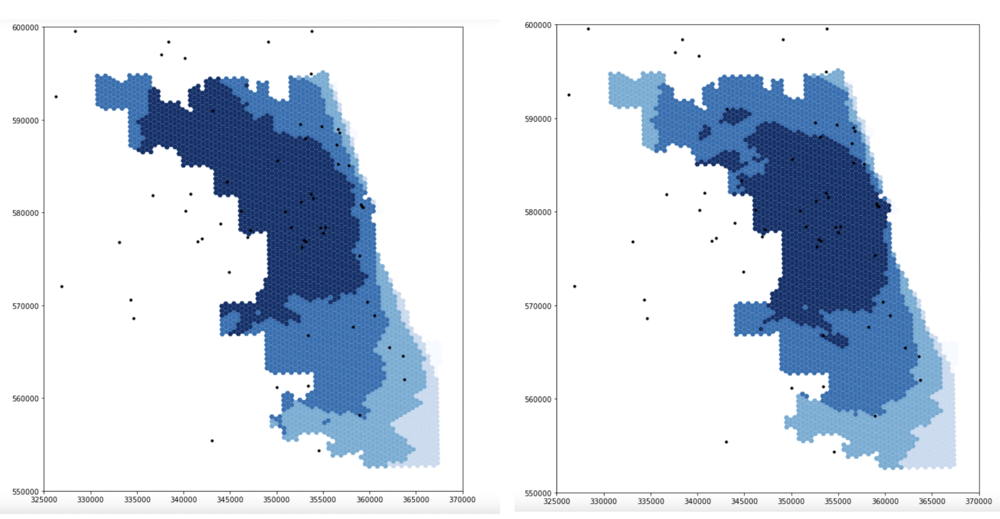

Emily Zhou, Middlebury College

Created 2021-10-28 | Last Updated 2021-12-12

**Reproduction of**: Rapidly Measuring Spatial Accessibility of COVID-19 Healthcare Resources: A Case Study of Illinois, USA

**Original Study by**: Kang, J. Y., A. Michels, F. Lyu, Shaohua Wang, N. Agbodo, V. L. Freeman, and Shaowen Wang. 2020. Rapidly measuring spatial accessibility of COVID-19 healthcare resources: a case study of Illinois, USA. International Journal of Health Geographics 19 (1):1–17. [DOI:10.1186/s12942-020-00229-x.](https://ij-healthgeographics.biomedcentral.com/articles/10.1186/s12942-020-00229-x)

**Original Research Material Available at**: [COVID-19AccessibilityNotebook](https://github.com/cybergis/COVID-19AccessibilityNotebook)

**Reproduction Material Available at**: [RPr-Kang-2020](https://github.com/emilyzhou112/RPr-Kang-2020)

**Useful Links**: [CyberGISx](https://cybergisxhub.cigi.illinois.edu/), [WhereCOVID-19](https://wherecovid19.cigi.illinois.edu/#7/40.926/-88.912/Dark_Mode-il_county_case/568)

[](https://www.ece.gatech.edu/news/643836/campus-initiatives-continue-tackle-challenge-covid-19)

## Introduction

One of the most evident impacts of Covid-19 pandemic is that it has exceed the capacities of healthcare resources. The inaccessibility to testing locations within certain driving distances, inadequacies of intensive care units (ICU), and imbalances between supply and demand for ventilators in many states present an inherently normative question for policy makers: how could healthcare resources be allocated fairly during the pandemic? Yet, to fully answer this question requires us first to identify the disparities in accessibility to healthcare resources across space as well as populations that are most vulnerable to the pandemic.

Five months into the pandemic, [Kang et al. (2020)](https://ij-healthgeographics.biomedcentral.com/articles/10.1186/s12942-020-00229-x) conducted a groundbreaking study that measures and visualizes the spatial accessibility of Covid-19 healthcare resources, with a focus on the state of Illinois (Chicago in particular), for both population at risk – people who are over fifty years old – and Covid-19 patients. The study models the potential of each hospital by using an enhanced two-step floating catchment area [(E2SFCA)](https://www.sciencedirect.com/science/article/pii/S1353829209000574?via%3Dihub) method, which looks at the outcome of interactions between the number of potential patients/at-risk population and number of healthcare resources. It reveals an uneven distribution of healthcare resources across the state: central and northern Illinois, with Chicago as its center, have greater access to these resources.

Besides the implications it provides for healthcare resources allocation in Illinois, the original study is novel in another sense as well: to enable reproduction and replication, it is published along with the code used to collect and analyze the data in an accessible Jupyter notebook via [CyberGIS](https://cybergisxhub.cigi.illinois.edu/). This has made the algorithms and workflow a shared knowledge, which is critical for verifying the study results and applying the methods to various geographic areas. By running, commenting, and making modifications to the code, it improves the reproducibility, establishes the credibility of the original study, and even facilitates the production of new knowledge. Collectively, these efforts could help policymakers make better decisions on the fair-allocation of healthcare resources.

Under these motives, the original study is reproduced using Chicago (and its surrounding areas) as the place of interest, aiming to explore how the spatial accessibility varies within the region of Illinois where population congregates, and healthcare resources are supposed to be the most adequate. It is also improved by adding more inline comments and breaking complex functions into smaller components to increase the overall intelligibility and by modifying the spatial extent to increase the accuracy of catchment area calculation.

## Materials and methods

### Original Study

The [original study](https://github.com/cybergis/COVID-19AccessibilityNotebook) has used the following data/layer for analysis:
- The road network obtained from [OpenStreetMap](https://www.openstreetmap.org/#map=4/38.01/-95.84).
- The population data for Illinois accessed from the [American Community Survey](https://www.census.gov/programs-surveys/acs).
- The hospital data collected from the [US Homeland Infrastructure Foundation Level Data](https://hifld-geoplatform.opendata.arcgis.com/datasets/hospitals/explore?location=7.501852%2C-15.457900%2C1.91).
- The hexagon grid is generated as a shapefile used for aggregation.

After loading the libraries and importing necessary data specified above, there are several preparations still need to be done for the analysis to run. This includes (ordered sequentially):

**Process the road network** to remove nodes with 0 out-degree to exclude unreachable nodes and remove small strongly connected components to avoid erroneously small ego-centric networks.

```python
def network_setting(network):
```

**Calculate the nearest node for each hospital** using the get_nearest_node function from the [osmnx](https://osmnx.readthedocs.io/en/stable/osmnx.html) packages. This appends an additional column to the hospital data set indicating the nearest node, which is used for calculating the catchment area later.

```python
def hospital_setting(hospitals, G):
```

**Convert GeoDataFrame of population into centroids**, which is easier to be compared to the catchment areas of hospitals.

```python
def pop_centroid (pop_data, pop_type):
```

**Set up the function for calculating catchment area**. This function would take in a processed road network, the nearest node of one hospital, and a specified distance whose unit is “time” as inputs. It first calculates an [ego-graph](https://networkx.org/documentation/stable/reference/generated/networkx.generators.ego.ego_graph.html) using the ego_graph function from the [networkx](https://networkx.org/documentation/stable/reference/functions.html) package based on the distance unit for an input node. Then, it applies a convex hull around each ego-graph and returns a catchment area for a particular hospital.

```python
def calculate_catchment_area(G, nearest_osm, distance, distance_unit = "time"):
```

With all these preparation work, accessibility for each hospital is measured based on their respective catchment areas and weighted by distance. This is followed by another overlap function that took the sum of accessibility for each hexagon of the grid in the grid shapefile.

```python
def hospital_measure_acc (_thread_id, hospital, pop_data, distances, weights):

def overlap_calc(_id, poly, grid_file, weight, service_type):  
```


*Figure 1: Illustration of catchment area calculation*  
*Figure by: Kang, JY., Michels, A., Lyu, F. et al. Rapidly measuring spatial accessibility of COVID-19 healthcare resources: a case study of Illinois, USA. Int J Health Geogr 19, 36 (2020). [https://doi.org/10.1186/s12942-020-00229-x](https://ij-healthgeographics.biomedcentral.com/articles/10.1186/s12942-020-00229-x#rightslink) Permitted to share under the [creative common license](https://creativecommons.org/licenses/by/4.0/)*

Eventually, the parallel processing functions of calculating catchment area and overlapping it with grids, which use the [multiprocessing](https://docs.python.org/3/library/multiprocessing.html) and [itertools](https://docs.python.org/3/library/itertools.html) libraries, apply the same calculation on all hospitals in the data set.


```python
def hospital_acc_unpacker(args):
def measure_acc_par (hospitals, pop_data, network, distances, weights, num_proc = 4):

def overlapping_function (grid_file, catchments, service_type, weights, num_proc = 4):  
```

NOTE: to save the space of this report, only names of the function are provided here for referencing purposes, you may find see the complete functions [here](https://github.com/emilyzhou112/RPr-Kang-2020/blob/main/procedure/code/02-COVID-19Acc-Original-Reanalysis.ipynb).

### Re-Analysis
The original study analyzed the spatial accessibility of healthcare resources in both Chicago and Illinois. Due to the computational intensity of dealing with data of the entire state of Illinois, our reproduction here is developed only upon the study of Chicago.

However, one of the biggest problems of the original study of Chicago is that while researchers tried to include hospitals outside of the boundary of Chicago, as they expect people who live in sub-urban Chicago would also access these hospitals, they excluded the road network outside the city. This problem has been addressed by students enrolled in the spring 2021 class by adding a 15-mile buffer around the street network. Yet, another problem remains in that those additional hospitals outside of Chicago do not merely serve population within Chicago; Rather there are shared resources for both Chicago residents and residents of surrounding communities. Our re-analysis deals particularly with this problem by including the geometries of demographic information of census tracts surrounding Chicago so that the capacities of these hospitals are represented correctly.

As such, the reproduction of the original research requires us to access two additional data/layers:
- The demographic data (age and sex) for Cook and adjacent counties, which is accessed from [United States Census Bureau—American Community Survey](https://data.census.gov/cedsci/table?text=b1001%20acs&t=Age%20and%20Sex&g=0400000US17%241400000&tid=ACSST5Y2019.S0101).
- The geometry of all census tracts within these counties, which is downloaded from the United States Census Bureau – [Cartographic Boundary Shapefiles](https://www.census.gov/geographies/mapping-files/time-series/geo/carto-boundary-file.html).

They could be loaded into the Jupyter notebook using the following code:
```python
# Read geometry of Illinois
illinois_tract = gpd.read_file('./data/raw/public/Pop-data-buffered/cb_2018_17_tract_500k.shp')

# Read census data of Illinois
demographic_data = pd.read_csv('./data/raw/public/Pop-data-buffered/ACSDT5Y2018.B01001_data_with_overlays_2021-10-28T145639.csv', sep=',' , skiprows=(1,1))
```
For each of these loaded layers, we need to transform the data to prepare it for the analysis. Starting with the demographic data, four steps are required to clean the raw data. **Firstly**, the census data contains a variety of demographic attributes of populations in Illinois. Referring to the [metadata](https://github.com/emilyzhou112/RPr-Kang-2020/blob/main/data/raw/public/Pop-data-buffered/ACSST5Y2018.S0101_metadata_2021-10-28T150304.csv), let’s extract only the at-risk population (both male and female) from the data set relevant to our analysis. Note, it is recommended to also include the name and total population of each census tract for reference.

```python
# Extract at-risk population (age 50+) from census data by referring to the metadata
at_risk_csv = demographic_data[["GEO_ID", "NAME", # geographic area name
                                "B01001_001E", # total
                                "B01001_016E", # total male 50-54
                                "B01001_017E", # total male 55-59
                                "B01001_018E", # total male 60-61
                                "B01001_019E", # total male 62-64
                                "B01001_020E", # total male 65-66
                                "B01001_021E", # total male 67-69
                                "B01001_022E", # total male 70-74
                                "B01001_023E", # total male 75-79
                                "B01001_024E", # total male 80-84
                                "B01001_025E", # totsl male 85 over
                                "B01001_040E", # total female 50-54
                                "B01001_041E", # total female 55-59
                                "B01001_042E", # total female 60-61
                                "B01001_043E", # total female 62-64
                                "B01001_044E", # total female 65-66
                                "B01001_045E", # total female 67-69
                                "B01001_046E", # total female 70-74
                                "B01001_047E", # total female 75-79
                                "B01001_048E", # total female 80-84
                                "B01001_049E" # totsl female 85 over
]]
```
**Secondly**, having demographic data across different sex and age groups is not helpful. As such, we need to summarize the total number of populations over fifty in each census tract and represent those in a new column named “OverFifty”. In addition, we renamed the column that represents total population as “TotalPop”.  

```python
# Summarize the total number of at-risk population, name it as 'OverFifty'
at_risk_csv['OverFifty'] = at_risk_csv.iloc[:, 3:23].sum(axis = 1)
# Rename the column that represents the total population
at_risk_csv['TotalPop'] = at_risk_csv['B01001_001E']
```
**Thirdly**, to make our table more intelligible, let’s clean this data set by dropping unnecessary columns.
```python
# Clean the population data by dropping unnecessary columns
at_risk_csv = at_risk_csv.drop(at_risk_csv.columns[2:23], axis =1)
```
**Lastly**, we notice that the naming of geoid is different between the two data sets. As this would be the key used to join the two data sets together, it is necessary that we keep their naming consistent. Let’s rename the geoid in this data set then.

```python
# Rename the columns for GEO_ID to match the naming in the census tract data set
newnames = {"GEO_ID":"AFFGEOID"}
at_risk_csv = at_risk_csv.rename(columns = newnames)
```
Proceed to the tract data, two steps are required before joining it to the census data. The **first step** is to always check the coordinate system of data that comes with a geometry and reproject the data when necessary. Here, we need to change the coordinate reference system to EPSG 4326.
```python
# Check and change the coordinate system of the census tract data set
print(illinois_tract.crs) # original crs
illinois_tract = illinois_tract.to_crs(epsg=4326)
print(illinois_tract.crs) # projected crs
```

**Next**, since this data set contains all census tracts in the state of Illinois and many of which are irrelevant to our re-analysis, let’s clean it by selecting only census tracts that are adjacent to Cook County.
```python
# Select tracts adjacent to Cook County(Chicago)
illinois_tract = illinois_tract.loc[(illinois_tract["COUNTYFP"] == '031')| # Cook County
                                    (illinois_tract["COUNTYFP"] == '089')| # Kane County
                                    (illinois_tract["COUNTYFP"] == '197')| # Will County
                                    (illinois_tract["COUNTYFP"] == '043')| # Dupage County
                                    (illinois_tract["COUNTYFP"] == '097')| # Lake County
                                    (illinois_tract["COUNTYFP"] == '111')  # McHenry County
                                   ]
```
At this point, we are able to inner join the two data sets using AFFGEOID as the key.
```python
# Join census data with track data, save it the output as atrisk_data
atrisk_data = illinois_tract.merge(at_risk_csv, how='inner', on='AFFGEOID')
```
You may find a workflow diagram [here](rpr-kang.pdf) to help with your understanding of the methods described so far.



### About Catchment Area Calculations
One of the biggest challenges to use this notebook as a learning material for enhanced two-step floating catchment area method is that the function used to explain this method is complex and poorly commented. While attempting to understand the python code has already been a steep learning curve to many, these complicated functions further add to the incomprehensibility of this notebook. For example, the major function that constructs catchment area and calculates accessibility is integrated into the parallel processing function, and we never get to see how its output look like. Thus, besides revising the original method, we broke the major function that implements catchment area calculation into several sub-functions (with slight modifications) to allow for a better understanding on the output of each segment of the function. We took the first hospital of the hospital data set and use it as input to the function as a firs step.

```python
# Run this code chunk below to prepare for the analysis
G = network_setting(G) # load and clean the osm network
pop_data = pop_centroid(atrisk_data, pop_type="pop") # load the population data
hospitals = hospital_setting(hospitals, G) # load and calculate the nearest node for hospital data
distances = [10, 20, 30]
weights = [1.0, 0.68, 0.22]

# Extract the first hospital from the hospital data set.
hospital_temp = hospitals.iloc[0]
```
*Output*:




After calling some necessary helper functions and defining the weight/distance we need to use, the **first sub-function** creates three concentric catchment area polygons that do not overlap each other.

```python
# Apply catachment calculation on each distance and create concentric polygons
# For each hospital, there needs to be three concentric rings of catchement area that do not overlap each other
def hospital_measures_polygon(hospital, distances):
    polygons = []
    for distance in distances:
        polygons.append(calculate_catchment_area(G, hospital['nearest_osm'],distance))

    for i in reversed(range(1, len(distances))):
        polygons[i] = gpd.overlay(polygons[i], polygons[i-1], how="difference")

    return polygons

hospital_measures_polygon(hospital_temp, distances)
```
*Output*:


The **second sub-function** summarizes the total number of populations within the catchment area using the three polygons created in the first sub-function. It outputs population summary as well as print the count of population centroids that are within the catchment area of the input hospital.

```python
# Summarize the total population that are within each catchment area for one hospital
# Apply weights population based on their distances away from the hospital.
def hospital_measures_popsum(pop_data, hospital, distances, weights):

    polygons = hospital_measures_polygon(hospital, distances)

    num_pops = []
    for j in pop_data.index:
        point = pop_data['geometry'][j]

        for k in range(len(polygons)):
            if len(polygons[k]) > 0: # To exclude the weirdo (convex hull is not polygon)
                if (point.within(polygons[k].iloc[0]["geometry"])):
                    num_pops.append(pop_data['pop'][j]*weights[k])

    cnt = len(num_pops)
    print(cnt)
    total_pop = sum(num_pops)
    return total_pop

hospital_measures_popsum(pop_data, hospital_temp, distances, weights)
```
*Output*:


The **third sub-function** calculates accessibility measurements for input hospital using the total population from the second sub-function as denominator and add results of the calculation to the list of polygons created in the first sub-function. It returns the same polygon list but with information on ICU/ventilator to population ratio.

```python
# Calculate accessibility measurements for one hospital
def hospital_measures_accessibility(pop_data, hospital, distances, weights):

    polygons = hospital_measures_polygon(hospital, distances)
    total_pop = hospital_measures_popsum(pop_data, hospital, distances, weights)

    for i in range(len(distances)):
        polygons[i]['time']=distances[i]
        polygons[i]['total_pop']=total_pop
        # proportion of # of beds over pops in 10 mins
        polygons[i]['hospital_icu_beds'] = float(hospital['Adult ICU'])/polygons[i]['total_pop']
        # proportion of # of beds over pops in 10 mins
        polygons[i]['hospital_vents'] = float(hospital['Total Vent'])/polygons[i]['total_pop']
        polygons[i].crs = { 'init' : 'epsg:4326'}
        polygons[i] = polygons[i].to_crs({'init':'epsg:32616'})
    return polygons

hospital_measures_accessibility(pop_data, hospital_temp, distances, weights)
```
*Output*:



You may find [here](https://github.com/emilyzhou112/RPr-Kang-2020/blob/main/procedure/code/02-COVID-19Acc-Original-Reanalysis.ipynb) a full copy of the python script used for this reproduction.

## Results and Discussions
Figure 2 compares the accessibility of ICU beds to population at-risk in Chicago based on data obtained from the original analysis and the re-analysis. While the darker color grid represents higher spatial accessibility, the lighter one represents lower accessibility. Both figures reveal that spatial accessibility healthcare resources is uneven across Chicago.
However, in terms of the degree of ICU access, the dark-shaded grids are of smaller extent and are more concentrated in the center of the map produced from re-analysis whereas from the original study, the shaded grids are more spread out and centered in northern and western portion of the map. Likewise, similar patterns can be observed in terms of the access to ventilators: results from re-analysis underscore a high accessibility at central Chicago


*Figure 2: Spatial accessibility of ICU beds in Chicago: the figure on the left is the result of analysis including the 15 miles buffer around Chicago, made by the students in the Spring2021 class, the figure on the right is the result of our re-analysis in Fall2021*

The major outcome of our modification to the original analysis manifested here is the differences in the extent of high-accessibility areas. The maps certainly illustrate a redistribution of resource accessibility in Chicago: it is certainly true that central Chicago has the highest accessibility in both analyses but results from re-analysis display lower accessibility along the border of Chicago. Since populations living in the vicinity of Chicago were excluded in the original analysis while the hospitals there were included, the potential of these hospitals were erroneously over-estimated. This is because Chicago residents might only represent a small portion of patients that these hospitals serve. Therefore, this justifies why areas at the northern and western border of Chicago display higher accessibility.

At this stage, although we have tried to further improve this analysis based on the work from Spring2021 class, there is one more limitation to acknowledge. While we have included the counties that are in the vincinity of Chicago for the purpose of including the populations there who share hospital resources with residents along the border of Chicago, we did not include the road network of those counties. To fix this error, we might need to re-consider the value of the buffer originally chosen by the Spring2021 class.

## Conclusions
Kang et al.’s study is a prominent one which exemplifies how studies that are reproducible could establish the credibility of current knowledge and facilitates the production of new knowledge. As a Covid-19 research in specific, it provides important insights into the spatial disparity of healthcare resources access in Chicago/Illinois so that policy makers could make informed decisions as to how resources should be allocated fairly during the pandemic. As a reproducible research in general, it allows other researchers to apply the same method to different areas of interests so that the healthcare accessibility crisis could be efficiently addressed across space. On top of that, by providing the code and data, it allows for further improvements on the original study in terms of the intelligibility of the code/workflow and the efficiency of the workflow, etc. For example, the differences in results obtained from this study and our re-analysis highlight the significance of “boundary effects” on influencing the outcome of research. In short, as a reproducible study on health geographies, this study would continue to be a valuable teaching and learning material for reproducible research and serve as an important material for future research looking for methods to measure spatial accessibility.
