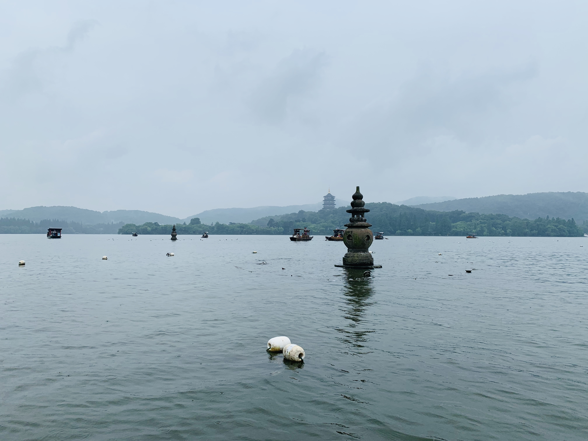

In the article “Show me the code: spatial analysis and open source” (Rey 2009), the concept of open source has been recognized as twentieth century’s only true innovation in business. The **cathedral and bazzar** model provide us with a vivid representation of how the organizations of software teams in open-source projects is radically different from the traditional development models: whereas the traditional model resembles the manner in which cathedrals are built, consisting of a tightly knit groups of developers, this arising model is more akin to a market bazzar, often relying on external input and developing through a network of collaboration. Accordingly, the innovative aspect of open-source movement is manifested in the collaborative research environment it embodies. Under this framework, students and researchers are able to access and assess the precise implementation of an analytical method, understand the logic of the systems under study, and identify errors and limitations in the study.

The benefits of using open-source software in teaching and research, include, as illustrated by Rey (2009) and Singelton et al. (2015), but are not limited to its accessibility to and inclusivity of the wider academia. Its *wider implications lie in the ways in which it facilitates the development of a discipline*. While it has always been the research question that drives the application of software, researchers now have the freedom to shape the development of software to suit their needs, rather than having to shape their research agendas to fit the capabilities of closed source programs. In the context of geography, spatial analysis tools in open-source software are open to examinations and improvements. Geographic information scientists are able to perform spatial analysis not only using existing tools but also collaborate to develop new applications that are relevant to their research. If a certain research project requires an extension of a function, a capable user could enhance the package. Such freedom to access and modify readily available tools greatly contributes to geography as a dynamic and continuously thriving discipline.

At this point, a note has to be made on what is “free” and what is “open-source”. The term open-source software and free software have been used interchangeably, and indeed free software is considered as a subset of open-source software. Yet, this generalization belies some important distinctions between the two. The philosophy they entail is different in that *free (as in freedom, not free of charge) software movement is a social movement of sharing and redistributing workflow during academic research whereas open-source software is a development methodology that investigates the practical benefits enabled by open-source licensing*, which is effective collaboration on software development. That being said, there are software that is open source but still put different restrictions on redistribution and incorporation into other software. To contextualize, open-source GIS might be described as the collaborative development of free software for use in spatial analysis.

However, even with the numerous benefits of open-source software in mind, *the practice of doing research with open-source software is not impeccable and the open-source movement is subjected to criticism*. Rey and Singleton address the potential challenges of the progression of open-source movement. As for GIScience, the characteristics of intelligibility among open-source projects are controversial. On one hand, information distributed via open-source GIScience has made the underlying logic behind the project more intelligible. On the other hand, the source code that has been made public of a spatial analysis package, for example, is not intelligible to the general audience and often requires a steep learning curve. In addition, since anyone can contribute to open-source project, it could change so rapidly that become a concern for researchers in the middle of a long-term research, such as geographers who want to look at the temporal changes of a specific pattern. On top of that, both authors make a strong call for the urgency of adopting a reproducible paradigm in geographic research. Modern publishing infrastructure is text-centric in that it emphasizes written content over code chunks. Publishers often lack the resources to host archives of code or data, which undermines the philosophy of open-source movements for data to accessible and tractable.

Nevertheless, despite the barriers that open-source projects need to overcome, the benefits greatly outweigh the challenges. Evidently, the simultaneity of the resurgence in spatial analysis and the rise of open-source movement has rendered open-source GIS at the core of academic spatial analysis. As the GIS tool kits are being used towards the more fundamental aspects of modeling spatial phenomena, it also renders complexity and sophistication of current GIS practices. Consequently, *this opens up the next discussion of whether open-source GIScience remains as a tool behind the scene of academic research or should be considered as a science that entails development of algorithms and proper research methodology*. Please see the following blog post for further [detail](science_tool).

===

*Rey, S. J. 2009. Show me the code: spatial analysis and open source. Journal of Geographical Systems 11 (2):191–207. [http://dx.doi.org/10.1007/s10109-009-0086-8](https://link.springer.com/article/10.1007%2Fs10109-009-0086-8)*

*Singleton, A. D., S. Spielman, and C. Brunsdon. 2016. Establishing a framework for Open Geographic Information science. International Journal of Geographical Information Science 30 (8):1507–1521. [http://dx.doi.org/10.1080/13658816.2015.1137579](https://www.tandfonline.com/doi/full/10.1080/13658816.2015.1137579)*

===

*West Lake, Hangzhou, China (12/26/19)*

> Thirty three moons are reproduced on the West Lake  
> How about a GIS research?
