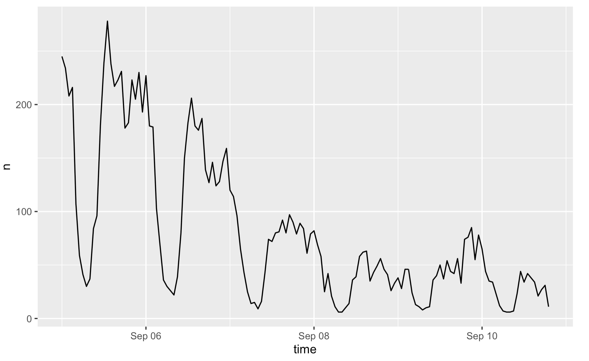
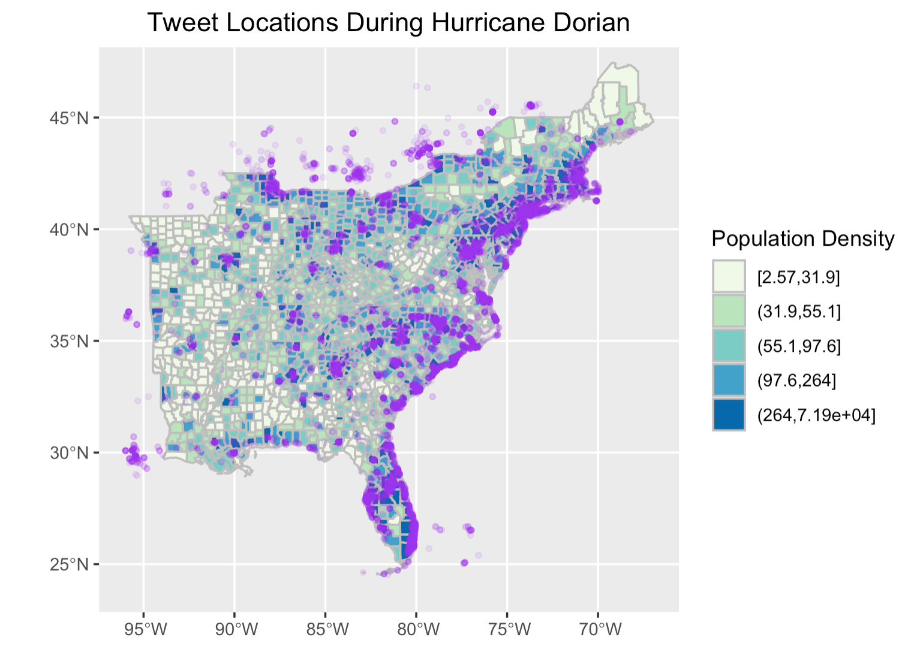
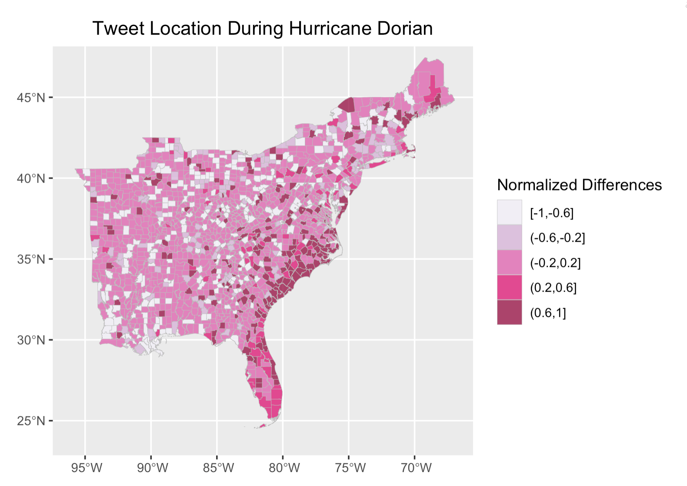

Do you know that every time when you message a friend via Instagram or post an update on Twitter, you are contributing to **volunteered geographic information (VGI)**?  While it does not make any literal sense to bridge social media and VGI, many social media platforms and mobile phone data have been proven to be innovative and effective data sources for researchers to acquire data on human behaviors and gain an alternative, more humanistic perspective on issues of their interest. In other words, the content of your tweets/messages carry far more implications than the literal information: they have been mined and studied by researchers for more detailed accounts on how some people are communicating in networked environments. This has been particularly useful in the study of social behavior during natural hazards, given that social medias are able to capture the situations, the opinions, the emotions, and the actions in a timely manner.

*Uncertainty, Uncertainty, Everywhere!*

However, although the application of VGI as a system of knowledge during crisis events, has brought new insights into how people experience a crisis, there are also limits to what we could learn from these data. *Recalling from previous [blog post](vulnerability), we reach the conclusion that uncertainty is ubiquitous, inevitable, and almost inherent in research of any kind*. Likewise, uncertainties are prevalent in the use of VGI and would become an issue if not sufficiently understood and examined. Drawing on examples from an analysis of twitter activity during [Hurricane Dorian](https://github.com/GIS4DEV/OR-Dorian), this blog post examines how, other than the methodology researchers deploy, but the tool that they use, which is volunteered geographic information in this case, could also entail uncertainty.

In the article “The limits of crisis data: analytical and ethical challenges of using social and mobile data to understand disasters”, Crawford and Finn (2014) raised a series of concerns regarding the use and misuse of social media data for disaster analysis. In specific, they are critical of the representativeness, the particularities, and the privacy of these data. It is necessary that we understand whether the data is a partial and skewed picture of a disaster, how could social media and its algorithms shape the way tweets are created, and issues regarding privacy and consent since all of which would contribute to uncertainty. To illustrates these concerns, they systematically categorized the limitations of social media data into three categories: *Ontological, epistemological, and ethical*.  

### Ontological Limitations:

Crawford and Finn first argue that the way that disasters are defined can strongly determine how social media datasets are operationalized during a crisis event. In contrast with the temporality of social media data, the effect of natural disaster itself covers a much longer time span. To fully account for the impact of a disaster requires us to not only focus on suffering during it, but also its aftermath, when the hard work of attempting to rebuild and recover occur. Yet, the short life span of social media data, which renders even post from yesterday as obsolete, would not do much help for us to gain a temporally holistic understanding of disaster. In other words, the data available after the attention of the public is gone would not produce any credible and meaningful result. On top of that, Crawford and Finn also assert that the analysis of social media during and after a disaster can resemble traditional media coverage, which has been accused of paying attention to only the most sensational stories. While it is totally reasonable that people tend to exaggerate their situation to seek for help during disaster, we need to be careful when making inference from the content of their post during analysis, which might entail uncertainty with respect to the magnitude and severity of the event.

*Figure 1: Number of geo-located tweet (n) over time. This figure illustrates how the interest Hurricane Dorian decreases over time on social media. Yet, the effect of this hurricane itself would cover a much longer time span.*  

### Epistemological Limitations:
Another problematic aspect of social media outlined by Crawford and Finn is the particularities of social media platforms and their users. **Firstly**, how do researchers take care of the content of tweets and Instagram posts? Since researchers are often in a different context and location than those who were experiencing the crisis, it is likely that when performing text analysis of tweets, for example, they would make inference from the tweet drawing upon their understanding and experience. This is particularly the case when the content of tweet is ambiguous and further processing is necessary to determine the number of people at risk, their precise location, the depth of water, etc. For example, how do you determine the exact depth of water when someone said “water is to chest deep” in their tweet? Apparently, uncertainty would accumulate in this process as researchers’ inference leads to subjectivity. On top of that, different researchers would have different interpretations regarding the same tweet, hence further introduces uncertainty.

**Secondly**, how should researchers account for the role social media platform and authorities play in shaping the messages? As an example, how could they distinguish between human activity and non-human agents like bots on twitter? According to Crawford and Finn, large number of tweets and datasets are produced algorithmically from non-human agents but are often included in analyses of human activity, which leads to uncertainty of the analysis result. In addition, the temporality nature of social media is also manifested in the fact that users have the freedom to delete their post and account.  Authorities, such as the platform developers and local governments, also have the power to determine what is allowed to stay public on social media and what content should not be disclosed. Considering from the perspective of reproducibility and replicability, if twitter content is dynamic, and we would never achieve the same result from any of the previous analysis, how could we check for the validity of those previous studies?

And **finally**, there is the important question of representativeness. Typically, social media data is not a representative sample of people’s experiences during a crisis: specific voices will be heard, and others will be missed entirely. In general, social media is skewed to younger, wealthier, more urban, and racial majority demographic groups. This ultimately leads to a problematic emergency imaginary since the demographic groups that are the most vulnerable to natural hazards happen to be the elderly, the impoverished, and the minorities.

*Figure 2: Tweet locations and population density. Hurricane Dorian went from the Bahamas up along the coasts of Florida, Georgia, South Carolina, North Carolina, Virginia, which is where we see most of the tweets are concentrated. In addition to that, there are also a large number of Dorian-related twitter activities far away from the areas affected by the hurricane. How should we account for the content of these tweets? To what extent do they represent the true experience of Hurricane Dorian?*  

### Ethical Limitations:
The ethical concern in the use of VGI is another factor that complicates uncertainty. This is particularly significant in a crisis situation when people reveal location data through the sharing of photos or requests for help that reveal highly sensitive personally identifying information. These information are collected without informed consent. In other words, people who sent these text messages did not consent to that particular use of their data. As such, whether we should disclose these information in research becomes an ethical issue. To protect user’s identity, twitter, for example, does not permit redistribution of its data, with the exception of tweet status ids. That is to say, if other user were to reproduce a previous research and re-access the data, they would not get the same results through rehydrating twitter data using status ids. Alternatively, we may aggregate individual tweets into larger geographic units, but aggregation as a means to generalize the data itself would introduce uncertainty.

 
 *Figure 3: Normalized differences in tweets over space. In the analysis of twitter activity of Hurricane Dorian, tweet locations were aggregated, summarized, and normalized into county levels to protect location data.*  

 In short, the effort of crowdsourcing and application of volunteered geographic information during crisis event has opened up new possibilities for researchers to examine the humanistic aspects of natural hazards. Yet, this participatory framework of data collection entails limitations and uncertainties. Questions, such as what we could learn from these data, how we could minimize those uncertainties, and how we should use them properly, needs to be fully accounted for before moving on to the analysis.

 ===

*Crawford, K., and M. Finn. 2014. The limits of crisis data: analytical and ethical challenges of using social and mobile data to understand disasters. GeoJournal 80 (4):491–502. [DOI:10.1007/s10708-014-9597-z](https://link.springer.com/article/10.1007%2Fs10708-014-9597-z)*

 ===

   
 *A random night walk at home (01/12/21)*

 > Always treat uncertainty with a positive approach.  
 > Always end the day with a positive thought.
