Emily Zhou, Middlebury College

Version 2.0 | Created 2022-2-1 | Last Updated 2022-2-4

[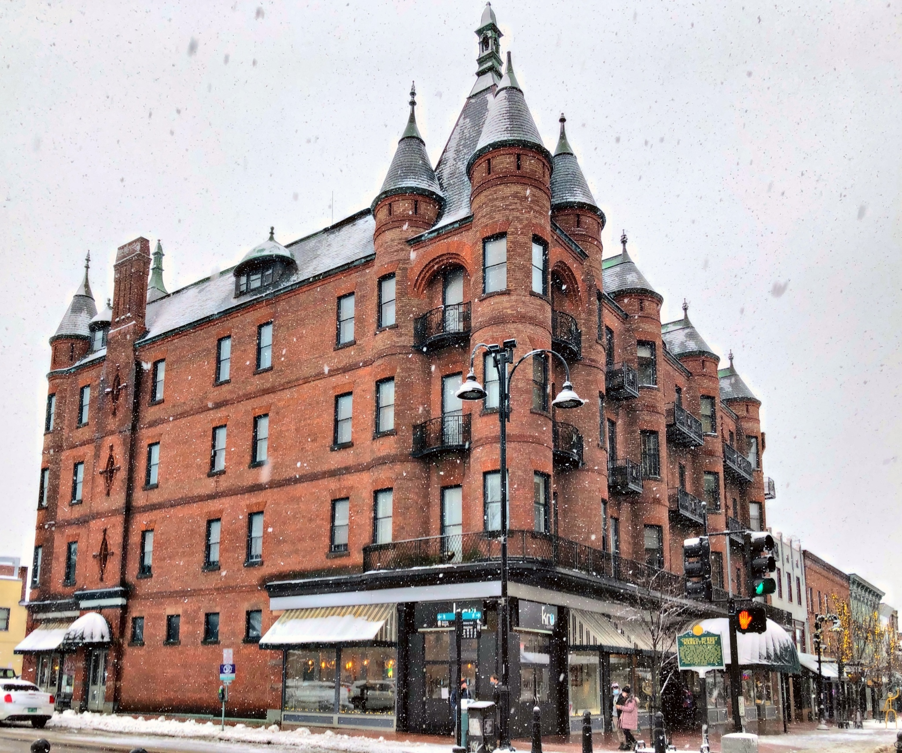](https://buildingsofnewengland.com/category/vermont/burlington/)

***Feel free to check the [poster board](1240assets/pinup3-emily.pdf) used in the class's final presentation.***

## Prologue

If you were to visit Burlington, you should not miss the [Church Street Marketplace](https://churchstmarketplace.com/). Described as the “gem in the crown” of the Queen City of Burlington, it welcomes 1.5 million visitors each year to shop, each, meet, and greet, mark milestones, or just pass the time of day.

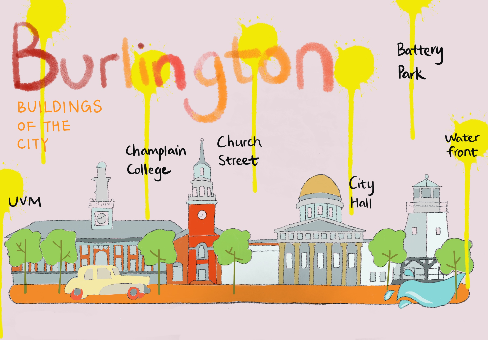
*Figure 1: Burlington skyline illustration, made with Procreate*

Before transforming into a marketplace, Church Street has gone through a drastic transformation in the past century. Photographs from the late 1800s indicate that Church Street was once home to residential properties; timer-frame houses flanked a dirt street with paved sidewalks. These were replaced with brick storefronts, and by the 1890s, larger buildings were being constructed to quarter expanding businesses. It was also around this time that some prominent buildings, now constitute part of the Church Street Historic District, were constructed. Indeed, there are many buildings in the Church Street Marketplace that deserve to have their architectural and historic significance acknowledged and explored. One of these buildings is the [Richardson Place](https://buildingsofnewengland.com/category/vermont/burlington/), the earliest commercial building, located at 2 Church Street.

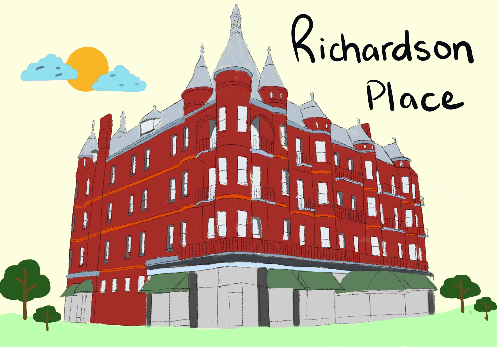
*Figure 2: Richardson Place illustration, made with Procreate*

## Historical Timeline

A little bit of [historical background](http://www.uvm.edu/~hp206/2015/King/king.html) of the building: It was constructed in 1895 by Albert E. Richardson and designed by Albany architect Walter Dickson as one of the earliest commercial buildings along the Church Street marketplace. In 1911, the building was taken over by Frank Abernethy and evolved into Abernethy’s Department store. As an important symbol of this transformation, Abernethy replaced the “R” sign on the balconies with “A” until 1982, when the department store went out of business. In June of the following year, Richard Corely purchased the property and spent $3 million to renovate it. The renovation includes restoring the “R” on the balconies, opening up new retail stores on the lower stories and transforming the upper stories from apartments into office spaces. Today, the building is owned by Jeff Davis and retains its structure since 1982. The retail spaces on the first story continue to extend itself to the pedestrian street by offering seating areas in the summer months.

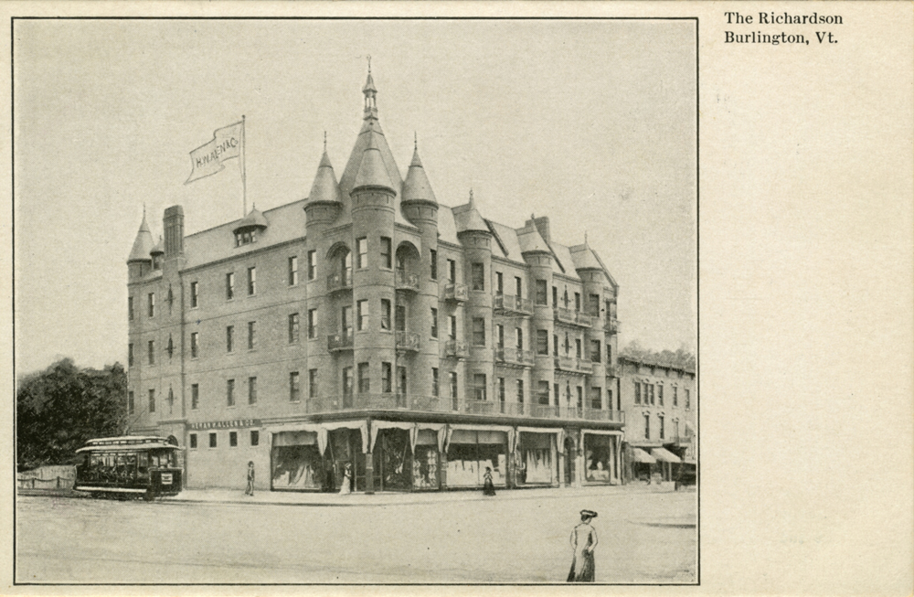
*Figure 3: Richardson Place in 1890s*

## Analytical Framework

The most interesting aspect of a building is the variety of approaches available for us to study its structure and socio-historical context. For example, through analyzing it from different scales, we are able to get different kinds of information about the building. Indeed, [Stweart Brand](https://en.wikipedia.org/wiki/How_Buildings_Learn#:~:text=How%20Buildings%20Learn%3A%20What%20Happens,TV%20series%20on%20the%20BBC.), as we have read, conceptualized **building as a layered structure consisting of stuff, space plan, service, skin, structure, and site, where each layer relates to the built environment and their users in different ways.** As such, I developed a narration about the Richardson Place in Burlington by scale magnitude, zooming from its site relative to the entire Burlington, the Church Street marketplace neighborhood, and the street block it lies, to its building materials, floor plan, and ornaments.

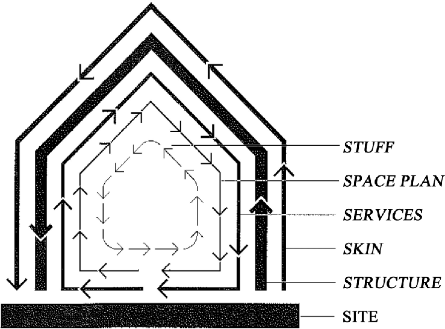
*Figure 4: Illustration of the shearing layer*

## Site - Burlington

Let’s start with the building’s context relative to the entire city. The zoning map of Burlington shows that areas in the city are mainly divided into agriculture, conservation, recreation, manufacturing, residential, and institutional. This small new England urban center carefully follows the traditional urban concentric model, where the downtown urban core is surrounded by residential, manufacturing, and agricultural zones. The Richardson place is located at the downtown urban core, east of waterfront areas, and west of Champlain College/UVM, and south of some high-density residential areas.

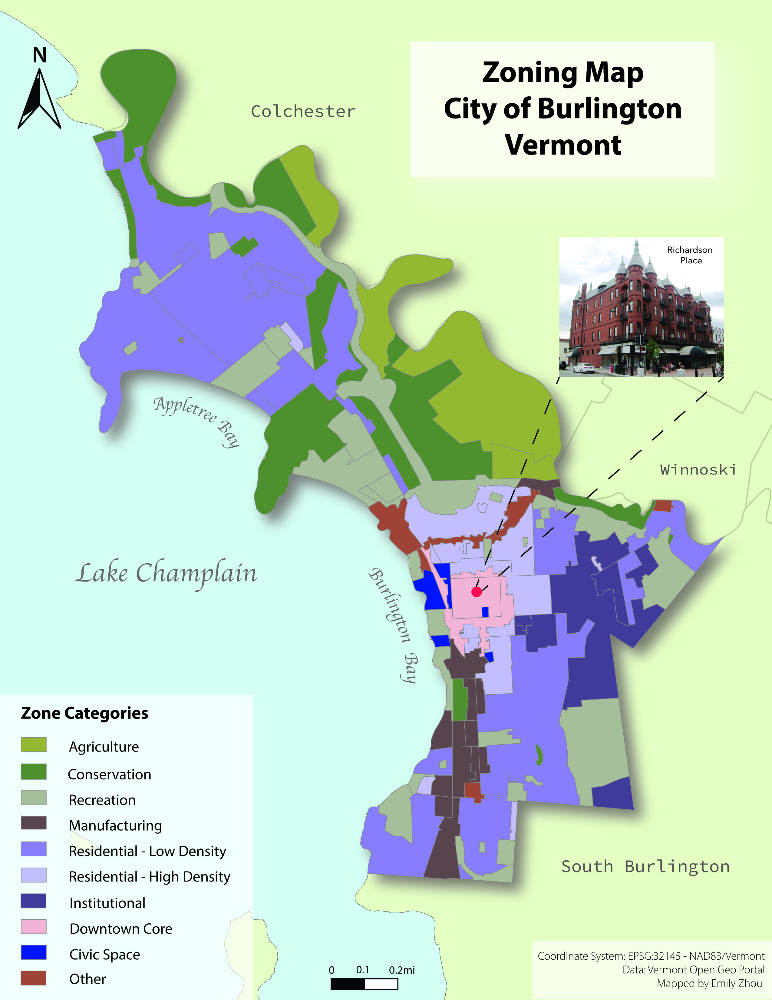
*Figure 5: Zoning map of Burlington, made with adobe illustrator*

The downtown area is also a place where bus stops are accessible within walking distances. As a fundamental component of the [urban matrix](https://www.publishersweekly.com/978-0-8142-0657-7), these bus lines serve as an indicator as well as **catalyst of high connectivity** between the downtown urban core and other places in Burlington.

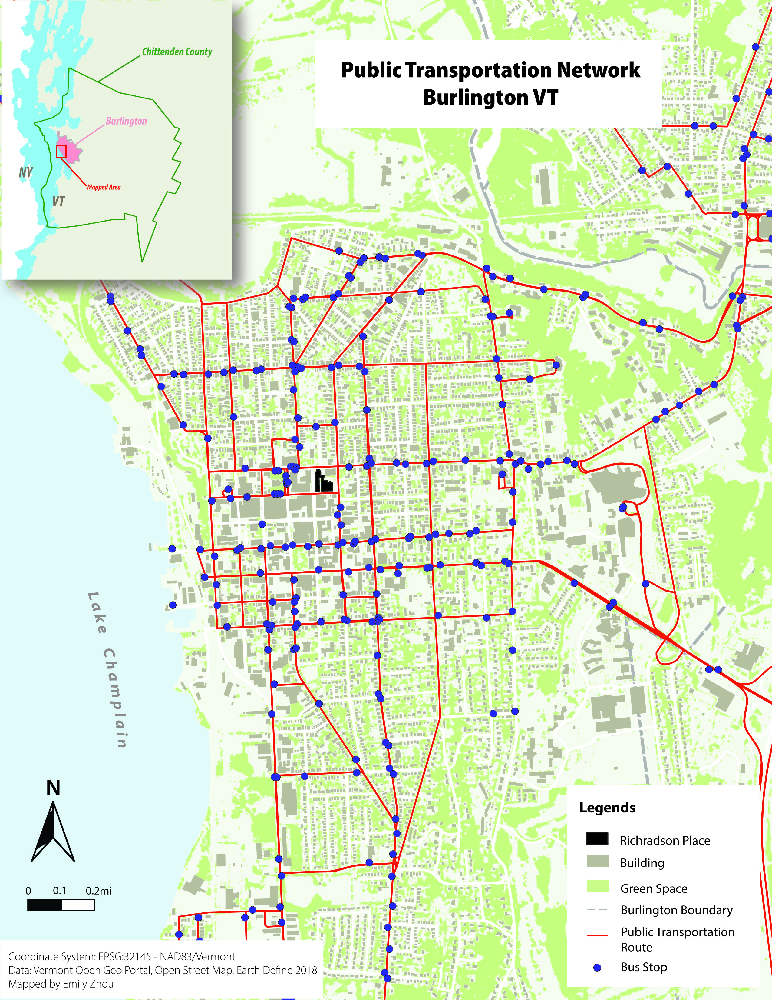
*Figure 6: Downtown Burlington Connectivity, made with adobe illustrator*

## Site - Neighborhood

Zooming into the Church Street Marketplace, the characteristics of high connectivity and accessibility is reiterated. The site plan map uses an 800m isochron to represent areas within 800 meters of walking distances centered at Richardson Place, from which we see that the City Hall, theaters, hotels, parking lots, churches, and a variety of dining and retail options are all congregated around the marketplace. This demonstrates how places around the Richardson place has served as an avenue for religious, social, and cultural activities. Drawing upon Mike Greenberg’s argument on urban matrix, we could also say that the **Richardson Place displays high physical, functional, and social connectivity between itself and various other places in Burlington given the close proximity to all those services**.

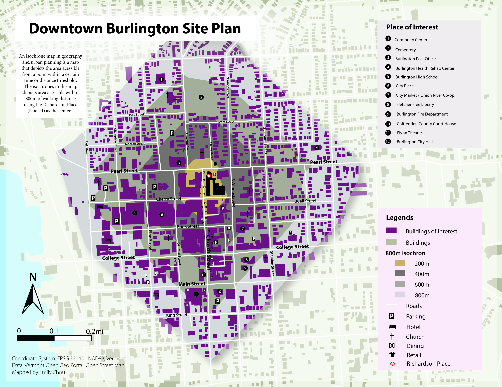
*Figure 7: Siteplan map of Church Street Marketplace, made with adobe illustrator*

## Site - Street Block

Further zooming in, Richardson Place is located at the intersection of Pearl Street and Church Street, which has made it both a [synchronous space and a punctuated space](https://books.google.com/books?id=FC82DwAAQBAJ&pg=PA205&lpg=PA205&dq=synchronous+space+and+a+punctuated+space+five+open+forms+richard+sennett&source=bl&ots=tpFvPC_w_x&sig=ACfU3U0w8tsK9_Bvr8bojYcjLhGJkfHDnQ&hl=en&sa=X&ved=2ahUKEwjhiYPr8ub1AhXrTN8KHeyqC3gQ6AF6BAgeEAM#v=onepage&q=synchronous%20space%20and%20a%20punctuated%20space%20five%20open%20forms%20richard%20sennett&f=false). On one hand, people gather along the Church Street to do many different things at the same time. On the other hand, the building itself serve as a semi-colon at the street corner where people pause to appreciate its beauty. In this map, I highlighted several important areas at downtown Burlington. Richardson place, together with the Masonic Temple and the Unitarian church, formed the prominent historic district of Burlington.

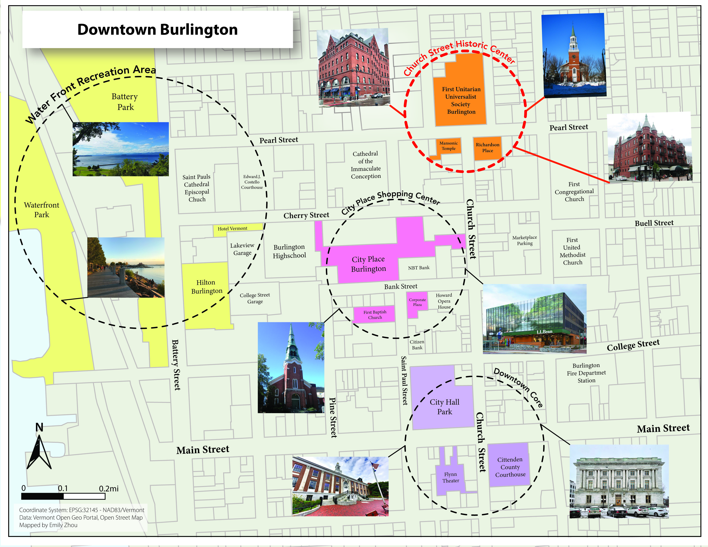
*Figure 8: Noticeable buildings in downtown Burlington , made with adobe illustrator*

## Structure

As for the structure, Richardson Place is a five-by-five bay brick building of four and a half stories. It obtains a blend of French Chateausque and Scottish baronial revival. It is also very asymmetric. The round towers are only present and divide the bays on the primary western façade, which is also more heavily adorned. The windows on each façade are very different. Only windows overlooking Church Street has balconies, which are adorned in the center with an “R”.

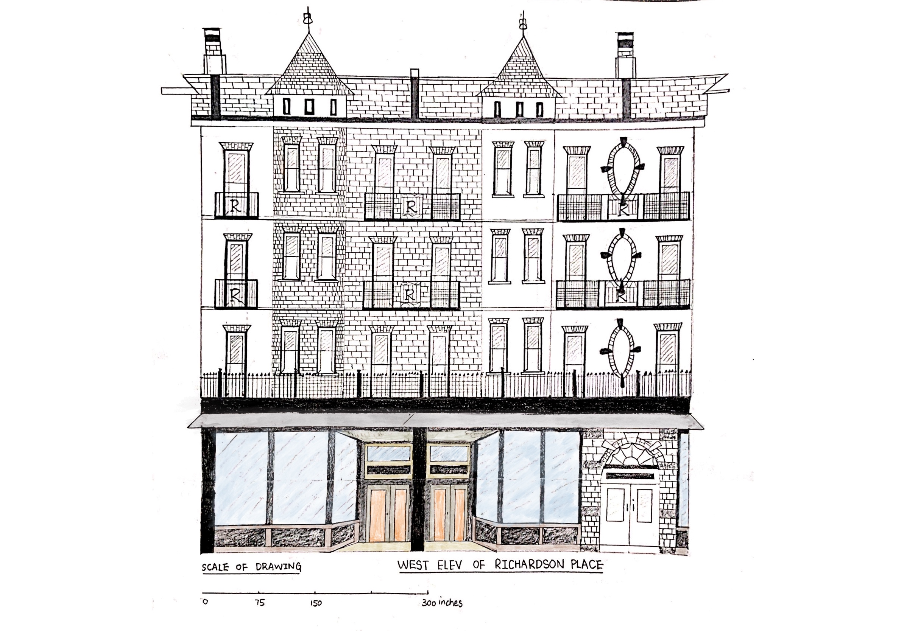
*Figure 9: West elevation of Richardson Place , drawn using pencil, charcoal, and watercolor, rendered in Procreate*

If we compare the elevation drawings on different facades of the building, we notice how each façade obtain very different appearances. For example, the west façade facing Church Street is more heavily adorned (the colored portion show its changes over time), which is that it keeps extending to the pedestrian street, while the east façade facing the parking lot is not very attractive in its appearance and its structure remain consistent the entire time.

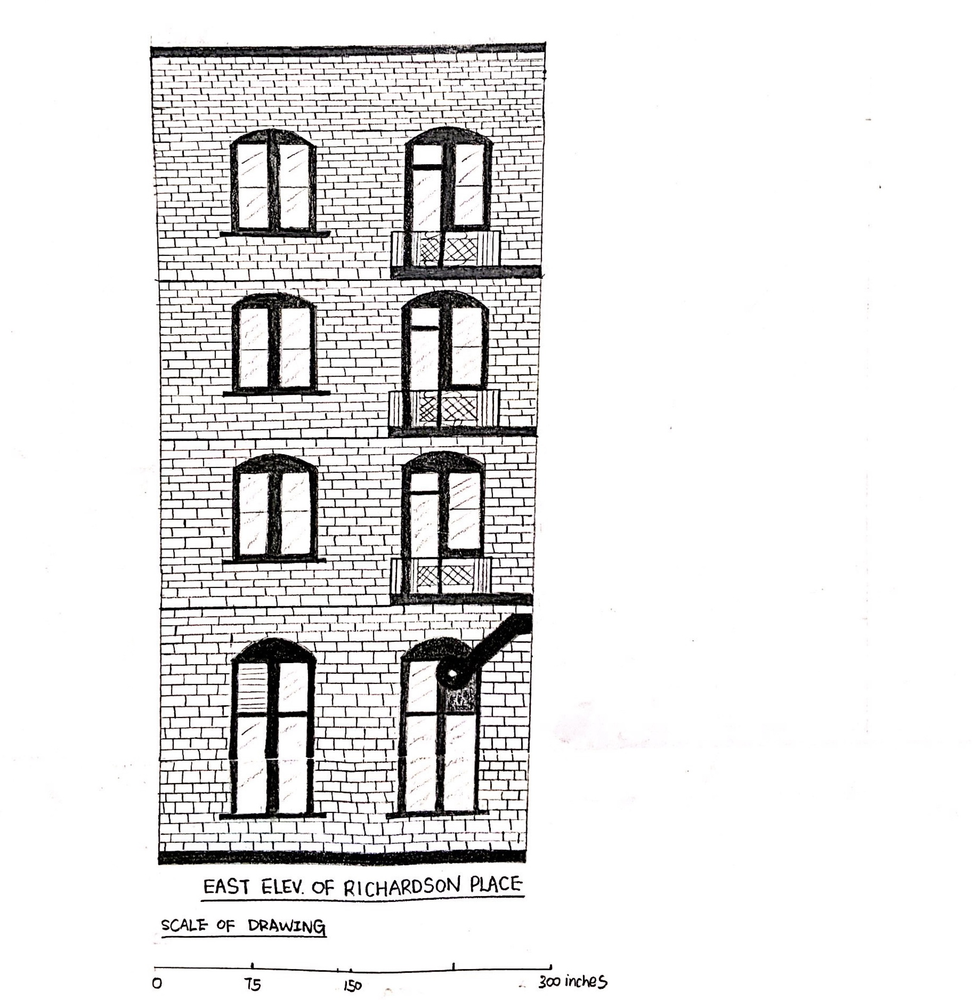
*Figure 10: East elevation of Richardson Place, drawn using pencil and charcoal, rendered in Procreate*

## Space Plan

In terms of the space plan, the building is easily accessible and has entrance towards the pedestrian street, Pearl Street, and behind the building through the parking lots. One can both access the building through the retail store, the side entrance, and front entrance.

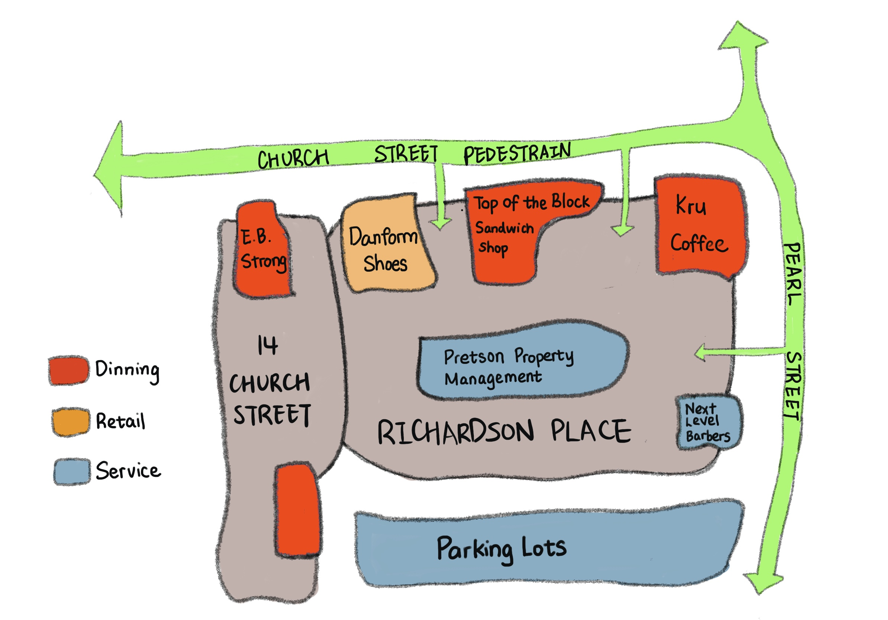
*Figure 11: Bubble diagram of the space plan and accessibility, made with Procreate*

Zooming into the interior of this building, the floor plan shows us that the Richardson Place is connected to its neighbor, the 14th Church Street, through a hallway and leads to this P-shape floor plan. The building is equipped with three elevators and five stairs with different functions. Stairs facing the west façade are much wider and looks like they are for public use while stairs facing the north facade are narrower and more likely to be reserved for employer use.

*Figure 12: Second floor plan, drawn using pencil and charcoal, rendered in Procreate*

## Stuff

Looking closely at some elements of the building, the interior is hollowed out with glass windows as the ceiling, which brings light to the interior and makes it looks much more spacious. The decoration of the interior displays a mix of modern and classic design and there are much evidence of change: modern elevators and classic elevators from different time periods are both kept, corridors of very different styles are visible.

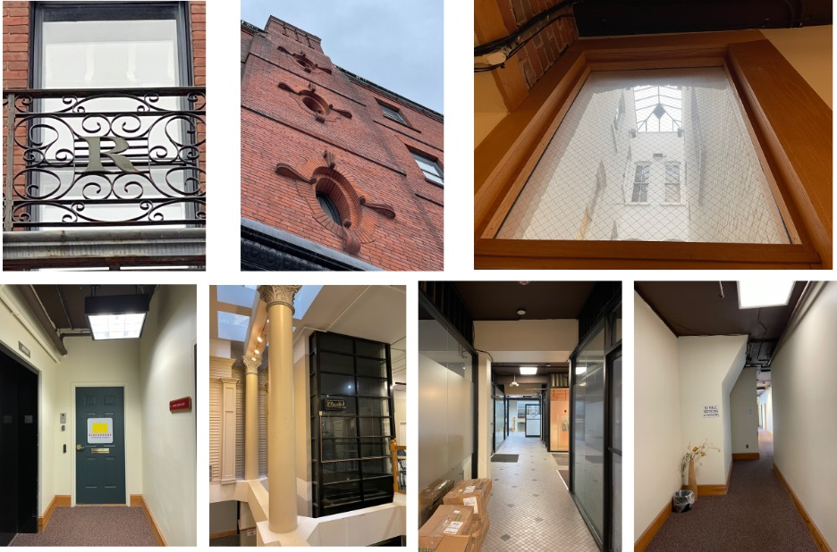
*Figure 13: Elements of building, taken during fieldtrip*

## Epilogue

To quickly conclude, there are many buildings in the Church Street Marketplace that deserve to have their architectural and historic significance acknowledged and explored, and the Richardson Place is just one of them. In the future, I expect the interior of the building to display more diversity as business move in and out and its exterior continue to blend with the pedestrian street, but no matter what will change and what stays the same, the stories of the Richardson Place will continue as the building grows with the city of Burlington.

===

**Sources**:    

The base layers of all map created in this project come from the [Vermont Open Geo Portal](https://geodata.vermont.gov/) and [Open Street Map](https://www.openstreetmap.org/#map=17/44.48025/-73.21954). Archival pictures are selected from [Champlain College Special Collection](https://specialcollections.champlain.edu/digital-collections/index.php/Detail/objects/1014) the [UVM Historic Preservation](http://www.uvm.edu/~hp206/2015/King/king.html) Program, and the [National Register of Historic Places](https://www.burlingtonvt.gov/PZ/National-Register-of-Historic-Places).

The narratives are supported by selected ourse readings that include [*The Poetics of Cities*](https://www.publishersweekly.com/978-0-8142-0657-7) by Mike Greenberg,  [*How Buildings Learn: What Happens After They’re Built*](https://en.wikipedia.org/wiki/How_Buildings_Learn) by Stewart Brand (P 12-23, "Shearing Layers"), [*Why Buildings Stand Up*](https://books.google.com/books/about/Why_Buildings_Stand_Up.html?id=N9PMTsCLTEAC) by Mario Salvadori (P 288-302, "The Message of Structure"), and [*Buildings and Dwellings*](https://books.google.com/books?id=FC82DwAAQBAJ&pg=PA205&lpg=PA205&dq=synchronous+space+and+a+punctuated+space+five+open+forms+richard+sennett&source=bl&ots=tpFvPC_w_x&sig=ACfU3U0w8tsK9_Bvr8bojYcjLhGJkfHDnQ&hl=en&sa=X&ved=2ahUKEwjhiYPr8ub1AhXrTN8KHeyqC3gQ6AF6BAgeEAM#v=onepage&q=synchronous%20space%20and%20a%20punctuated%20space%20five%20open%20forms%20richard%20sennett&f=false) by Richard Sennett (P 205-241, "Five Open Forms").

===

*In the process of learning to produce some elevation drawings:) (01/27/22)*

> In the end, I would like to thank my instructors Zane and Alix for being super helpful in guiding me to produce standard architectural drawings and brainstorming the site plan maps.
I also want to thank my field trip group members: Charlie, Dira, and Ola for making our field trip fun and successful!
