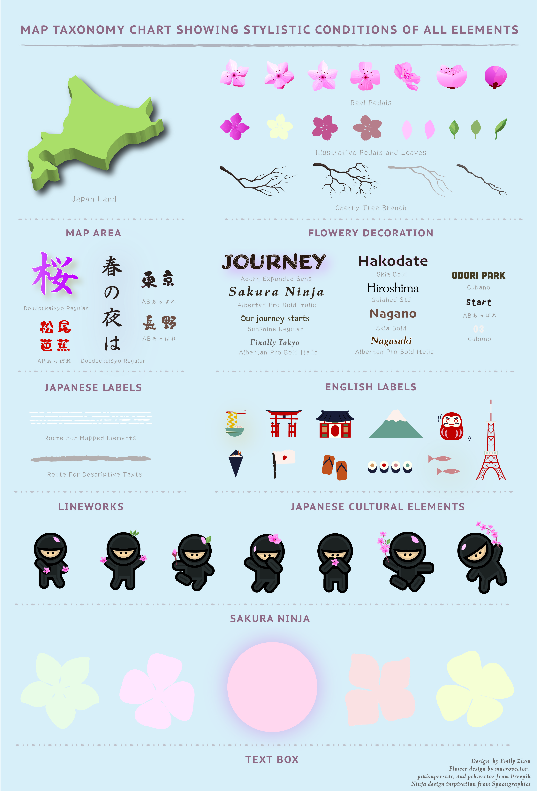

## Map Layout

You may click [here](231assets/proj2map.jpg) to see this map in better resolution

## Design Narratives

### Subject

In this map, I have developed a narrative based on when and where the cherry trees blossom in Japan as a route from Kyushu to Hokkaido, from mid-March to late-April. The target audience of my map are mainly tourists who will travel to Japan in the spring for cherry blossom viewing. Therefore, this map could either exist on the web or be printed. Regardless of how it will be presented to the audience, I hope that this map could ultimately help them plan their trip， navigate space, and introduce them to various Japanese customs and cultures while they are in Japan.

### Design Inspiration

The inspiration behind this map mainly comes from my personal experiences in Japan. I am a Japanese minor and I used to travel to Japan every year before covid to learn about the cultures, language, and traditions. As long as I am in Japan during spring, I would often see those kinds of pinkish brochures on the street where the land of Japan is placed in the middle and various pointers on the layout point to different cities in Japan that are labeled with date, which tell you when the cherry trees reach full blossom in each city. There are two things I like about such a layout. Firstly, their simple layout is straightforward and effective in delivering information and is convenient for tourists trying to get a quick sense of when and where cherry trees bloom. Secondly, they used a wide variety of decorative flower petals as well as symbols unique to Japan in the marginalia, which attracted people’s attention in the first place and greatly promoted Japanese culture at the same time. However, I always feel that advertisements like this could be improved if they pay more attention to the projection of the mapped area so that Japan is not tilted, and if narratives could be developed on the side panel for people who want further information on any place worth visiting in each city. In addition, instead of using plain narrative, it would be much better and unique if they use a symbolic character from Japanese anime to do the narration from a first-person perspective.

### Compilation

With all these in mind, I made the following decisions about my map compilations.
- I only include parts of Japan (I excluded the southern islands) with major cherry blossom viewing sites to simplify the mapped area.
- I customized the projection into an equidistant conic projection with central meridian at 138°E so that Japan is no longer tilted; I split the cities into two categories--major cherry blossom sites and other viewing sites--in which I would only develop narratives for the previous category as these are the most representative places to visit for cherry blossom viewing.
- I created a character named “Sakura Ninja” for the narratives considering that it is not only unique to Japan, but also feasible to make with simple line works and polygons in illustrator.
- I drafted the narrative from the perspective of Ninja drawing on my personal experiences traveling in Japan, and each narrative, together with the full bloom date, are placed at the center of a flower petals to contextualize with the subject of this map
- I collected a wide variety of vector files for flower petals and Japanese elements and used them to either fill negative spaces in the layout or enrich its content by rendering it a feeling of flowery and Japanese.

### Layout

My layout is therefore designed with the land of Japan as the visual center (because of the 3D and drop shadow effect) and the first thing I expect my audience to notice, followed by the title on the right-hand side and the description of the map towards the left (because of the outer-glow and drop shadow effects). Then I expect my audience could direct themselves to the “start point” of the route and start reading the narratives along the route. For this map, I tried to break the conventional way of map reading, which usually starts from the upper left corner, by placing the title towards the right. This is because the reading convention in many Asian countries, including Japan, is to start from the right side of a page. As a map about Japan designed for foreign tourists, I would like to integrate this idea by leading my audience to see the title as one of the first elements that attract their attention. Because there are a certain number of decorative elements that contribute to the aesthetics and purpose of this map, I have been very careful not to make them into chartjunk by avoiding overlapping flower petals with texts, lowering transparency and their place in visual hierarchy.

### Lettering and Color

Zooming into the detail of this map, there are six different types of English fonts and two types of Japanese fonts being used here. To avoid causing confusion, only one type of English font and one type of Japanese font is used on mapped geography while all the others are used in title and narratives. The decision on when to use a different font depends on when and where contrasts need to be shown or attention needs to be drawn. I think one of the greatest hardships at this stage is to find a type of English font that matches well with the aesthetic of a Japanese font. I believe that if I had more time to explore the adobe font library, I could find a better match. As for the color, I used two different palettes for this map given that there are two types of cherry blossom flowers: pink and white. In addition, I made full use of green and brown as two other major colors (green for mapped geography and brown for texts) since they are also the color of leaf and branch. I chose this light blue as my background color not only because green and blue are neighbors on the color wheel and that pink and blue well-complement each other, but also because most people see Japan as an island on the Pacific. With the drop shadow effect applied on to the greenish land, it renders the audience a feeling that this country is floating on the water, which is consistent with the majorities’ impression towards Japan.

You may click [here](231assets/proj2tax.jpg) to see this map in better resolution

