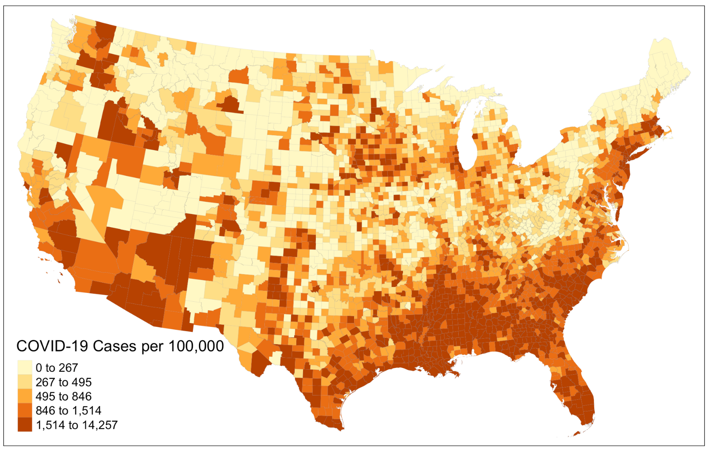
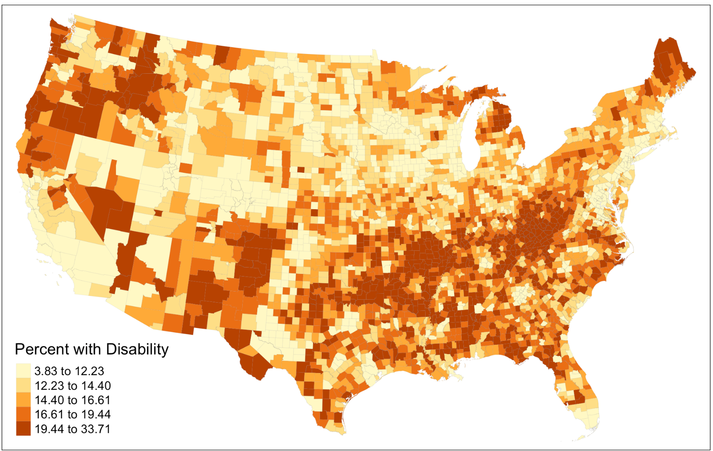
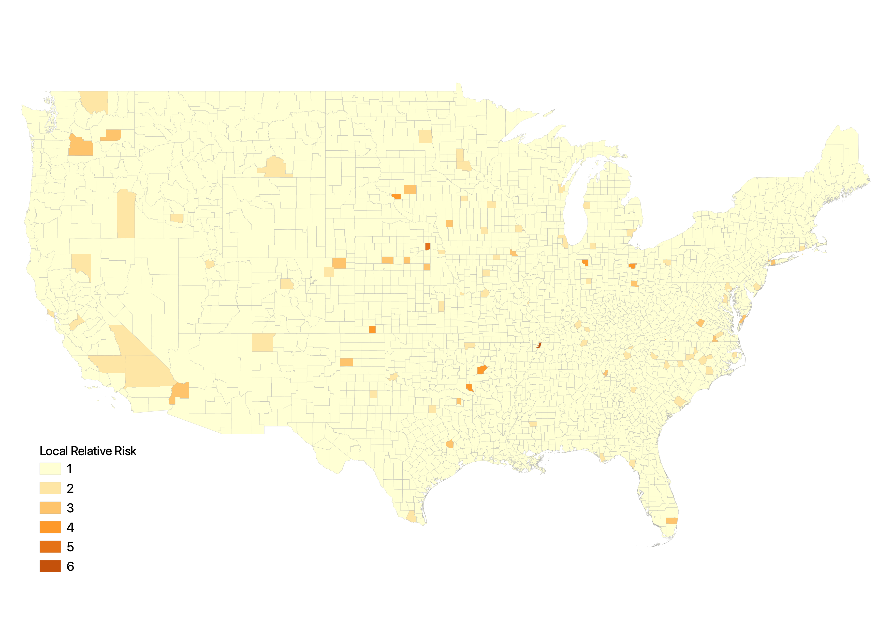
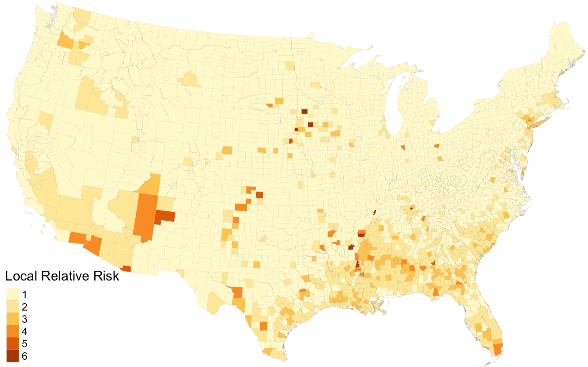

Throughout this semester, we have learned from Kang’s notebook that medical resources in Chicago are unequally distributed for aging population and covid patients to be fully served. We have also gained insights into how minorities and /or people who are vulnerable to natural hazards are more likely to be under-represented when evaluating the impacts of hazard events, using twitter data to study social media patterns on Hurricane Ida. The final reproduction study of this semester effectively bridges ideas from previous analysis and examine *how social inequity in the distribution of COVID-19 is manifested in another dimension by considering the populations with disability (PwD)*.

## Chakraborty’s original study

The COVID-19 pandemic has highlighted systemic inequities inherent in many aspects of people’s day to day life across the country. This inequity is not only articulated by Kang through his study on spatial inaccessibility of ICU beds and ventilator, but also by Chakraborty, who hypothesized that *COVID-19 incidence would be significantly greater in counties containing higher percentages of PwD because a substantial number of those population are more vulnerable to public health crisis based on their socio-demographic characteristics*.  

To demonstrate his hypothesis, Chakraborty conducted a national scale study of the relationship between COVID-19 incidence and disability characteristics in the US. He collected county level data on confirmed COVID-19 cases from the Johns Hopkins Center for Systems Science and Engineering database and calculated the COVID-19 incidence rate as the number of confirmed cases per 100,000 people in each county. The data for PwD were retrieved from the American Community Survey (ACS) 2018. The ACS disability estimates are disaggregated based on five socio-demographic categories: race, ethnicity, poverty status, age, and biological sex, which allows Chakraborty to do a cross-tabulated analysis of disability sub-groups.

**In the first part of the analysis**, Chakraborty chose the bivariate Pearson product-movement correlations to measure the statistical associations between COVID-19 incidence rate and each disability variable. The results show a relative weak but significant negative correlation between COVID-19 incidence and the overall disability percentage in the county. In addition, COVID-19 incidence is negatively and significantly correlated with the percentages of PwD who are white alone, non-Hispanic White, and above poverty, as well as those who are older and male.

Subsequently, Chakraborty used the generalized estimating equations (GEE) for a multivariate analysis of disability subgroups within each socio-demographic category **in the second part of the analysis**. He defined a cluster of observations (required for GEE) using two approaches. The state in which a county is located was first used to account for potential correlation because COVID-19 responses and testing policies should be similar across counties within the same state. To also account for intra-state geographic variation, Chakraborty ran the Piosson model to determine spatial clusters and estimate relative risk for COVID-19 incidence rates at the county level. The relative risk is defined as the estimated risk at a given location divided by the risk outside of the location. Based on the relative risk score, Chakraborty categorized all US counties into six groups.

Drawing upon observations from the bivariate correlations and multivariate GEE model, Chakraborty validated his hypothesis by showing that *greater COVID-19 incidence rate is significantly associated with Higher percentages of people with disabilities who are black, Asian, Hispanic, native American, below poverty, under 18 years of age, and female*.

## Reproduction analysis

[Here](https://github.com/emilyzhou112/RPr-Chakraborty-2021) is the link to our reprodction study repository.

To fully reproduce Chakraborty’s study, we need to re-create the three major components from his original work: the map of county level distribution of COVID-19 incidence rate, the table that displays bivariate correlations between COVID-19 cases and socio-demographic variables, and the table that shows the GEE model for predicting COVID-19 county-level incidence rate.

The **first part of** our reproduction analysis is dedicated to visualizing the spatial distribution of COVID-19 cases per 100,000 in the US. At this stage, the reproducibility of this research would be much improved if Chakraborty could specify the name of the ACS table they use and made the COVID-19 incidence data public. With the correct data, the reproduction result closely resembles that of in the original study, both showing that COVID-19 cases are more prevalent in the southern US as well as more urbanized counties along the east coast and west coast. This includes states such as Florida, Alabama, Georgia, New Mexico, as well as the several counties in New York, California.

*Figure 1: COVID-19 incidence rate per 100,000*

As an improvement to this part of the analysis, we proceed to create a map that illustrates the percentages of population with disability in each county. Doing so complement Chakraborty’s treatment of the census data he pulled from the ACS, in which he went straight into the bivariate correlations instead of examining the characteristics of these data first. The map provides us with a brief overview of how the distribution of COVID-19 incidence rate might correlate with the distribution of disability population across space before running any model. It reveals that many counties in the northeast, northwest corner of the US as well as in the south obtain a relatively high percentages of disability population. To further improve this, we could try visualizing the COVID-19 incidence rate and percentages disability population on the same layout using a bivariate choropleth to allow for more straightforward comparison between the two variables.  

*Figure 2: Percentages of population with disability*

The **second part** of our reproduction analysis focused on computing the summary statistics for variables analyzed and the bivariate correlations with county COVID-19 incidence rate. Following Chakraborty’s method, we calculate the Pearson’s correlation coefficient. Our results are consistent with that of from Chakraborty’s, though differ slightly in magnitude. However, one of the shortcomings of Chakraborty’s original approach is that the Pearson’s correlation is only applicable to variable with normal distribution. We revise this error by calculating the Spearman’s correlation coefficient, which, in comparison to our previous calculation, changes slightly. For example, while the Pearson’s correlation coefficient shows a weak positive relationship between “COVID-19 incidence rate” and “Percentages with disability that are Native American”, this turns into a weak negative relationship in Spearman’s correlation coefficient.

The **third part** of our reproduction analysis is to implement the GEE for predicting county COVID-19 incidence rate. This has been the most challenging part to reproduce for a couple of reasons. The use of GEE for multivariate analysis is a new modeling technique to many and the reasons why Chakraborty chose GEE for this analysis are poorly documented in the methodology section of the research paper. On top of that, how the relative risk score is calculated is not explained in detail and is left for readers to explore on their own, which reduces the overall reproducibility of this analysis. Therefore, to improve the reproducibility for this section and to increase the reproducibility of this paper in general for teaching purposes, it is necessary to briefly explain the applications of GEE and illustrate the calculation of relative risk score.

Based on my own understanding after studying Chakraborty’s analysis in detail, **GEE models the average response, instead of the within-subject covariant**. The goal is to make inferences about the general population when accounting for the within-subject correlation to see how much the average response would change for every unit increase in the covariant. The difference between predicting the **subject-specific odds** and the **population average** could be illustrated using [two scenarios](https://rlbarter.github.io/Practical-Statistics/2017/05/10/generalized-estimating-equations-gee/). In scenario one, the doctor wants to know how much a drug will lower the likelihood of severe illness of covid patients. In scenario two, a state official wants to know how the number of covid patient would change if every people with disability is given acute protection against covid. GEE can give us estimates for the second, but not the first, because in the previous scenario, we want to predict the subject-specific odds whereas in the latter scenario, we are interested in the prediction for the entire population. This explains why GEE modeling is more suitable for our subject of analysis here.

The relative risk score, to put it simply, calculates the ratio between local and global variable. Its full equation is (`covid_cases` / `population`) / (`all_other_covid_cases` / `all_other_population`). If we were to calculate the relative risk score for New York City, then this equation would turn into (`NYC_cases` / `NYC_pop`) / ((`USA_cases` – `NYC_cases`) / (`USA_pop` – `NYC_pop`)). A ratio greater than one corresponds to higher relative risk score.

The results of our reproduction study are mostly consistent with that of from Chakraborty’s, with slight differences in the magnitude of correlation coefficients. The coefficients that we compute are relatively smaller, which is in part due to one revision we have made to the Chakraborty’s work. The original study only calculates the relative risk score for the center of the cluster, where as our reproduction analysis calculates the relative risk score for each county in the cluster, although the ideal scenario is to have one relative risk score for all counties in the cluster (saved for future work). The differences become more evident if we visualize the relative risk score we compute, and compare it to that of Chakraborty’s original result.

*Figure 3: Relative risk score if calculated based on the center of the cluster*

*Figure 4: Relative risk score if calculated for each county in the cluser*

## Next step

In conclusion, Chakraborty’s study on social inequities under public health crisis represents an important starting point for more detailed investigation of the disproportionate impacts of COVID-19 on people with disabilities and highlights the need for COVID-19 data reporting systems to incorporate disability information. Our reproduction results agree with the conclusion reached by Chakraborty, but suggest that the study’s design and reproducibility could be further improved by:

- Conducting simple analysis on the raw data, such as mapping disability rate.
- Enclosing the data/metadata used in the original analysis.
- Providing simple and comprehensible explanations on the spatial statistical model (GEE) used in the analysis.
- Documenting, in detail, how various decisions in the analysis are made (relative risks score calculation, spatial clusters determination).
- Evaluating the possible uncertainties involved in the quality of raw data and GEE modeling.

===

*Chakraborty, J. 2021. Social inequities in the distribution of COVID-19: An intra-categorical analysis of people with disabilities in the U.S. Disability and Health Journal 14 (1):101007. [DOI: 10.1016/j.dhjo.2020.101007](https://www.sciencedirect.com/science/article/pii/S1936657420301394?via%3Dihub)*

===

*A quiet night with maps (01/24/21)*
> The struggle you face when reproducing a work today is becoming the strength you need for creating you own work tomorrow…
