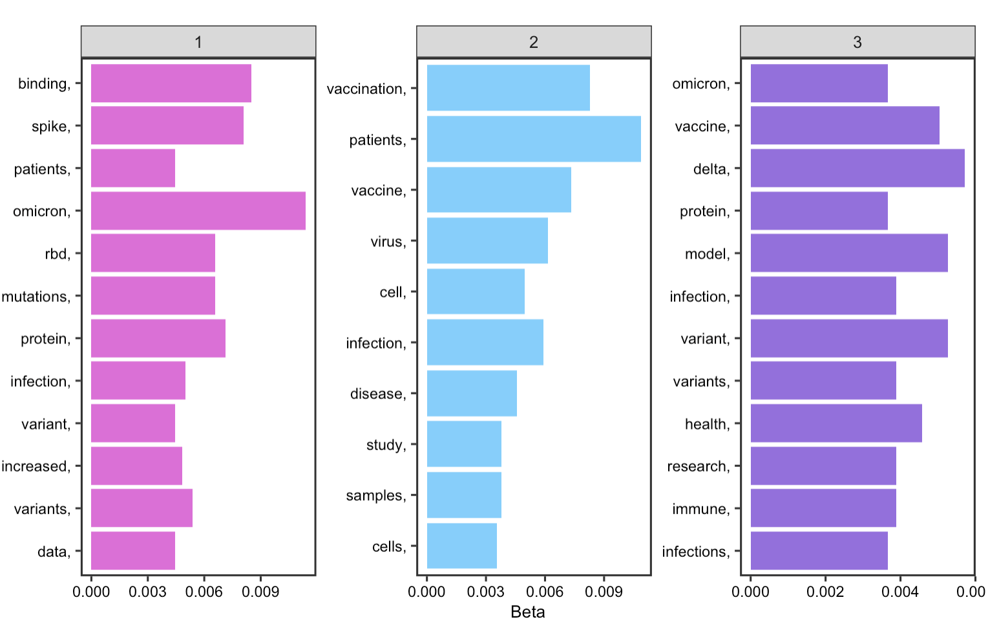

Emily Zhou, Middlebury College

Created 2021-12-10 | Last Updated 2021-12-18

**Reproduction & Replication of**: Preliminary Analysis of COVID‐19 Academic Information Patterns: A Call for Open Science in the Times of Closed Borders.  

**Original Study by**: Homolak, J., Kodvanj, I. & Virag, D. Preliminary analysis of COVID-19 academic information patterns: a call for open science in the times of closed borders. Scientometrics 124, 2687–2701 (2020). [https://doi.org/10.1007/s11192-020-03587-2](https://link.springer.com/article/10.1007%2Fs11192-020-03587-2)

**Original Study Materials**:  [COVID-Academic](https://github.com/davorvr/covid-academic-pattern-analysis-v2)

**Reproduction & Replication Analysis Materials**: [RPr-Homolak-2020](https://github.com/emilyzhou112/RPr-Homolak-2020)

**Useful Links**: [PubMed](https://pubmed.ncbi.nlm.nih.gov/), [Scopus](https://www.scopus.com/search/form.uri?display=advanced), [BioRxiv](https://www.biorxiv.org/)

[](https://www.researchprofessionalnews.com/rr-news-uk-views-of-the-uk-2020-5-scientists-must-show-their-covid-19-workings/)


## Introduction

The COVID-19 pandemic has motivated the scientific community to work closely together in order to gather, organize, process, and distribute data on this novel biomedical hazard. Indeed, throughout the semester, we have encountered various COVID-19 related articles that assess the [spatial accessibility](https://github.com/emilyzhou112/RPr-Kang-2020) of medical resources, such as ICU beds and ventilators, as well as articles that highlight the underlying [social inequities](https://github.com/emilyzhou112/RPr-Chakraborty-2021). Yet, as we delve into the content of these articles to examine the impacts of and learn about the solutions towards the pandemic, it is also important that we consider the **articles themselves** --- *their quantity, publication time, publication status, distribution* etc.--- as a measure of article quality and relevance. To put it simply, could we evaluate how the scientific community responded to the pandemic by quantifying distribution and availability patterns of the academic publications related to COVID-19?

Three months into the pandemic, Homolak et al conducted an analysis on COVID-19 related academic information patterns. Their aim is to *assess the quality of the information flow and scientific collaboration, hoping to see that the international scientific community can act as a coherent whole with teams all over the world switching focus to contribute with their expertise in understanding how we should approach, prevent, diagnose, and treat the new disease*. In their study, they obtained article metadata and investigated the publication rate and publication status, affiliation and author count per article, and submission to publication time, for article being published on PubMed, Scopus, and BioRxiv pre-print server using the R programming language. Their results revealed that in the early stages of the pandemic, the large amount of scientific data being generated have demonstrated potential problems regarding the information velocity, availability, and scientific collaboration in the early stages of the pandemic.

Appealing for the movement of scientific collaboration and open access to raw data themselves, Homolak et al organized their study materials (code and data) into a [GitHub repository](https://github.com/davorvr/covid-academic-pattern-analysis-v2) to allow for further validations and applications of their study, which is published along with their research paper. Taking advantage of this, the original study was first reproduced by loading the author’s original data and running the R and python script. By running, commenting, organizing, and making slight modifications to the code, it aims to verify the conclusions reached by Homolak and improves the reproducibility. On top of that, the original study was also replicated using the most updated article metadata. The purpose is to see the temporal changes in the COVID-19 academic information patterns as the situation of the pandemic changes almost on a daily basis. More importantly, to testify the applicability of Homolak’s methodology under a different temporal matrix would allow us to further prove/disprove their hypothesis. Based on the original work, the reproduction and replication materials have been organized into a [R-Markdown document](https://github.com/emilyzhou112/RPr-Homolak-2020/blob/main/procedure/code/01-covidacademic.Rmd) and published onto its own [repository](https://github.com/emilyzhou112/RPr-Homolak-2020) along with the data and figures.

## Original Study Information

Homolak’s original study **first** uses the `RISmed` and `pubmedR` pacakges in R to fetch metadata on articles indexed in PubMed. [PubMed](https://pubmed.ncbi.nlm.nih.gov/) is a free search engine accessing primarily the MEDLINE database of references and abstracts on life sciences and biomedical topics, hence where the majority of COVID-19 articles are published. The data base hosts a variety of article metadata, and from which Homolak et al have asked for the data on *accepted and received date, journal name, publication status, country, language, and the number of authors and affiliations per article*. A series of five groups of search words were constructed to return articles on COVID-19 and articles that will serve as a comparison group from PubMed. In particular, Homolak searched for *articles that are COVID-related and are published until the study as well as non-COVID related articles published until the study and articles published the year before as the two comparison group*.

[](https://pubmed.ncbi.nlm.nih.gov/)

**Next**, noticing the growing popularity of publishing preprints, meaning the version of a scholarly or scientific paper that precedes formal peer review, Homolak et al have also decided to include these grey literatures from the [BioRxiv](https://www.biorxiv.org/) using a custom python script to connect to the Rxiv preprint server. As they are interested in the number of articles published as preprints and whether those articles were later published in journals, the retrieved data includes *a list of authors and their affiliations, date of publications on BioRxiv and dates when the article was received, accepted or published in its respective journal*. Lastly, articles on [Scopus](https://www.scopus.com/search/form.uri?display=advanced) were manually searched, and the metadata was exported in BibTex file using the `Bibliometirx` R package.  

With these data, Homolak et al have conducted five major analyses that are briefly summarized here. Please refer to the reproduction analysis section below for detailed interpretations of the result. **Firstly**, the analysis on *publication date* draws upon the date when the articles is being received and accepted into a journal. The analysis illustrated that COVID-19 has elicited a rapid response from the scientific community and was met with a huge surge in the number of peer-reviewed publications. **Secondly**, the analysis on *publication status* revealed that a substantial proportion of articles are published ahead of print, indicating an acceleration of information dissemination. **Thirdly**, the analysis on *submission to publication(SP) time* is visualized on a box plot categorized by journal types, based on different searches. Surprisingly, the figure shows that for article pertaining to COVID-19, the submission to publication time reduced dramatically when compared to articles published in the same journal a year ago. **Fourthly**, the *language analysis* points to the rise of a substantial amount of non-English language articles. **And finally**, the number of authors and affiliations per article were used as proxies for the degree of *collaboration* of researcher on studying the pandemic. Summary statistics were computed, and four density plots were created to visualize the distribution of article data. Yet, the result showed little difference in the number of authors and affiliations per article on COVID-19, from the number of authors and affiliations per article published in the same journal a year ago. The collaboration is even worse than expected.

[](https://towardsdatascience.com/top-coronavirus-research-topics-using-nlp-may-2020-b4166289b728)

## Reproduction Analysis

*The code for reproduction analysis are now shown here. You may find this [R markdown](https://github.com/emilyzhou112/RPr-Homolak-2020/blob/main/procedure/code/01-covidacademic.Rmd) file helpful as you read along the description below. The abbreviation "CC", usually in brackets, refers to the code chunk number.*

The reproduction study on COVID-19 academic information patterns follow the same methodology as Homolak’s original work. To reproduce the analysis, I have loaded the following raw data provided by the author into R (CC10).

- The five search results of article metadata fetched from PubMed using the `RISmed` package, provided as `.csv` files, loaded as **records1, records2, records3, records4, and records5** into R.
- The five search results of article metadata fetched from PubMed using the `pubmedR` package, provided as `.csv` files, loaded as **df1, df2, df3, df4, and df5** into R.
- The search results of article/author metadata downloaded from `BioRxiv` preprint server using python script, provide as a `.json` file, loaded as **json** into R.
- The search results of article metadata from Scopus, provide as `.bib` file, loaded and converted to data frame as **M** into R.

[](https://www.science.org/content/article/scientists-are-drowning-covid-19-papers-can-new-tools-keep-them-afloat)

Even though these data are prepared by the original author, there are still a couple of extra steps to go through before the analysis. This includes to organize raw data into readable data frames and to load the functions that perform the analysis. For data that were fetched using the `RISmed` packages, we need to reorganize the accepted and received date by creating two new columns in the dataset. Since, the original function, named as `rismedextract`, could only be used in replication analysis and would output an error if loading provided data (CC3), I edited the function and created a version suitable for reproduction analysis, as `rismedextract_rp`(CC4). Following that, the five data frames were passed into the function named `sptime` (CC5), where a new field would be added that calculates the submission to publication time.

For data that were fetched using `pubmedR` package, we need to pass them into functions `AuthorCount`, `AffiliationCount`, and `countryF`(CC6,7,8) that counts the number of authors and affiliations and organize country data respectively.  

On top of that, the preprint data is not provided in readable data frame format. Hence, we need to first create an empty data frame titled `dfrxiv` and contains a list of vectors of empty field(CC11). Then, use a for loop to read through data in the json file and fill in the empty data frame (CC40).

### Publication date

The reproduction results on article’s publication date closely resembles the original result. The two histograms on the number of COVID-19 articles per submission date and per acceptance dates in journal show *a gradual increase in the number of COVID articles received and accepted every day as time goes on, with reduced publishing on weekends only*. Likewise, the number of papers published on Rxiv repositories have also been increasing steadily since the beginning of the pandemic, with only a small fraction of these papers published in journals. This supports Homolak’s conclusion that the COVID-19 crisis has elicited a rapid response from the scientific community.


*Figrue 1: Date Received*


*Figrue 2: Date Accepted*

### Publication status

The reproduction work on articles’ publication status was successful as well. The analysis highlights potential changes in publishers and journals approach in response to the pandemic. The stacked bar chart reveals that *a substantial number of articles are published ahead of print*, which is indeed a praiseworthy approach taken by publishers to accelerate the dissemination of information.


*Figrue 3: Publication Status*

### SP time

The reproduction analysis on the submission to publication time of articles supports Homolak’s concern on the quality of COVID articles. The box plot points to a drastic reduction of SP time for most COVID articles, with the decrement being around 10 times on average and as large as 15 times in some cases. Some articles even had a SP time less than 24h. The fact that such measures was specifically directed to article pertaining to COVID-19 articles and not spotted on other articles published concurrently or a year ago, implies that some articles might be poorly reviewed before publishing. *The SP time analysis indeed divulges a dark side of some journals that decided to sacrifice the quality of their content in exchange for speedier publications*.


*Figrue 4: SP time for COVID-19 articles*


*Figrue 5: SP time for non-COVID articles*


### Language

The reproduction analysis on the usage of language displays that English has been the dominant language in which most COVID articles indexed in PubMed are published, followed by Chinese and French. Further analysis on the number and language of published papers by country of publisher shows that the US, UK, and China have been the leading countries that contribute to our knowledge on COVID-19. Yet, as Homolak pointed out in their analysis, since most of the non-English language papers are published by Chinese publishers, *this language barrier is one of the most difficult to overcome in the sharing of information.*


*Figrue 6: Article languages*


*Figrue 7: Article languages by country*

### Collaboration

The reproduction analysis on how researchers have collaborated to study COVID-19 validates Homolak’s conclusion, which asserts that the collaboration is worse than expected. By exploring the number of authors and affiliations, *the results display little difference in the number of authors and affiliations per article on COVID-19 from that of published in the same journal a year ago*. Summary statistics in tables also suggest a decrease in the number of affiliations and authors per article.


*Figrue 7: Affiliation count for original research papers*


*Figure 8: Author count for original research papers*

Further, a large proportion of articles from on Scopus are single country publications.


*Figure 9: Mutiple or single source publication count*


In this part of the analysis, Homolak also created a flow map on the number of papers per country and collaborations between countries using the Biblioshiny app. Unfortunately, due to the lack of documentations on how to use this Biblioshiny app, I have not figured out a way yet to reproduce this map in this analysis.

*To avoid being tedious, some figures are not shown in this report, you may visit [here](https://github.com/emilyzhou112/RPr-Homolak-2020/tree/main/results/figures/reproduce) to see all the results of this reproduction study or run the [R markdown](https://github.com/emilyzhou112/RPr-Homolak-2020/blob/main/procedure/code/01-covidacademic.Rmd) yourself following the instructions*


## Replication Study

*The code for reproduction analysis are now fully shown here. You may find this [R markdown](https://github.com/emilyzhou112/RPr-Homolak-2020/blob/main/procedure/code/01-covidacademic.Rmd) file helpful as you read along the description below.*

Because Homolak have made the R script and the python code accessible to public, it is also possible to replicate this study by replacing their original data with the most up to date ones to examine how COVID-19 academic information patterns have changed over time, and if any characteristics or concerns mentioned by Homolak before still remains.

### PubMed dataset

Homolak et al have provided the search function, `searchF`, which fetch metadata from the PubMed data base. This function gets summary information on the results that matches the search phrase for any data base from the [National Center for Biotechnology Information](https://www.ncbi.nlm.nih.gov/) and then download the results. While the function has worked properly for Homolak’s analysis, there is one problem that we need to note before doing our own search.

```r
searchF <- function(search_topic_TopicSpecified){
  search_query <- EUtilsSummary(search_topic_TopicSpecified,  retmax = 9999)
  summary(search_query)
  Sys.sleep(3)
  records <- EUtilsGet(search_query)
  return(records)}
```

The number of articles that matches the search criteria will increase significantly compared to the time when Homolak did their analysis, but the `retmax` parameter in the searchF function only allows for [100,000 search results in maximum](https://www.ncbi.nlm.nih.gov/books/NBK25499/). For example, the first search is supposed to return 167363 articles and the second search should return 204112 articles, but using this function, only 9999 results will be fetched. In addition, even if using 9999 as the value for `retmax` for the second and third search, the console would still report a “subscript out of bound error. Consequently, as a compromise to fully replicate this study, I have decided to fetch 9999 article data for the first, fourth, and fifth search while 4000 article data only for the second and third search. The reason for choosing 4000 as the number is because in the original study, the number of articles fetched from the second and third search is close to that.

```r
# example search

# search phrase
search2 <- 'COVID-19'

# RISsmed search
search2atime <- Sys.time()
records2 <- searchF(search2)

# pubmedR search
search2btime <- Sys.time()
pubmed2 <- pmApiRequest(search2, limit=8000, api_key = NULL)
df2 <- pmApi2df(pubmed2, format = "bibliometrix")
```

Following the preparation of function, I proceed to change the search parameters to contextualize it with this replication study. In particular, I have modified the search phrase to include publications from between `Dec-01-2019` and `Dec-12-2021` for the third and fifth search and between `Dec-01-2017` and `Nov-30-2019` for the fourth search. This is the ideal scenario as I want to fetch all article metadata in almost two years of time, from the beginning of the pandemic until now, as well as article data two years before the pandemic as the comparison group. *However, given the limitation of our search function, the data used in this replication study are not a full record of data specified by the time frame in our research phrase*. Instead, the search function would return articles that are the mostly “recently” published according to the time frame. (If we ask for article between `Dec-01-2019` and `Dec-12-2021` in the third search, it returns 4000 articles that were probably published in the second half of 2021)

### BioRxiv data

To obtain the data on preprint articles from BioRxiv has been one of the most challenging parts of this replication analysis. This is mainly due to the different processing environments and set up of computers. For example, Homolak et al conducted their analysis using **python 3** and the **Firefox** browser, from which they pull the data. As such, we would need to install [python 3](https://www.python.org/downloads/) (or above), the [Firefox browser](https://www.mozilla.org/en-US/firefox/mac), [GeckoDriver](https://firefox-source-docs.mozilla.org/testing/geckodriver/) (web browser engine for Firefox), and a series of [python dependencies](https://docs.python.org/3/installing/index.html) libraries (they are not readily available in python standard libraries yet). On top of that, we would need to set up our computer for the analysis. On a Mac, this includes setting up a path for any executables and authenticate the access of any newly installed packages, etc. To increase the replicability of this analysis, I have enclosed a [file](https://github.com/emilyzhou112/RPr-Homolak-2020/blob/main/procedure/code/python_instruction.md) in which I documented the process of setting up my computer.

[](https://www.researchprofessionalnews.com/rr-news-world-2021-4-covid-19-changes-the-face-of-preprints/)

### Scopus data

Unfortunately, the ways in which the authors have done their search on Scopus were poorly documented in their research paper. Although I have tried several attempts to fix the [search queries](https://www.scopus.com/search/form.uri?display=advanced) on Scopus, the output data is missing important components to create those figures as in the original study. Hence, parts of the analysis that use Scopus data is currently non-replicable. Despite that, I still have included the steps required to advanced search on Scopus in the R markdown.

### Publication date:

In the publication date analysis, I visualized the date and the number of COVID-19 articles accepted/received from `Sep-10-2021` to `Dec-10-2021`. I chose to only visualize three months of data not only because of the limitation of our raw data mentioned above, but also to greatly replicate the original study, which also uses three months of data for this part of the analysis. The two histograms look almost symmetric, showing that the number of articles received gradually decreased from September to Decembers while the number of articles accepted increased in contrast. This could indicate that *reviewers are spending longer time to review articles before publishing them*. Reduced receiving on weekends and the Thanksgiving break are detectable, but not for publishing. Overall, the result support Homolak’s conclusion in that rapid response from the scientific community on COVID-19 maintains, with around 20 articles being submitted and over 50 articles being published every day


*Figure 10: Date received for replication analysis*


*Figure 11: Date accepted for replication analysis*

### Publication status

The replication analysis on article’s publication status produces interesting findings. In contrary to Homolak’s finding on a substantial number of COVID-19 articles published ahead of print, the bar chart shows that number of articles published ahead of print is almost the same between COVID-19 articles, and non-COVID-19 articles. It is also surprising to notice that *most COVID-19 articles recently have been published in print or electronic form*. This could imply that more effort has been devoted to officially publish COVID-19 articles as the pandemic goes on.


*Figure 12: Publication status for replication analysis*

### SP time

Homolak et al were concerned about the short submission to publication time for COVID-19 articles at the start of the pandemic in their original study. However, according to the replication study, the situation ameliorates. Compared to non-COVID-19 articles and articles published before the pandemic, the SP time for COVID-19 articles is relatively shorter, but we no longer see articles with a SP time less than 24 hours. This finding is consistent with the one we notice when analyzing the publication time, which implies that reviewers are spending longer time to carefully review articles before publishing to ensure the quality and authenticity of materials.


*Figure 13: SP time for COVID-19 articles for replication analysis*


*Figure 14: SP time for non COVID-19 articles for replication analysis*


### Language

The replication analysis on article languages reveals that more articles in different languages have been published since Homolak did their analysis, meaning that language barrier on information sharing and dissemination still exist. Though the data is limited to include only 4000 most recent COVID-19 articles, it is evident that *a significant number of articles are published in English, which is the same as Homolak’s observation*. Unfortunately, because the newly downloaded article metadata from PubMed are missing data on publishing country, I am unable to replicate the figure on the language of published articles by country.


*Figure 15: Article languages for replication analysis*

## Collaboration

In this part of the replication, I notice that there has been an increase in the number of authors and affiliations per COVID-19 article, as compared to Homolak’s analysis. The density graph visualizes the distribution of values of our dataset, from which we could see that the distribution is skewed to the left. This means that a large proportion of the articles have less than 10 authors or affiliations. Yet, by computing the median number of authors/affiliations, it shows that the median is now greater, though not much, for COVID-19 articles than non-COVID articles and indeed increase relative to the original analysis. *This at least illustrates that collaborations on COVID-19 research have improved since then*.


*Figure 16: Article affiliation count for replication analysis*


*Figure 17: Article author count for replication analysis*

### Content analysis

One of the biggest limitations of this replication study is the compromise I have to make on the quality and quantity of preprint article metadata available. While testing the correctness of the modified python code, I found out that the [API summary](http://connect.biorxiv.org/relate/content/181) for the collection of COVID-19 preprints from BioRxiv now only returns the 100 most recent papers in the collection, which means that using the API now does not ensure a full replication of this part of the analysis.

However, I decided to take a positive approach towards this barrier. To make fully use of the limited data, I performed a content analysis on the text in the title and abstract of each article to see what kinds of topic research are interested in given the current COVID situation. To do so, I furthered modified the python code so that it also fetched the abstract of each preprint article and made a new column in data frame `dfrxiv` to put the abstract.

The first part of the content analysis focuses on graphing the most frequently occurred word in article title & abstract. By selecting the abstract and title from the data frame and unnest them into individual words, it seems that in article titles, words such as **spike, infection, omicoron, variant, and vaccine** are the most frequently occurred whereas in the abstract, **omicoron** is the top word. This suggests that despite the recent discovery of the new omicoron variant, it has already elicited a rapid response among researcher for further investigate this variant, some of them even starts to publish academic papers on it. Other than the new variant, it seems that researchers have continued to devote time and interest in investigating COVID-19 vaccines, their impact on patients, and obviously the virus itself.


*Figure 18: Word frequency in titles*


*Figure 19: Word frequency in abstracts*

The second part of the analysis focuses modeling the topics in article abstracts. [Natural Language Processing (NLP)](https://www.kaggle.com/rtatman/nlp-in-r-topic-modelling) refers to the task of automatically extracting and summarizing information from text data. Here, I tried to identify three major themes from the abstract based on informative words. Following examples online, I created the function topic_cat, which would get and plot the most informative terms by a specified number of topics (parts of it is shown below). Within this function, I used the [Latent Dirichlet allocation (LDA)](https://www.tidytextmining.com/topicmodeling.html) algorithm, the most common method for fitting a topic model and is available as `topicmodel` package in R. This algorithm treats each document as a mixture of topics, and each topic as a mixture of words, which allows document to overlap each other in terms of content, rather than being separated into discrete groups.

```r
topic_cat <- function(text, num_topics = 2){   

    # create a corpus (type of object expected by tm) and document term matrix
    Corpus <- Corpus(VectorSource(text))
    DTM <- DocumentTermMatrix(Corpus) # get the count of words/document

    # remove any empty rows in our document term matrix
    unique_indexes <- unique(DTM$i) # get the index of each unique value
    DTM <- DTM[unique_indexes,] # get a subset of only those indexes

    # preform LDA & get the words/topic in a tidy text format
    lda <- LDA(DTM, k = num_topics, control = list(seed = 1234))
    topics <- tidy(lda, matrix = "beta")

    # get the top ten terms for each topic
    top_terms <- topics  %>%
      group_by(topic) %>% # treat each topic as a different group
      top_n(10, beta) %>% # get the top 10 most informative words
      ungroup() %>%
      arrange(topic, -beta)}
```

We have learned how to remove individual stop word from a data frame in class, but here we need to remove stop words from all abstracts while retaining their paragraph formats. To do so, I wrote another few lines a code that convert the data frame into a [document-term matrix](https://bookdown.org/Maxine/tidy-text-mining/tidying-a-document-term-matrix.html), where each row represents one document (abstract) and each column represents one term. This matrix was then tidied so that the stop words could be anti-joined.

```r
absCorpus <- Corpus(VectorSource(abstract$abstract))
absDTM <- DocumentTermMatrix(absCorpus)

# convert the document term matrix to a tidytext corpus
absDTM_tidy <- tidy(absDTM)

custom_stop_words <- tibble(word = c("covid", "cov", "sars", "19", "2", "covid-19", "sars-cov-2"))

# remove stopwords
absDTM_tidy_cleaned <- absDTM_tidy %>% # take our tidy dtm and...
    anti_join(stop_words, by = c("term" = "word")) %>% # remove English stopwords and...
    anti_join(custom_stop_words, by = c("term" = "word")) # remove my custom stopwords

# reconstruct cleaned documents (so that each word shows up the correct number of times)
cleaned_documents <- absDTM_tidy_cleaned %>%
    group_by(document) %>%
    mutate(terms = toString(rep(term, count))) %>%
    select(document, terms) %>%
    unique()

```

The results show that key words for the first topic is mostly centered around the COVID virus itself given that words, such as **protein, infection, and binding** are grouped together. The second topic is related to COVID-19 vaccines and the third topic is related to COVID variants such as delta and omicoron.


*Figure 20: Topics in abstracts*

## Discussions and Conclusions:

In summary, the reproduction analysis supports Homolak’s conclusion. Despite showing the rapid response towards COVID-19, the analysis also demonstrate that the COVID-19 pandemic resulted in the generation of a large amount scientific data, and reveals potential problems regarding the information velocity, availability, and scientific collaboration in the early stages. More specifically, the results indicate significant problem with publication quality, precarious overload of the standard publication systems, and apparent deficiency in collaboration. As such, Homolak et al, suggest at the early stage of the pandemic that the scientific community should consider the quality and authenticity of publications and create proper foundations to facilitate collaborations.

They also emphasize that during these times of crisis, **scientists should opt for transparent, open-science data sharing approach as the fastest and most efficient way to distribute important information and accelerate the discovery of more efficient solutions**. Accessible raw data, in particular, would allow researchers all over the world to evaluate the statements being made and would thus represent the highest level of peer-review, ensuring the maximal level of information quality. Indeed, their decision to publish their code and data along with the research paper have greatly contributed to our understanding of various problems regarding academic publications. So far, their original study has proven to be 90% reproducible, with the 10% of irreproducibility attribute to lack of documentation on using the Biblioshiny app.  

The replication analysis, conducted 20 months after Homolak et al finish their analysis, addressed several concerns in their original study. As we started to learn more about the pandemic, we see that there have been improvements in the information quality and peer-review process efficiency on COVID-19 articles. This is manifested in the increasing number of articles published in print, longer SP time, and increase in collaborations between researchers and institutions. Scientists are still responding rapidly to any new discoveries on the pandemic, but they are becoming more critical of the quality and authenticity of the information being distributed. The content analysis provides an alternative approach that dives into the topics scientists have been interested in recently in relate to COVID, from which we found that the topics of interests are centered around the COVID virus itself, the vaccine, and the new variant.

While Homolak et al appealed for open science, and mentioned at the conclusion of their paper that they hope a repeated analysis could largely improve this study, I would add on to this point by arguing that *the replicability of their research could be further improved if the metadata of raw data is included, the processing environment of their analysis is documented, the methods of data collection is made explicit in the research paper, and the R script is well commented, organized logically*. This replication study managed to replicate 70% of the materials from the original analysis and several decisions on data collection and pre-processing were made that ended up as compromise towards a full replication. In the future, this replication study could be refined if we could:

- Modify the searchF function that only returns 9999 search result at this moment.
- Seek measure to search for all article data on BioRxiv instead of only the most recent 100 articles.
- Look for alternative ways to obtain data from Scopus that best matches the author’s original search.
- Use leaflet map instead of the Biblioshiny app to recreate the map from the original study.
