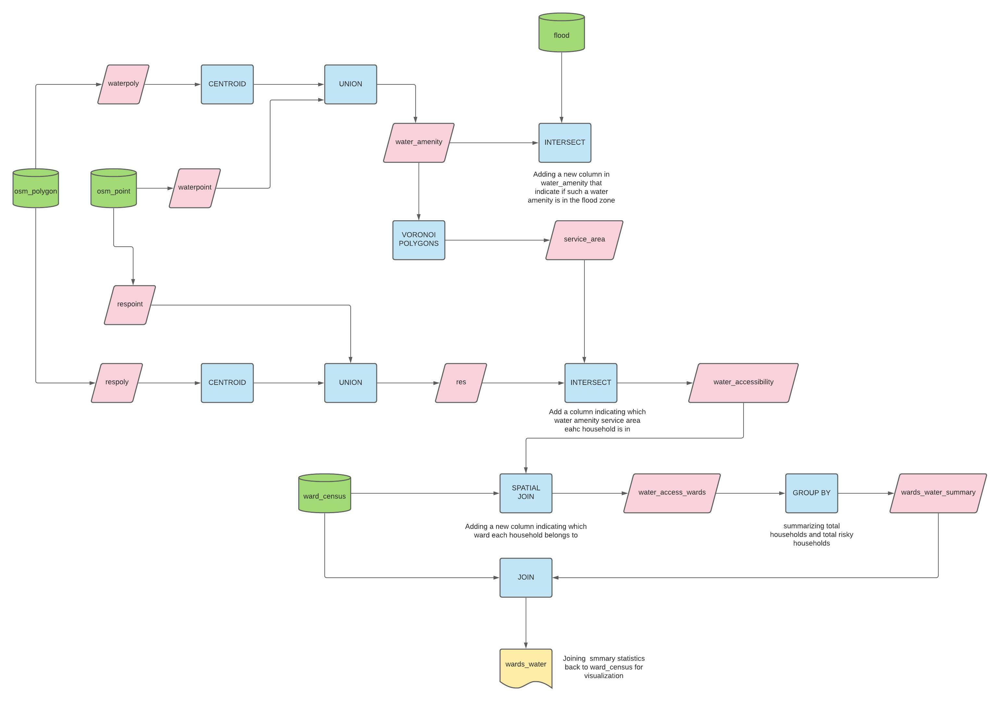
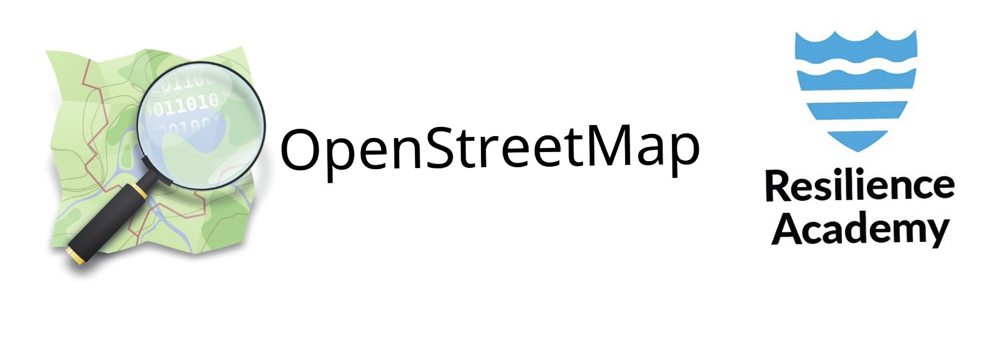
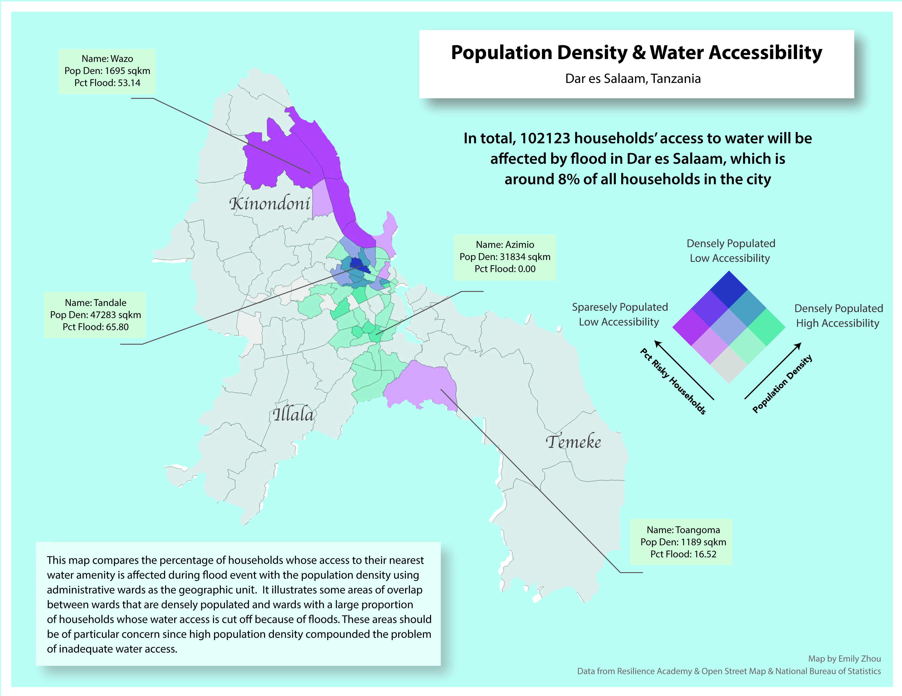
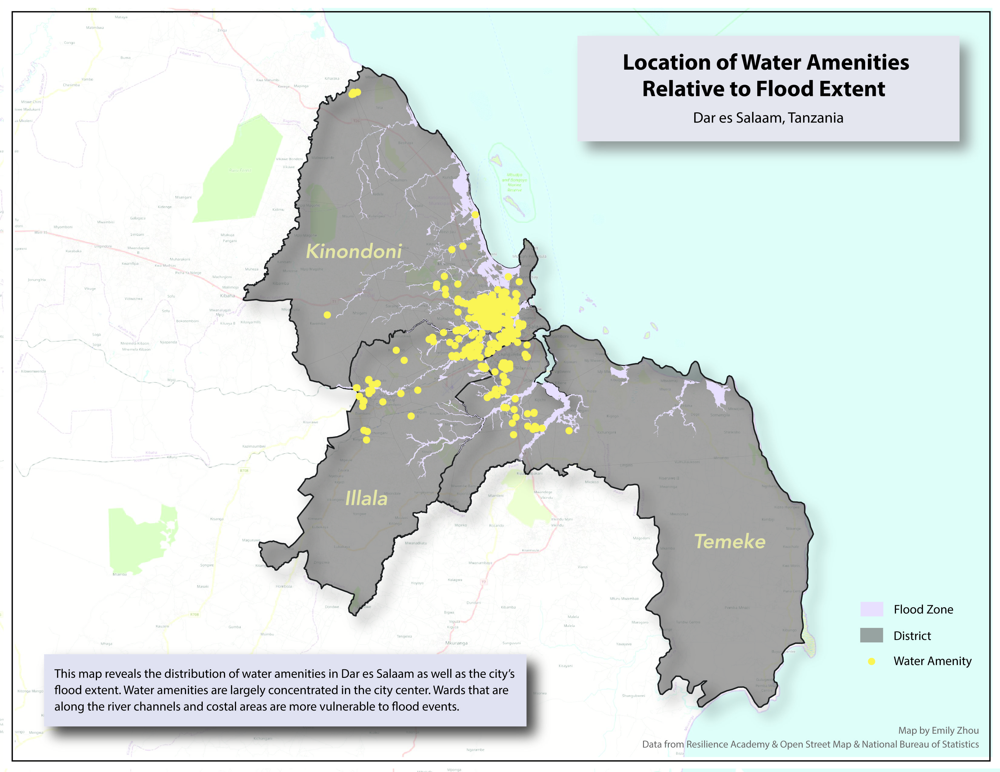

Emily Zhou, Middlebury College  

Version 1.0 | Created 2021-10-07 | Last Updated 2021-10-12  

## Abstract

Many developing countries are facing water accessibility crisis under climate change. Structural poverty, high population density, poor municipal infrastructure, and factors of many other kinds have been continuously compounding this problem. This analysis examines resilience and vulnerability to flood in the city of Dar es Salaam in terms of households’ access to water amenities. Using data from Resilience Academy and Open Street Map, the analysis demonstrates that significant number of households in Dar es Salaam do not have access to water during flood. It also illustrates how uneven population and water amenity distribution are the primary reason responsible for such vulnerability.

[](https://water.org/our-impact/where-we-work/tanzania/)

### Keywords

*Vulnerability and Resilience, Water Accessibility, Flood Hazard, Dar es Salaam*

### Important links

[Research Compendia](https://github.com/emilyzhou112/Dar-Es-Salaam-Resilience)  
[Water Amenity Accessibility Under Flood Scenario in Dar es Salaam](https://emilyzhou112.github.io/dsm_analysis/qgis2web_2021_10_10-16_18_22_680939/index-copy.html#11/-6.8081/39.2802)

## Introduction

Water is an essential resource for life, and whose adequate access is recognized as basic a human right under the [United Nations’ Sustainable Development Goal](https://www.unwater.org/water-facts/human-rights/). While water access is generally measured by the distance to a source of water, this concept overlooks important issues such as the reliability, quality, and quantity (Nganyanyuka et al.2014). In many developing countries, citizen’s access to reliable and safe water remains a challenge, and the reality gets more disheartening when the issue of water quality is considered. The city of Dar es Salaam in Tanzania manifests one of these water accessibility crises. A significant proportion of Dar es Salaam’s population has no adequate access to water supply because of old infrastructure and poor public services. This problem is compounded by the increase in population density and informal settlements. Concurrently, the city is vulnerable to natural hazards, especially flood, that contaminates the already fragile and unstable water supply system. Although solving this crisis in Dar es Salaam is a time-consuming and thorny process that requires efforts from multiple sources, it is always helpful to first identify the crisis and visualize its spatial patterns to allow for future planning, resource allocation, and resilience building. This leads to the guiding question of this analysis: What percentage of households in each administrative wards in Dar es Salaam have their access to the nearest water amenity affected during flood?


## Study design

We need the following spatial features of Dar es Salaam in order to answer the question above: the administrative wards, the area of flood extent, the location of water amenities and residential buildings.

Among those features, residential buildings are used as a proxy for population for the ease of calculating summary statistics. All types of public water sources, such as water wells and taps, are counted as water amenities. To assess which water amenities are affected during flood, we need to compare it with the flood extent and highlight those water amenities that are within the flood zone. We assume that people would always use the water amenity that are closest to them and that each water amenity has its own service area. If a particular water amenity is damaged during flood, then all households within its service area are considered to have their water access affected. As such, we then need to compare residential buildings with the service area of each water amenity to learn the total number of households located in particular service areas, whose water amenity would be affected by flood.

Representing water accessibility using administrative wards as the geographic unit better allows us to visualize the spatial pattern of water accessibility under flood. To do so, we further compare the residential buildings with wards to summarize the total number of households in each ward as well as households facing water accessibility crisis.

A full description of how each step is achieved can be found in the next section. You may find [this](dsm_workflow.pdf) workflow diagram helpful for understanding the study design.




## Materials and procedure

### Data and variables



The water amenity and residential data in this analysis were obtained from [Open Street Map, OSM](https://www.openstreetmap.org/#map=10/-6.8767/39.2287). OSM is an open-source public mapping effort aimed at creating accessible and accurate mapping data. Under the open-source framework, its data are contributed by various parties including individuals, research groups, and organizations. The contributors to the data used in this analysis are members of [Ramani Huria](https://ramanihuria.org/en/),a community-based mapping effort concerned about collecting flood data and building flood resilience in the city.

The administrative wards data and flood data were downloaded from [Resilience Academy](https://geonode.resilienceacademy.ac.tz/), a digital geospatial data repository with WMS raster and WFS feature services. It is also one of several projects created by Ramani Huria. The census data was collected and obtained from the [National Bureau of Statistics](https://data.humdata.org/dataset/population-by-ward-adm3), Tanzania.

### Data transformations

In this analysis, we use the Database Manager within QGIS to access data via the [PostgreSQL](https://www.postgresql.org/) database, a powerful open-source relational database with spatial extension [PostGIS](https://postgis.net/). The OSM data was downloaded and pushed into the database by Professor Joseph Holler. The flood extent and ward data were then loaded as layers in QGIS and added to the database.  Yet, there are a couple of additional data preparation works required before starting the analysis.

**Firstly**, we need to select, extract, and combine all the water amenities in Dar es Salaam to prepare for our water amenity data. In OSM, water amenities are labeled as “drinking water”, “water point”, “water well”, or “water tap” that are either under the category of “amenity” or “man made”. Make sure to include all of them using ORs in the WHERE clause. Since we are creating a new table, by default, PostGIS does not understand its type of geometry, we type cast it with *:: geometry(geometrytype, SRID)* to manually assign it to the correct coordinate reference system.

```sql
CREATE TABLE waterpoint AS
SELECT osm_id, st_transform(way,32737)::geometry(point,32737) as geom, name, amenity, man_made
FROM planet_osm_point
WHERE amenity ILIKE 'drinking_water'
OR amenity ILIKE 'water_point'
OR man_made ILIKE 'water_well'
OR man_made ILIKE 'water_tap';
```

The same process applies to any polygon features that qualify as water amenities. As contributors to OSM are not consistent upon the geometry they use to represent the same feature. We need to ensure that the analysis is inclusive of all water amenities.

```sql
CREATE TABLE waterpoly AS
SELECT osm_id, st_transform(way,32737)::geometry(polygon,32737) as geom, name, amenity, man_made
FROM planet_osm_polygon
WHERE amenity ILIKE 'drinking_water'
OR amenity ILIKE 'water_point'
OR man_made ILIKE 'water_well'
OR man_made ILIKE 'water_tap' ;
```

Having two separate tables with different geometries representing water amenities is not efficient for analysis, especially for comparing with other features. Hence, we convert water polygons into points using the centroids tool and subsequently union it with the point layer to create a composite point layer for water amenities.

```sql
CREATE TABLE water_amenity AS
SELECT osm_id, geom, name FROM waterpoint
UNION
SELECT osm_id, st_centroid(geom)::geometry(point,32737) as geom, name FROM waterpoly
```

**Secondly**, we need to select the residential buildings in Dar es Salaam. Residential buildings are defined here as any point or polygon that is NOT listed as an amenity and has a building tag of "yes" or "residential". We repeat the same process as we have done to water amenities here by first selecting and extracting all points and polygon in Dar es Salaam that are residential buildings.

```sql
CREATE TABLE respoint AS
SELECT osm_id,  st_transform(way,32737)::geometry(point,32737) as geom, building, amenity
FROM planet_osm_point
WHERE amenity IS NULL
AND (building ILIKE 'yes' OR building ILIKE 'residential')


CREATE TABLE respoly AS
SELECT osm_id,  st_transform(way,32737)::geometry(polygon,32737) as geom, building, amenity
FROM planet_osm_polygon
WHERE amenity IS NULL
AND (building ILIKE 'yes' OR building ILIKE 'residential')
```

Then, we convert residential building polygons into points and union it with the point layer to create a composite point layer representing all households.

```sql
CREATE TABLE res AS
SELECT osm_id, geom, building FROM respoint
UNION
SELECT osm_id, st_centroid(geom)::geometry(point,32737) as geom, building FROM respoly
```

**Thirdly**, the geometric complexity of the current flood zones will slow down the process for any vector overlay analysis we wish to conduct. Let’s divide the flood layer into smaller components to simplify the geometry.

```sql
CREATE TABLE flood_divide as
SELECT st_subdivide(geom, 20)::geometry(polygon, 32737) as geom, flood_leve
FROM flood
```

**Finally**, let’s join the ward with census data so that the ward table are also populated with information on population. We use a left join here because we want to keep all the wards.

```sql
CREATE TABLE ward_census AS
SELECT wards.*, total_both as totalpop, total_male as male, total_fema as female
FROM wards LEFT JOIN census
ON wards.ward_name = census.ward_name AND wards.district_n = census.dis_name;
```

### Analysis

The question of what percentage of households in each administrative wards in Dar es Salaam have their access to the nearest water amenity affected during flood can be broken down into several simpler sub-questions:

- Which water amenities are affected by flood?
- What is the service area for each water amenity?
- How many households are in service areas where the water amenity is affected by flood?
- How many households are there in each ward?
- How many households in each ward will be facing water accessibility crisis during flood?

In conjunction, answers from these questions will lead us to the final conclusion more easily. The **first question** is answered by comparing the water amenity table with the flood extent. By checking whether each water amenity intersect with the flood zone using the *st_intersect* function, we create a new boolean column that writes TRUE if that water amenity is within flood zone.

```sql
ALTER TABLE water_amenity
ADD COLUMN isflood boolean;

UPDATE water_amenity
SET isflood = TRUE
FROM flood_divide
WHERE st_intersect(water_amenity.geom, flood_divide.geom);
```

To better answer the **second question**, it is essential that we provide background information on “Voronoi Polygon”, a tool that we use to create service area. In GIS, voronoi polygon is a systematic way to divide spaces into a number of regions using a set of points. For each point there will be a corresponding region that consists of the points closer to that point than any other. This matches our expectation for service area. Yet, using voronoi polygon in PostGIS is tricky in the sense that the function takes a collection of geometry. That is to say, when feeding a table of point into *[st_voronoipolygons](https://postgis.net/docs/ST_VoronoiPolygons.html)*, we need to combine all the points into a multipoint using *[st_collect](https://postgis.net/docs/ST_Collect.html)*, a function that combine points without performing any spatial operations such as would happen with *[st_union](https://postgis.net/docs/ST_Union.html)*.

The voronoi polygon function also takes two additional inputs: tolerance and extend_to. We need to use the extent of the ward layer as the geometric extent for our polygons.
Since the output of this voronoi polygon function is a geometry collection of polygons. While our expectation is to have each service area to stand as individual features, we further wrap the entire function with another function, *[st_dump](https://postgis.net/docs/ST_Dump.html)*, that converts a multi-part feature to single-part feature. NOTE: make sure you wrap the  function with another bracket and add *“.geom”* outside the bracket to type cast geometries and to ensure it functions properly.

As we will be using the information of whether the water amenity in a particular service area is affected by flood, it is essential to include the name and flood status of each water amenity in this new service area table. Instead of having several tables, we make this process of creating voronoi polygons a subquery so that we could use the main query for selecting useful attributes from the water amenity table.

```sql
CREATE TABLE service_area AS
SELECT water.osm_id, water.name, water.isflood, vpoly.geom
FROM
    (SELECT (st_dump(st_voronoipolygons(st_collect(geom),0.0, (SELECT st_union(geom) FROM wards)))).geom::geometry(polygon,32737) AS geom FROM water_amenity) AS vpoly

JOIN water_amenity AS water
ON st_within(water.geom, vpoly.geom)
```
Now that we have the service area, we could simply answer the **third question** by intersecting all the residential buildings with the service area. This returns a new table containing columns that indicate which service area each building corresponding and if the water amenity in that service area is at risk.

```sql
CREATE TABLE water_accessibility AS
SELECT res.building, service_area.name, service_area.isflood, st_intersection(res.geom, service_area.geom)::geometry(point, 32737) AS geom
FROM res
LEFT JOIN service_area
ON st_intersects(res.geom, service_area.geom);
```

At this point, we could execute the following query to count the total number of households whose access to water is affected during flood.

```sql
SELECT count(isflood) AS totalflood
FROM water_accessibility
WHERE isflood IS NOT NULL
```

Shifting to the **last two questions**, we need know the ward that each household belong to. This could be done by intersecting residential buildings with wards. Using a left join, we keep all the residential buildings along with their flood status. Then, in this following new table, each residential building is paired up with a ward.

```sql
CREATE TABLE water_access_wards AS
SELECT ward_census.ward_name, water_accessibility.isflood, water_accessibility.building
FROM water_accessibility
LEFT JOIN ward_census
ON st_intersects(ward_census.utmgeom, water_accessibility.geom);
```
To get the total number of households in each ward, simply group it by wards and summarize by counting the total number of households and households facing water crisis.

```sql
CREATE TABLE wards_water_summary AS
SELECT ward_name, count(isflood) AS flood_houses, count(building) AS total_houses
FROM water_access_wards
GROUP BY ward_name;
```
As our analysis will be visualized using the ward_census layer, in this last step, we join what we have summarized in terms of total households and households facing water crisis back to our ward_census layer. With only 95 attributes, we could load this table into QGIS canvas and calculate the percentage of households in each administrative wards facing water accessibility crisis in FIELD CALCULATOR.

```sql
CREATE TABLE wards_water AS
SELECT ward_census.*, flood_houses, total_houses
FROM ward_census
LEFT JOIN wards_water_summary
ON ward_census.ward_name = wards_water_summary.ward_name;
```
NOTE: All SQL queries used for this analysis can be found [here](dsm_resilience.sql) for replication.

## Results



The results of the SQL queries above are visualized in a bivariate choropleth and dot map. In the choropleth map, population density of each ward is mapped against the percentage of households in each ward whose access to water amenity is affected during flood. The pinkish color scheme corresponds to water accessibility and the blueish color scheme corresponds to population density. The dot map provides us with an overview of the location of flood zones and water amenities in Dar es Salaam.


The impact of flood on water accessibility is uneven across space. Demographical and geographical characteristics inherent in each ward determine their vulnerability to flood hazard. The dot map reveals that coastal areas and wards along the river channels are more vulnerable to flood. The choropleth map reveals that wards with a large number of households facing flood-time water accessibility issue are mostly concentrated in northern Kinondoni and Illala districts whereas residents are densely populated in the city center. Likewise, water amenities are also unevenly distributed in Dar es Salaam: most are found in the city center.

A couple of wards are of particular interests in the choropleth map. For example, Tandale is one of the wards in Dar es Salaam where households’ water access is severely affected during flood: this ward is densely populated and as much as 65% of all households in Tandale will have their water access cut off during flood. Wazo exemplifies a costal ward where over 50% of households do not have access to clean water during flood, although it is less densely populated. Nevertheless, not all populated wards are equally vulnerable to flood: ward Azimio is located in the vicinity of river channel and is densely populated. Calculations show, however, that households’ water access in this ward are not affected by flood.

You may use the web map [here](https://emilyzhou112.github.io/dsm_analysis/qgis2web_2021_10_10-16_18_22_680939/index-copy.html#11/-6.8081/39.2802) to see data aggregated for each ward.  
You may download a copy of the maps above at [here](dsm_pdf1-01.pdf) and [here](dsm_pdf2.pdf).

## Discussion

A closer examination of the two maps provides us with more insights into the vulnerability of Dar es Salaam to natural hazards. **Firstly**, water amenity is unevenly distributed. This implies that Wazo and Tandale, for example, are vulnerable to flood in slightly different ways. In particular, Wazo is vulnerable because of insufficient water amenities. All households in this ward must rely on only a few water amenities, meaning that each water amenity has a large service area. If any of those water amenities is polluted by flood, a large number of households would be affected. Conversely, Tandale is vulnerable because it lies in the flood zone and water amenities are in close proximity to one another. As such, if water in one of those amenities is contaminated by flood water, it is likely that those in the vicinity would be equally contaminated, affecting thousands of households given its population density.

**Secondly**, population is also unevenly distributed, with wards in city center being much more densely populated. Even though water amenities are more often found in urban wards, it is unlikely that access to clean and safe water is ensured for all households even without the presence of flood. Consequently, the flood would only exacerbate existing problems.   

**Thirdly**, it is important to acknowledge here that results obtained from this analysis is only an underestimation of water accessibility vulnerability in Dar es Salaam. The water amenities queried from OSM in this analysis does not fully summarize water sources for households in Dar es Salaam. As piped water service is extremely unreliable and characterized by extensive rationing and low pressures, households rely on various sources of water. This includes drilling private deep wells, installing water pumps and reserve tanks, buying water from vendors, neighbors, and mosques, and even stealing and installing illegal pipes (Mapunda et al. 2018). Since OSM is an open- source platform, it is unfeasible for us to know whether private wells and reserve tanks are mapped, nor is it possible for us to conclude how water accessed from vendors, both legal and illegal, would be affected during flood. On top of that, Dar es Salaam is a rapidly growing city and the water sector is informal and unstable in many ways, meaning that the quality of our data is also not consistent over time.


## Conclusions

In conclusion, many of the urban poor in Africa face growing problems of severe flooding. Increased storm frequency and intensity related to climate change are exacerbated by such local factors as the growing occupation of floodplains, inadequate waste management, and high population density. The city of Dar es Salaam is an example of such kind.  Households are densely congregated in the city enter, some even on the flood plain. Water amenities are unevenly distributed and inadequate. Citizens acknowledge the lack of capacity of public water providers to provide adequate services and resort to informal and private efforts. *To increase Dar es Salaam’s resilience to flood hazard and ameliorate water accessibility crisis, there should greater emphasis on water amenities development and building robust disaster relief management plan: human settlements should be avoided on floodplain, flood storage should be incorporated into reservoirs, etc.*

## References

Mapunda, D. W., S. S. Chen, and C. Yu. 2018. The role of informal small-scale water supply system in resolving drinking water shortages in peri-urban Dar Es Salaam, Tanzania. Applied Geography 92:112–122. [https://linkinghub.elsevier.com/retrieve/pii/S014362281730752X](https://www.sciencedirect.com/science/article/abs/pii/S014362281730752X?via%3Dihub)

Nganyanyuka, K., J. Martinez, A. Wesselink, J. H. Lungo, and Y. Georgiadou. 2014. Accessing water services in Dar es Salaam: Are we counting what counts? Habitat International 44:358–366. [https://linkinghub.elsevier.com/retrieve/pii/S019739751400112X](https://www.sciencedirect.com/science/article/abs/pii/S019739751400112X?via%3Dihub)

Smiley, S. L. 2013. Complexities of water access in Dar es Salaam, Tanzania. Applied Geography 41:132–138. [https://linkinghub.elsevier.com/retrieve/pii/S0143622813000854](https://www.sciencedirect.com/science/article/pii/S0143622813000854?via%3Dihub)
