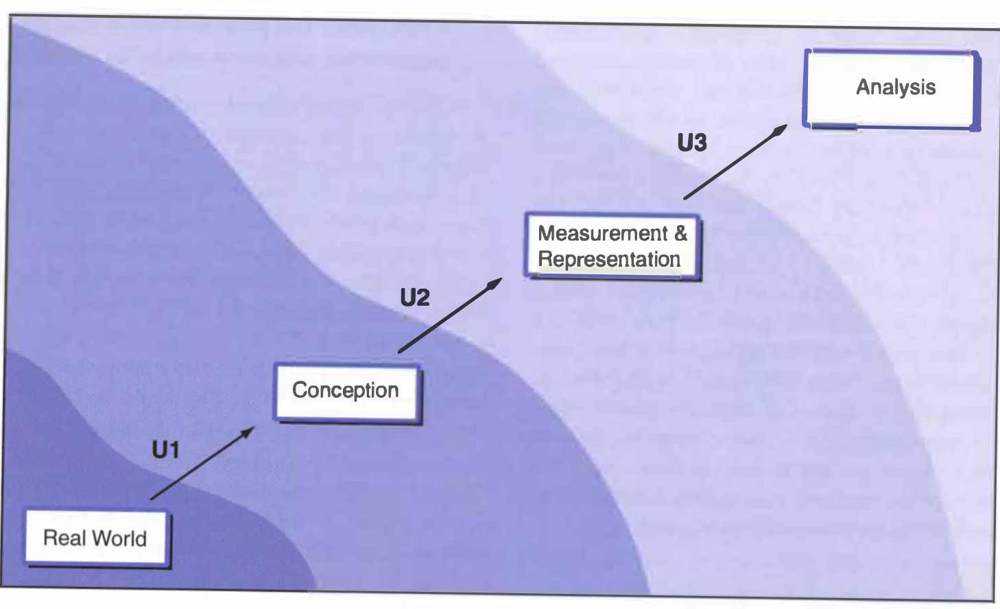
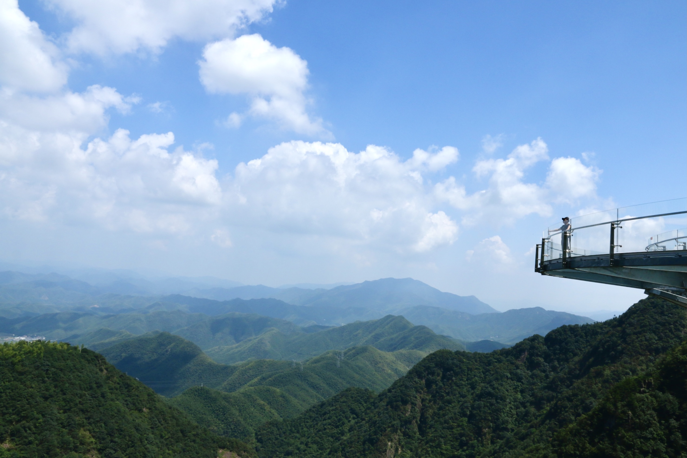

Impressive cartographic layouts, sophisticated GIS workflows, and carefully designed algorithms, all these components of geographic research that we encountered before have been subtly creating the illusion that geographic representations are reliable and accurate for spatial analysis is able to perfectly capture our world. Yet, over-idealizing the importance of geographic research in contributing to our knowledge of the world is dangerous as this belies the errors and uncertainty that are inherent in spatial analysis of any kind, no matter how sophisticated and intricate the tools we use are.

As pointed out by Longley et.al, one of the biggest ironies in contemporary GIS is that “as we accrue more and better data and have more computational power at our disposal, we become more uncertain about the quality of our digital representation”. Indeed, recalling the type of GIS analysis that we have done in GEOG120, the exercise that require us to analyze flood hazard vulnerability in southern Vermont’s mobile home manifests how using data from multiple sources could generate great discrepancy between results, hence leading to uncertainties. As we chose mobile home data between that of collected from American Community Survey (ACS) and e911 point data to represent their distribution and flood data from Vermont River Corridors program and Federal Emergency Management Association (FEMA) to indicate flood zones, we notice that different data would define “flood zones” differently. To elaborate, FEMA identifies substantially more flood zones in low-lying areas while River Corridor identifies more flood zones in mountainous zones. On top of that, we also realize that different approach we to solve the problem returns different result. In particular, to use ACS data requires re-aggregating the data to fit into the flood zones, which systematically underestimate flood risk whereas using e911 point data better captures the location of mobile homes.

Uncertainty arises in multiple stages of a geographic research. In the example above, they arise when we are trying to define the boundary of the flood zone as well as when we are deciding whether to use aggregated or point data. Longley et.al has attributed the principal sources of uncertainty to three different stages in research (see figure above). As you move from an observation in the real world to analysis in the lab, uncertainties arise in the conception, measurement, and analysis phase. Essentially, Longley et.al argues that the way in which we conceive of a geographic phenomenon very much prescribes the way in which we are likely to set about measuring the representing it and the measurement procedure conditioned the ways in which it may be analyzed within GIS. Eventually, the effect of one phase layers on one another, distorting the representation of the real world.

In the context of geographic research, uncertainty arises in the conception phase in part due to the difficulties for GIS to present a value-neutral view of the world given that many objects are assigned different labels by different national or cultural groups. As such, it is reasonable that different organizations would produce different flood layers. Uncertainties in the measurement phase include choosing the right model (vector & raster) to store data. Since different data models impose quite different filters on reality, it is unsurprising they can each generation additional uncertainty in different ways to different degrees. In the analysis phase, uncertainties come along with aggregating and summarizing data. Using are-weighted re-aggregation is an example of such kind. Likewise, when applying the random points inside polygon algorithm to create a dot density map of population for each census tract, we are generalizing and summarizing the exact location of each point data in the census tract by replacing them with a random point.  

As stated by Longley et.al. the inherent complexity and detail of our world makes it virtually impossible to capture every single facet. Accordingly, since we cannot completely eliminate uncertainty, the best we could do as geographers is to live with it and ameliorate its effect on our overall result. In other words, it is essential that we take a positive approach towards uncertainty, acknowledging its prevalence while minimizing its impact, rather than denying its existence. To achieve this in the conception phase, we seek for reconciliation between different perceptions that is applicable to a larger scale. To achieve this in the measurement and analysis phase, we should be more critical with our data. Data, regardless of it being primary or secondary, should never be taken as truth. It is necessary to assemble what is known about the quality of the data and use this to assess whether the data are fit for use. That is also to say, geographic data and research are required to stay transparent for assessment and evaluation so that errors could be addressed, and uncertainties be examined, avoiding problems to accumulate when data and research methods are reused. Alternatively, we could rely on multiple sources of data to approach a problem.

===

*Longley, P. A., M. F. Goodchild, D. J. Maguire, and D. W. Rhind. 2008. Geographical information systems and science 2nd ed. Chichester: Wiley. (only chapter 6: Uncertainty, pages 127-153)*

===

*Anji, Zhejiang, China (08/31/20)*

> Different individuals see the world in different ways and no single view is likely to be accepted universally as the best.
