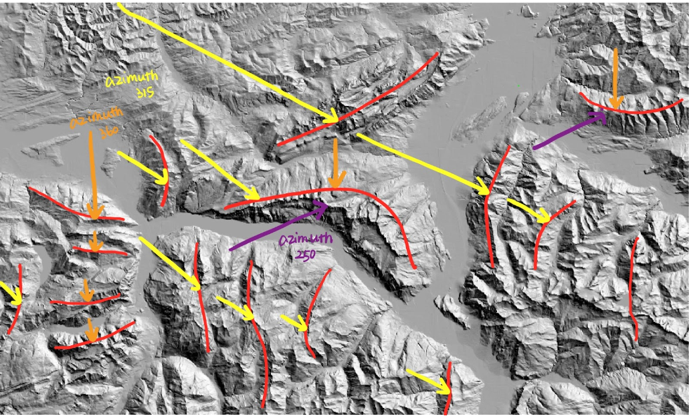
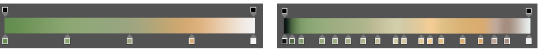

## Introduction
The process of designing an effective terrain map consists of making a series of important decisions based on the elevation, topographic features, and land cover of the area we are mapping. This visual study compares how different decisions made at each stage of the design could lead to different visual outcomes of the mapped geography, using Churfirsten in Switzerland as an example. The goal is to understand how a compelling terrain map is contingent upon choosing the appropriate light source, blending mode, color palette, and more as well as to experiment with making/comparing terrain maps controlling for these factors.

You may click [here](231assets/proj3.jpg) to see this map in better resolution

## Hillshade and Light Sources
The first decision to make when designing terrain maps is to determine the light sources and subsequently generate hillshade layers based on that. A good light source is important as it allows us to identify the large landforms at first sight and still easily discern important small details. Plate 1 and 2 compares hillshades of Churfirsten under different directions and altitudes of sunlight.

Plate 1 consists of two hillshade layers that each have an azimuth angle of 45 degrees and 315 degrees, both with an altitude angle above the horizon of 40 degrees. The initial rationale behind adding a light source (45 degrees azimuth angle) is that while the default only illuminates the northwestern side of a ridge, leaving the other side in shadow, the added light source could complement this drawback by illuminating the northeastern side. However, doing so does not fully account for the complexity of the mountainous landscape as the ridges are not always vertically oriented. Plate 1 shows some interesting details, but the larger landforms are not very discernable: the landscape looks flat as several illuminated and the shaded sides of a mountain share the same shades of gray, which reduces the differences in elevation. In particular, the hill at the upper left corner looks flat, and the northern façade of the middle horizontal ridge, where all the lights concentrate, becomes so bright that the light masks any topographic features.

Attempting to fix these problems. I adjust the azimuth and increase the altitude of sunlight so that plate 2 consists of three hillshade layers that each has an azimuthal angle of 250 degrees, 315 degrees, and 360 degrees, all with an altitude angle above the horizon of 50 degrees. Figure 1 briefly illustrates the rationale behind choosing the light sources, which is to ensure that the azimuths of sunlight are perpendicular to the orientation of the ridge. Compared to plate 1, plate 2 better shows variation in elevation as the illuminated and shaded sides become stronger and more evident. For example, the topography of the major horizontal ridge becomes more discernible as the 360-degree azimuth illuminates the northern façade while the 250-degree azimuth sheds light on the inner southern façade, rendering it with more texture. In addition, increasing the altitude of the sunlight also enhances the contrast, especially in lower elevations. The terrain of the hills at the upper left corner is more discernible since shadows are applied. Similarly, it is easier in plate 2 to differentiate the valley floor from the ridges.

*Figure 1: Rationale behind choosing light sources for plate 2*

The main takeaway here is that there is not a standardized formula for the best angle of sunlight: when representing a three-dimensional landscape on a two-dimensional flat surface, there will be aspects where the mapped geography deviates from the actual geography. However, the comparison above shows that a good approach is to supply sunlight based on the orientation of the ridges, rather than based on where lights are missing since when light sources are complementary to each other, it is difficult to reveal the contrast.

## Stylizing Hypsometric Tints

The second most important step is to apply a suitable hypsometric tint to the hillshade. While a good choice of color gradient could make the mapped terrain as natural as possible, a poorly stylized one might undermine the contrast and complexity in elevations established by the hillshade and even emphasize or deemphasize certain ridges, leading to confusion. Plate 3 and 4 compares how Churfirsten looks with hypsometric tint before and after further stylization of the mapped geography. The [color ramp](https://gis.stackexchange.com/questions/25099/choosing-colour-ramp-to-use-for-elevation) used here is adapted from a good example online and is seen on many standard terrain maps.

Plate 3 separates the color into five equal intervals and applies it directly above the hillshade, without further edits. There are two major problems associated with plate 3. Firstly, the map creates an illusion that Churfirsten is flooding. Despite having five colors, the map only shows two colors: green and brown. Secondly, it undermines the variation in elevation: the darker green completely masks the topography in the valley and the greenish shadow deteriorates the illuminations and shadows of the mountain ridges in the hillshade.

Plate 4 attempts to fix these problems by inverting the DEM to create an elevation mask that could highlight the lower elevations, modifying the color ramp, and enhancing the shadows. Compared to plate 3, we could see the following differences. The added elevation helps to differentiate the valley floor from the mountain ridges to avoid “flooding”, though still, some people might misinterpret the geography by considering there to be a small stream in the valley. Figure 2 compares the color ramp used in plate 3 and plate 4, from which we could see how adding more stops in the color ramp allows us to see more contrast in topography as the elevation increases. Meanwhile, adding shadows on the shaded side of the ridge offset the greenish shade from the hypsometric tint and ensures that the contrast still sharpens towards the highest peaks and softens towards the lowlands.

*Figure 2: Comparison of color ramp for plate 3 (left) and plate 4 (right)*

The main takeaway here is that simply applying hypsometric tints to the hillshade does not mean that we are closer to the more realistic representation of our mapped geography. It is important to stylize the color ramp so that it fits the context. In the case of Churfirsten, using the DEM as an elevation mask as adding more stops on the color ramp are good approaches to enhance the contrast in elevation, making landforms more evident. This also suggests a drawback of simply using hillshade to represent the terrain: from the hillshade, we are unable to see what is at the lower elevation as the shading diminishes (Is there a stream or simply valley floor?) but the hypsometric tints can achieve that.  

## Unconventional Tinting
In addition to the conventional color ramps seen on most atlas and publications, there is a wide variety of terrain map that uses unconventional hypsometric tints. The type of color ramp usually depends on the map’s target audience, mapped geography, and purposes. A wise choice of the color ramp could make the map unique, attractive, and better serve its purpose. A bad choice, on the other hand, could make the map distracting and lead to confusion.

Plate 5 and plate 6 each use an unconventional hypsometric tint adopted from a good example seen online, and there are both strengths and weaknesses associated with the two palettes. [Plate 5](https://www.pinterest.com/pin/65161525834191589/) uses a palette from a vintage terrain map, which focuses on using dark green, yellow, and brown to represent rising elevation. The strength of this palette is that it offers the audience a refreshing experience when looking at terrains by creating a sense of antiquity. The weakness, however, is that people associate color not only with elevation but also with land cover. While they easily associate the green with vegetation on the low land, they might associate the dark yellow at a higher elevation with desolated, sandy, and brownish rocks.

[Plate 6](http://www.reliefshading.com/examples/walensee/) is inspired by Eduard Imhof's Walensee map. Unlike other conventional terrain maps, Imhof created the map in 1938 based on his “free artistic interpretation of visual impression gained during long walks through the mountains”. Since parts of our mapped geography match with Imhof’s, I tried to replicate the color palette that Imhof used. Though the replication is far less delicate and accurate than Imhof’s hand-drawn version, this color combination is indeed attractive: during the crit, most people have found this plate to be the catchiest. In addition, the use of cyan in the valley among the surrounding light blue could reduce the impression of a flooding valley. Nevertheless, people might still associate blue with water features or even glaciers and reddish brown with arid landscapes. It is therefore likely that this map would confuse the audience in terms of Churfirsten’s actual landscape.

The main takeaway here is that using unconventional hypsometric tint provides the designer with the freedom to bring the landscape to the audience and create a refreshing map viewing experience for them. Yet, doing so risks the consequence that the audience would associate color with specific topography not intended for this map. Therefore, the unconventional hypsometric tint should be applied based on one’s knowledge and experience with the landscape, considering the map audience and purpose.
