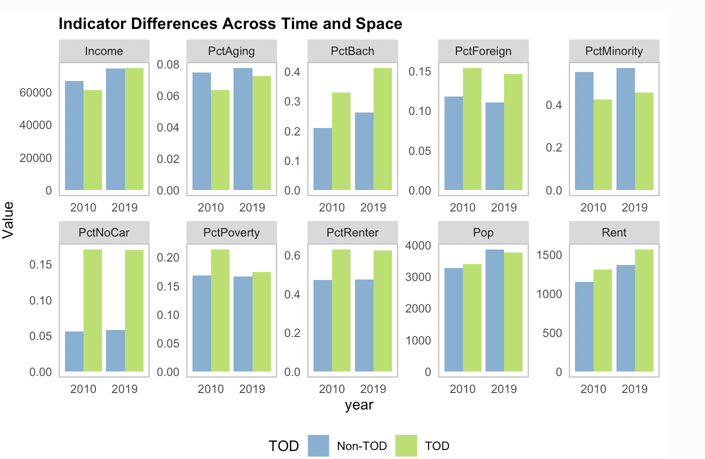

# GIS for Planning and Policy Making

### [Transit Oriented Development in Boston](musa-reports/01-Boston-TOD.html)

This project examines the effects of transit-oriented development (TOD) in Boston, focusing on how it shapes neighborhood demographics, social, and economic trends over time. By analyzing transit stop locations and comparing TOD with non-TOD areas, the report explores who lives near transit, whether residents pay a premium for proximity, and how planners can strategically develop transit-rich neighborhoods. The goal is to inform zoning and development strategies that support sustainable, transit-focused urban growth.

  

