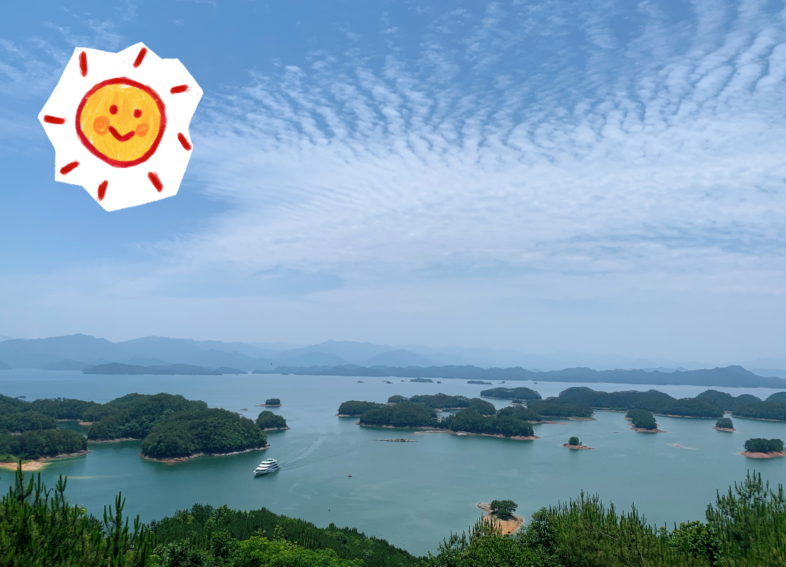

# Emily's World of Geography

My academic and research work mainly focus on using geographic information system, spatial data science, and cartographic design to study urban resource accessibility, natural hazard vulnerability and preparedness, as well as environmentally sustainable development. 

*Qiandao Lake, Chun'an, China*

## GIS for Public Policy
- [Transit Oriented Development in Boston](musa-reports/01-Boston-TOD.html)
- [Philadelphia Home Price Prediction with Geospatial Machine Learning](musa-reports/02-Philly-ML.html)
- [Geospatial Risk Prediction of Robbery Incients in Chicago](musa-reports/03-Chicago-Risks.html)
- [Targeting Housing Subsidy with People-Based Machine Learning](musa-reports/04-Housing-Subsidy.html)

## Open Source GIScience Analyses
I have expanded my experience in geospatial analysis through learning advanced spatial statistics and reproducing studies using open source geospatial software. In Fall 2021, I reproduced three health and hazards spatial analysis studies using open source R or Python code and completed a reproducible study on urban resource accessibility using Postgre SQL.

- [Water Amenity Access and Flood Hazard Vulnerability in Dar es Salaam, Tanzania](dsm_analysis/dsm_report.md)
- [Reproduction of COVID-19 Healthcare Resources Spatial Accessibility in Chicago, Illinois](RPr-Kang/re-analysis.md)
- [Replication of Twitter Data Analysis for Natural Hazards](RE-Ida/ida.md)
- [Reproduction and Replication Analysis of Academic Information Patterns under COVID-19](covidpattern/report.md)

## New England Planning with Mock Mapping Charrettes
In Winter 2021, I worked with Middlebury alumni [Ben Meader](https://www.linkedin.com/in/benjamin-meader-5ba6923a), current director of Rhumb Line Maps to practice solving real planning issues in New England. I created a series of maps and visual studies on public transport access, habitat conservation, and residential development, etc. and presented in 4 mock stakeholder meetings.

- [Accessibility and Agency in Cambridge and Somerville, Massachusetts](1026reports/week1.md)
- [Conservation and Ecology in Coastal Maine](1026reports/week2.md)
- [Sustainable Development in Chittenden County, Vermont](1026reports/week3.md)
- [Law and Social Justice in Boston, Massachusetts](1026reports/week4.md)
- [Flood Hazard Vulnerability in Southern Vermont](120reports/exam2.md)

## Cartography and Architectural Studies
I honed my skills in design through studying architecture with Middlebury alumni [Alix Pauchet](https://www.linkedin.com/in/alix-pauchet-b0591367) in Winter 2021 and cartography with Professor [Jeff Howarth](https://jeffhowarth.github.io/) in Spring 2021. 

- [A Journey of Cherry Blossom Through Time](gg231reports/proj2.md)
- [Where the Water Goes in Vermont](gg231reports/proj1.md)
- [Comparative Visual Study of Shaded Relief in Churfirsten Switzerland](gg231reports/proj3.md)
- [Building Portraits of Richardson Place, Burlington, Vermont](buildingportraits)

## Data Visualization Projects
I also applied my interest and expertise in spatial data analysis and visualization to various project works in Geography, Computer Science, and Math that cover topics ranging from public health, geopolitics, generative art, and more!

- [The Sino-Myanmar Border Conflict](https://storymaps.arcgis.com/stories/672602e5a37b4643a121110efa7d855a)
- [Spatial Variations of Health Conditions in the USA](assets/ds_pre.pdf)
- [Interactive COVID-19 Dashboard with JavaScript D3](https://observablehq.com/d/b0fdbacaccbc7f7c)
- [Sketchbook for Generative Art with JavaScript P5](https://csci467-s23.github.io/sketchbook-emilyzhou112/)

---

## GIS Research on Reproducibility and Replicability in Geographical Science
In summer 2022, I worked as a GIS research assistant for Middlebury College professor [Joseph Holler](https://www.middlebury.edu/college/people/joseph-holler) and ASU Professor [Peter Kedron](https://search.asu.edu/profile/3316903) to reproduce spatial health geography papers. In the past two years, we have: 
- Hosted [workshop](https://github.com/HEGSRR/UCGIS-Workshop) at [UCGIS 2022](https://www.ucgis.org/workshops-2022#HEGS) in Syracus, NY
- Completed reseach compendium on [reproducing](https://osf.io/s5mtq/) and [replicating](https://osf.io/5tzy9/) Chakraborty 2021
- Hosted [sessions](https://github.com/HEGSRR/CP-AAG-2023) at [AAG 2023](https://aag.secure-platform.com/aag2023/solicitations/39/sessiongallery/5681) in Denver, CO
- Presented at Middlebury College's Spring 2023 Student [Symposium](assets/sym-poster-final-emily.pdf) 

## Remote Sensing Research on Congo Basin Forest Change
Since Spring 2022, I have worked with Middlebury College Professor Niwaeli Kimambo and Phd candidate Sarah Tolbert at University of Wisconsin Madison on managing spatial database that record study sites and metadata of included journals in comparing the drivers of deforestation versus degradation.

This is an ongoing work. Final results will be shared soon, but for now you can view the project layers [here](https://drive.google.com/drive/folders/1-Omn3vSY2g0Sdce00yJmtXgxZcyknD6v?usp=sharing).

## Reflections on Geospatial Research
- [What is Open Source GIScience?](open-giscience)
- [GIS: Science or Tool?](science_tool)
- [Reproducibility and Replicability in Geography](r_r)
- [Error and Uncertainty in GIS](error_uncertainty)
- [Learning Spatial Analysis in CyberGIS Environment](cybergis)
- [Uncertainty Analysis in Vulnerability Research](vulnerability)
- [Applications, Limitations, and Ethical Issues in VGI](vgi)
- [Social Inequities under Public Health Crisis](covid_disability)
