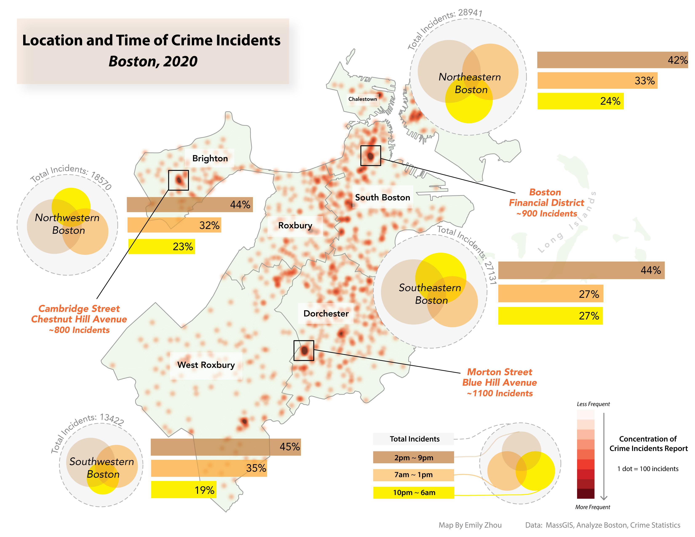

<!-- This is a comment to prevent the first line from being interpreted as a title -->

### Philadelphia's Urban Landscape Evolution - 200 Years of Change

### [Building Portraits of Richardson Place, Burlington, Vermont](../cart/1240assets/buildingportraits.md)

The project examines the historical and architectural significance of the Richardson Place building in Burlington’s Church Street Marketplace. Constructed in 1895 and later transformed into Abernethy’s Department Store, the building underwent a major renovation in 1983, restoring its original features. This project explores the building’s role within Burlington's urban core, highlighting its structural details, spatial planning, and architectural style. Through historical maps, site plans, and elevation drawings, the analysis underscores Richardson Place's ongoing importance as a landmark and its integration into the evolving urban landscape.

<table align="center" width="100%" cellpadding="0" cellspacing="0">
    <tr>
        <td></td>
        <td></td>
    </tr>
</table>

### [Accessibility and Agency in Cambridge and Somerville, Massachusetts](../cart/1026reports/week1.md)

This mapping exercise explores the impact of transportation on community agency in Massachusetts, highlighting how individuals' ability to choose their living situations is influenced by cultural, political, and personal factors. The visuals created aim to show how transportation infrastructure can better support or limit agency for different community members.

<table align="center" width="100%" cellpadding="0" cellspacing="0">
    <tr>
        <td></td>
        <td></td>
    </tr>
</table>

### [Conservation and Ecology in Coastal Maine](../cart/1026reports/week2.md)

This mapping exercise focuses on identifying ecological assets in coastal Maine watersheds, aiming to inform the public and support land trusts in prioritizing areas for conservation. Using QGIS tools, visualizations were created to help community members understand which watersheds should be targeted for future conservation efforts, balancing the interests of development and environmental preservation.

<table align="center" width="100%" cellpadding="0" cellspacing="0">
    <tr>
        <td></td>
        <td></td>
    </tr>
</table>

### [Sustainable Development in Chittenden County, Vermont](../cart/1026reports/week3.md)

This mapping exercise explores the relationship between land cover, land use, and development potential in Chittenden County, Vermont, focusing on identifying suitable areas for solar power development. Two visualizations were created to help a hypothetical development company assess the best locations for solar projects, highlighting how land value and zoning regulations influence local land use decisions.

<table align="center" width="100%" cellpadding="0" cellspacing="0">
    <tr>
        <td></td>
        <td></td>
    </tr>
</table>

### [Law and Social Justice in Boston, Massachusetts](../cart/1026reports/week4.md)

This mapping exercise examines police incident reports and arrest statistics in Boston from 2016-2020, with a focus on 2020 arrests. Using available datasets, three visualizations were created to explore patterns in reported crime and law enforcement. The goal is to highlight how data may reveal underlying trends in justice or injustice, even if the datasets themselves are influenced by systemic biases. 

<table align="center" width="100%" cellpadding="0" cellspacing="0">
    <tr>
        <td></td>
        <td></td>
    </tr>
</table>

### [Flood Hazard Vulnerability in Southern Vermont](../cart/120reports/exam2.md)

This project assesses the vulnerability of mobile homes to flood risk in four Vermont counties using three different approaches. It compares FEMA flood zones and Vermont River Program data to understand how flood risks, including fluvial erosion, are represented. The analysis highlights the uncertainty in flood risk assessments and aims to improve understanding of natural hazard management in the context of housing vulnerability.

<table align="center" width="100%" cellpadding="0" cellspacing="0">
    <tr>
        <td></td>
        <td></td>
    </tr>
</table>

### [A Journey of Cherry Blossom Through Time](../cart/gg231reports/proj2.md)

This map visualizes the blooming of cherry trees across Japan, from Kyushu to Hokkaido, between mid-March and late April, aimed at helping tourists plan their trips. Inspired by personal experiences, the design features a simple layout for easy navigation and includes cultural elements, like decorative petals and symbols, to enhance engagement. The map also proposes improvements, such as using proper projections and adding narratives, potentially narrated by a symbolic anime character, to enrich the experience for tourists.

   

### [Where the Water Goes in Vermont](../cart/gg231reports/proj1.md)

This map is designed to teach primary school children in Vermont about the flow of water and its connections to both natural and man-made features. It helps them understand how water moves through rivers, lakes, and human infrastructure like reservoirs and treatment plants. The design draws inspiration from vintage maps, Japanese woodblock prints, and treasure maps to create a fun and educational experience. Visual hierarchy is used to emphasize larger water features, and simple symbols make it easy for kids to understand. The map is intended as a printed leaflet with playful marginalia to engage young learners.

   

### [Comparative Visual Study of Shaded Relief in Churfirsten Switzerland](../cart/gg231reports/proj3.md)

This visual study explores the impact of design choices on creating an effective terrain map, using Churfirsten in Switzerland as a case study. The process involves analyzing how various factors—such as light source, blending modes, and color palettes—affect the visual outcome of the map. By controlling these elements, the study aims to understand how different decisions influence the representation of elevation, topography, and land cover. The goal is to experiment with these design variables to produce compelling and informative terrain maps.

   

