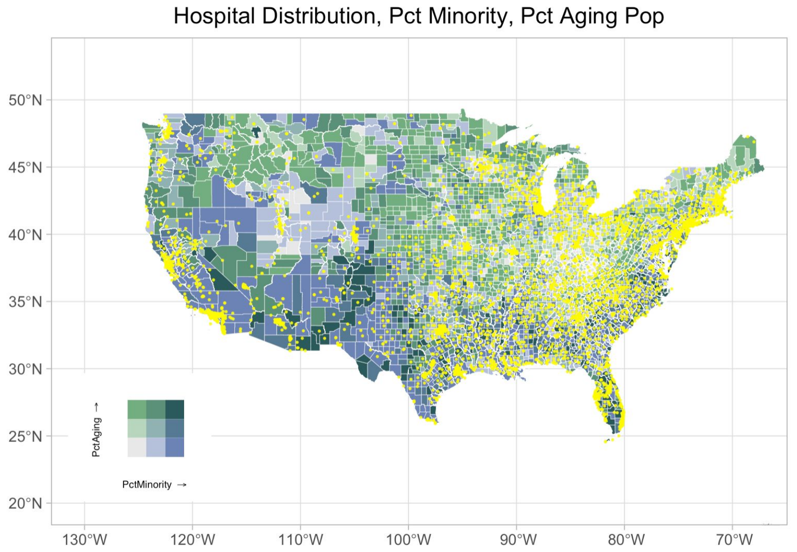
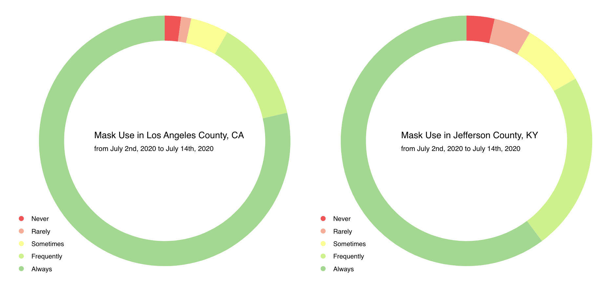
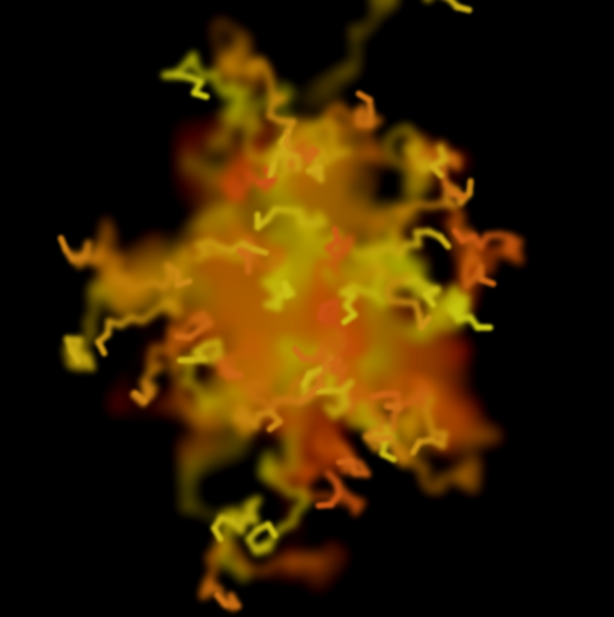
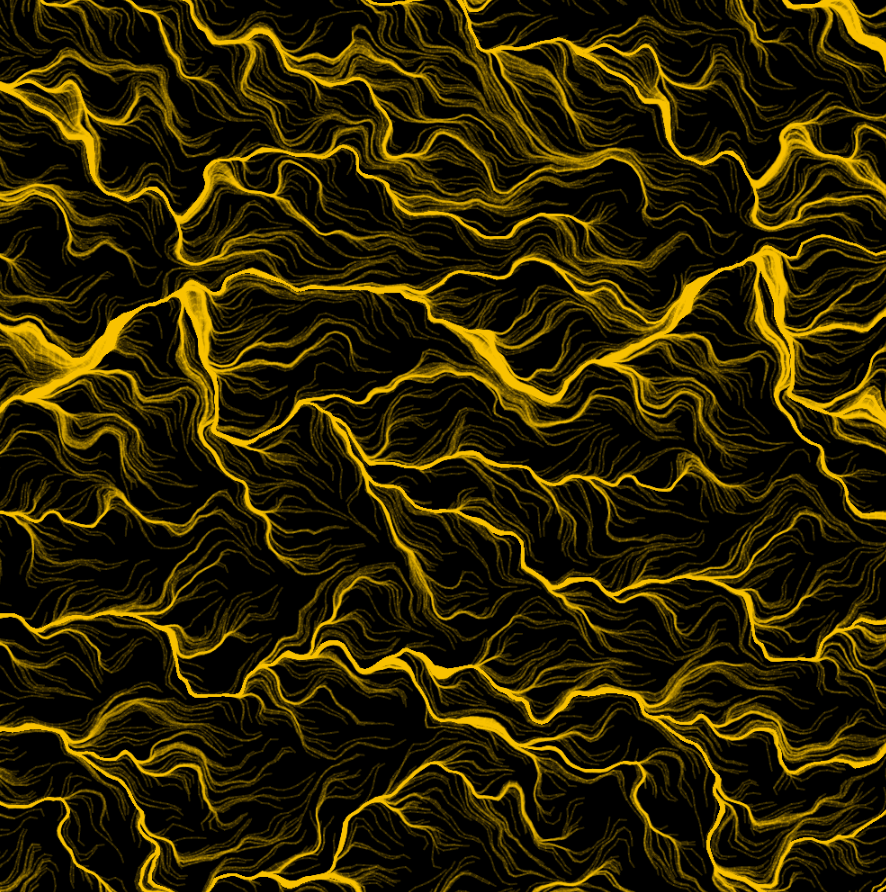
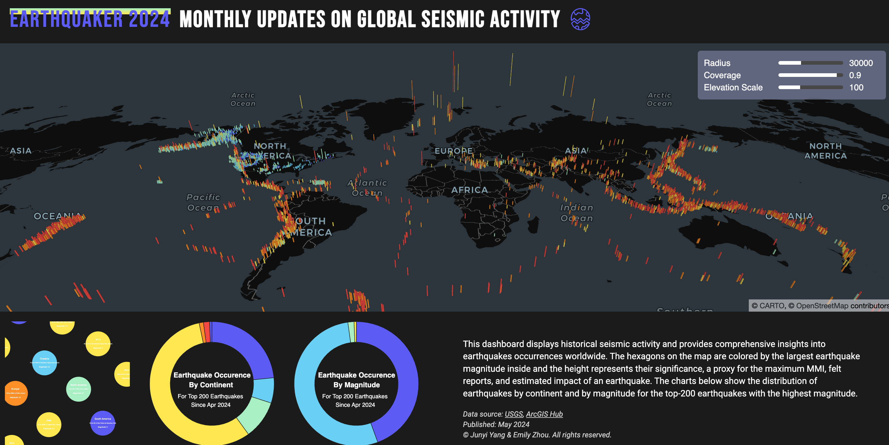

<!-- This is a comment to prevent the first line from being interpreted as a title -->

## [Spatial Variations of Health Conditions in the USA](../assets/ds_pre.pdf)

This project explores spatial variations in health conditions across the USA, particularly examining how personal, environmental, and structural factors impact health outcomes. It utilizes datasets on demographics, health variables, and hospital accessibility to identify vulnerable regions, such as the Rust Belt and Southeast. We applied linear regression and Geographically Weighted Regression (GWR) to account for spatial autocorrelation, highlighting disparities in hospital bed distribution and healthcare access, especially among minority populations. The project concludes with suggestions for future analyses, including refining models and incorporating additional variables like income.

   

## [Interactive COVID-19 Dashboard with JavaScript D3](https://observablehq.com/d/b0fdbacaccbc7f7c)

This project presents a series of interactive visualizations depicting COVID-19 data in the U.S. from 2020 to 2022. Key features include a line graph showing national cases, a scatter plot comparing state-level cases and deaths against population density and income, an interactive county-level map, and a static doughnut chart comparing mask usage in two counties. The visualizations combine data from the New York Times, SocialExplorer, and the U.S. Census, providing insights into COVID-19 trends across different geographic and socioeconomic scales.

   

## [Sketchbook for Generative Art with JavaScript P5](https://csci467-s23.github.io/sketchbook-emilyzhou112/)

This page hosted all the generative art project created with the p5.js library. Through creative coding, I tried to explore algorithmic patterns and dynamic visuals, producing interactive and abstract artworks. Each piece is designed to showcase the balance between randomness and control, with intricate visual outputs determined by mathematical functions

<table align="center" width="100%" cellpadding="0" cellspacing="0">
    <tr>
        <td></td>
        <td></td>
    </tr>
</table>

## [A Cloud-Based Interactive Dashboard of Global Seismic Activities](https://junyi2022.github.io/earthquaker/)

The EarthQuaker Dashboard visualizes global seismic activity using earthquake data from the USGS and continent data from ArcGIS. Hosted on Google Cloud, it automates data extraction and updates every 30 days, storing the top 200 land-based earthquakes by magnitude since April 2024. The frontend, built with D3.js and Deck GL, lets users explore earthquake hotspots and clusters. Hexagons represent magnitude and significance, offering insights into earthquake distributions by continent and magnitude.

   

