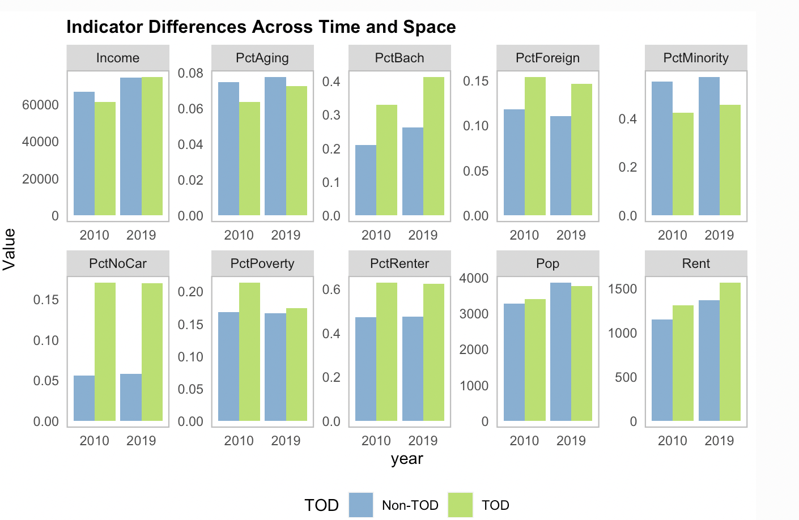

## [Transit Oriented Development in Boston](musa-reports/01-Boston-TOD.html)

This project examines the effects of transit-oriented development (TOD) in Boston, focusing on how it shapes neighborhood demographics, social, and economic trends over time. By analyzing transit stop locations and comparing TOD with non-TOD areas, the report explores who lives near transit, whether residents pay a premium for proximity, and how planners can strategically develop transit-rich neighborhoods. The goal is to inform zoning and development strategies that support sustainable, transit-focused urban growth.

  

## [Philadelphia Home Price Prediction with Geospatial Machine Learning](musa-reports/02-Philly-ML.html)

This project uses Ordinary Least Squares (OLS) regression to predict property values in Philadelphia by analyzing property characteristics and spatial data from sources like PHILA.GOV and OpenDataPhilly. The model tests for spatial autocorrelation and compares results with and without spatial features. While it captures much of the variation in home prices, the linear approach under-predicts values in lower-income, minority neighborhoods, revealing the limitations of OLS in accounting for the city's social and historical complexities. These inaccuracies underscore the need for more nuanced models to avoid reinforcing biases and inequities in housing market predictions.

