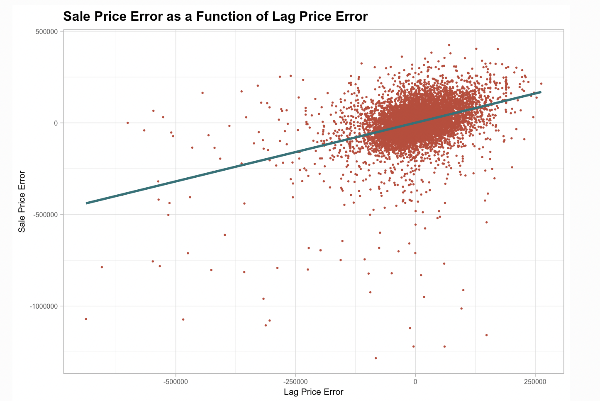
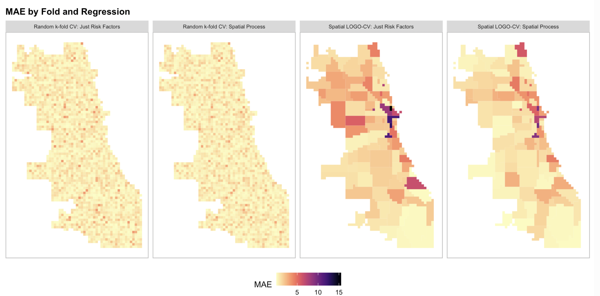
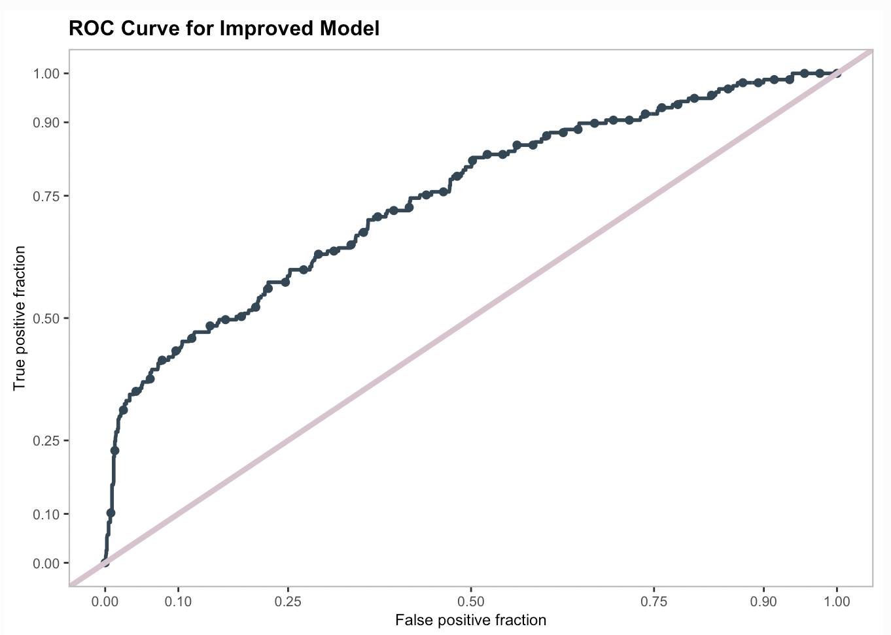
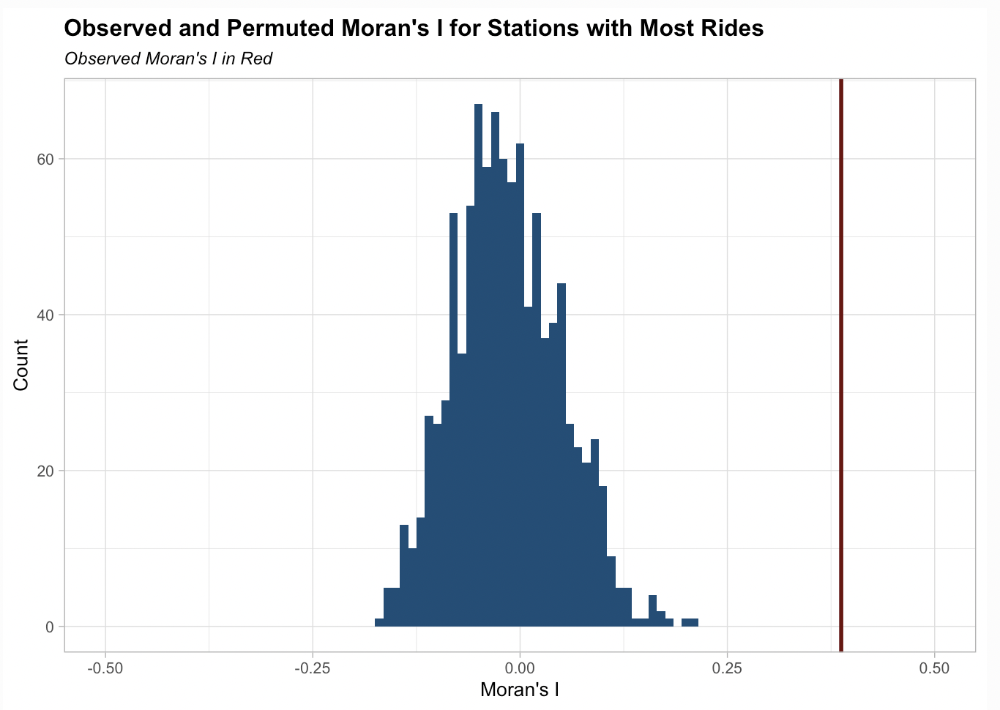
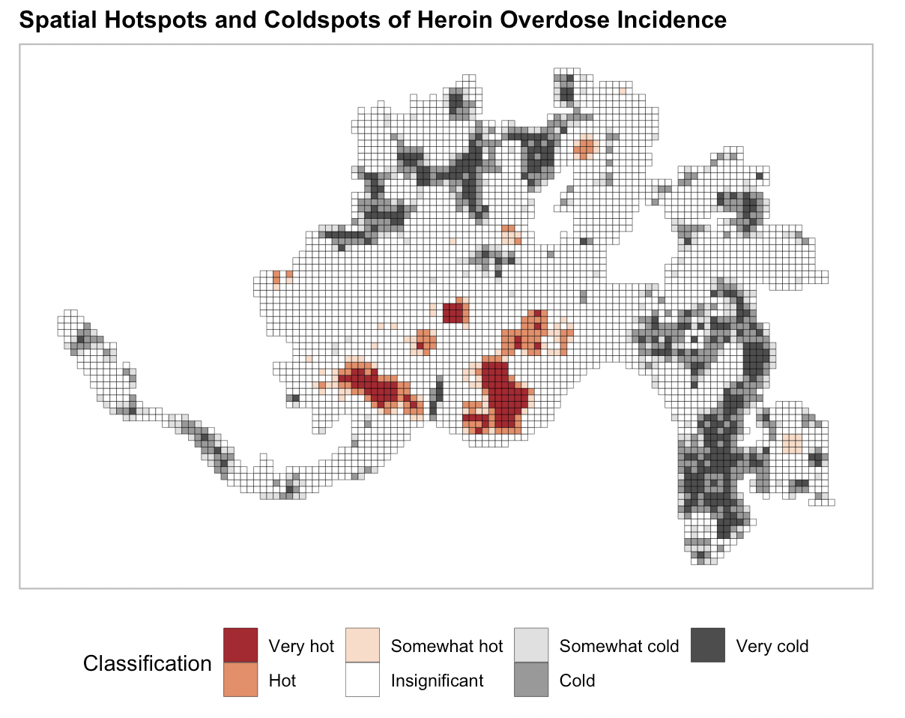

<!-- This is a comment to prevent the first line from being interpreted as a title -->

## [Transit Oriented Development in Boston](../musa-reports/01-Boston-TOD.html)

This project examines the effects of transit-oriented development (TOD) in Boston, focusing on how it shapes neighborhood demographics, social, and economic trends over time. By analyzing transit stop locations and comparing TOD with non-TOD areas, the report explores who lives near transit, whether residents pay a premium for proximity, and how planners can strategically develop transit-rich neighborhoods. The goal is to inform zoning and development strategies that support sustainable, transit-focused urban growth.

  

## [Philadelphia Home Price Prediction with Geospatial Machine Learning](../musa-reports/02-Philly-ML.html)

This project uses Ordinary Least Squares (OLS) regression to predict property values in Philadelphia by analyzing property characteristics and spatial data from sources like PHILA.GOV and OpenDataPhilly. The model tests for spatial autocorrelation and compares results with and without spatial features. While it captures much of the variation in home prices, the linear approach under-predicts values in lower-income, minority neighborhoods, revealing the limitations of OLS in accounting for the city's social and historical complexities. These inaccuracies underscore the need for more nuanced models to avoid reinforcing biases and inequities in housing market predictions.

  

## [Geospatial Risk Prediction of Robbery Incients in Chicago](../musa-reports/03-Chicago-Risks.html)

This project develops a geospatial risk model to predict robbery incidents in Chicago using Poisson regression, incorporating historical crime data, socioeconomic factors, and spatial attributes. The goal is to anticipate crime hotspots and improve law enforcement resource allocation. The model acknowledges the risk of selection bias and perpetuation of existing biases, such as over-policing in certain areas. As such, spatial factors and feature engineering techniques, such as calculating distances to risk factors and identifying spatial hotspots, are used to enhance accuracy. The report also  compares different models, including a spatially-aware Poisson regression, and evaluates their effectiveness through cross-validation.

  

## [Targeting Housing Subsidy with People-Based Machine Learning](../musa-reports/04-Housing-Subsidy.html)

This project develops a logistic regression model to predict whether homeowners in Emil City will take part in a home repair tax credit program. By analyzing homeowner behavior, the model helps the Department of Housing and Community Development (HCD) target eligible homeowners more efficiently, maximizing the program's financial benefits while minimizing outreach costs. The model uses data exploration, training, and testing, followed by cross-validation to assess its predictive performance. By optimizing thresholds for prediction accuracy, the model informs more strategic decision-making, enabling better resource allocation and policy implementation for enhancing home values and neighborhood revitalization efforts.

  

## [Predicting Summer Bikeshare Demand in Jersey City](../musa-reports/05-BikeShare-JerseyCity.html)

This project focuses on developing a demand prediction model for Citi Bike in Jersey City using Ordinary Least Squares (OLS) regression. By analyzing historical data on bike usage across various stations, time periods, and weather conditions, the model aims to forecast demand and address the challenge of rebalancing—ensuring an adequate supply of bikes at each station. The project involves feature engineering, exploratory analysis of temporal and spatial patterns, and the integration of weather data. This predictive approach helps improve the availability of bikes, optimizing user experience and supporting sustainable transportation.

  

## [Geosptial Risk Terrain Model for Better Rehabilitation Resource Allocation and Heroin-Overdose Prevention, a Case Study of Cincinnati, Ohio](../musa-reports/06-Cincinnati-Heroin-Overdose.html)

This project focuses on modeling opioid overdose risk in Cincinnati, Ohio, using multiple data sources such as emergency response records, crime reports, and neighborhood demographic information. The study employs geospatial clustering techniques, specifically Getis-Ord hotspot analysis, to identify high-risk areas for opioid overdose incidents between 2016 and 2020. Principal Components Analysis (PCA) is used to create measures of the built environment, which are incorporated into a logistic regression model to predict opioid hotspots. The technical aim is to build an accurate model that identifies key socioeconomic and environmental factors contributing to overdose risk, validated through random k-fold cross-validation and kernel density estimation.

  