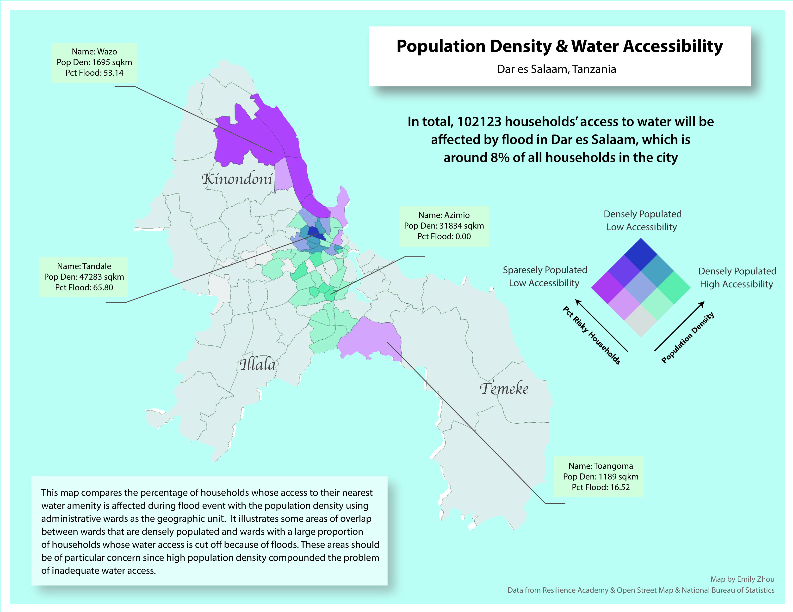
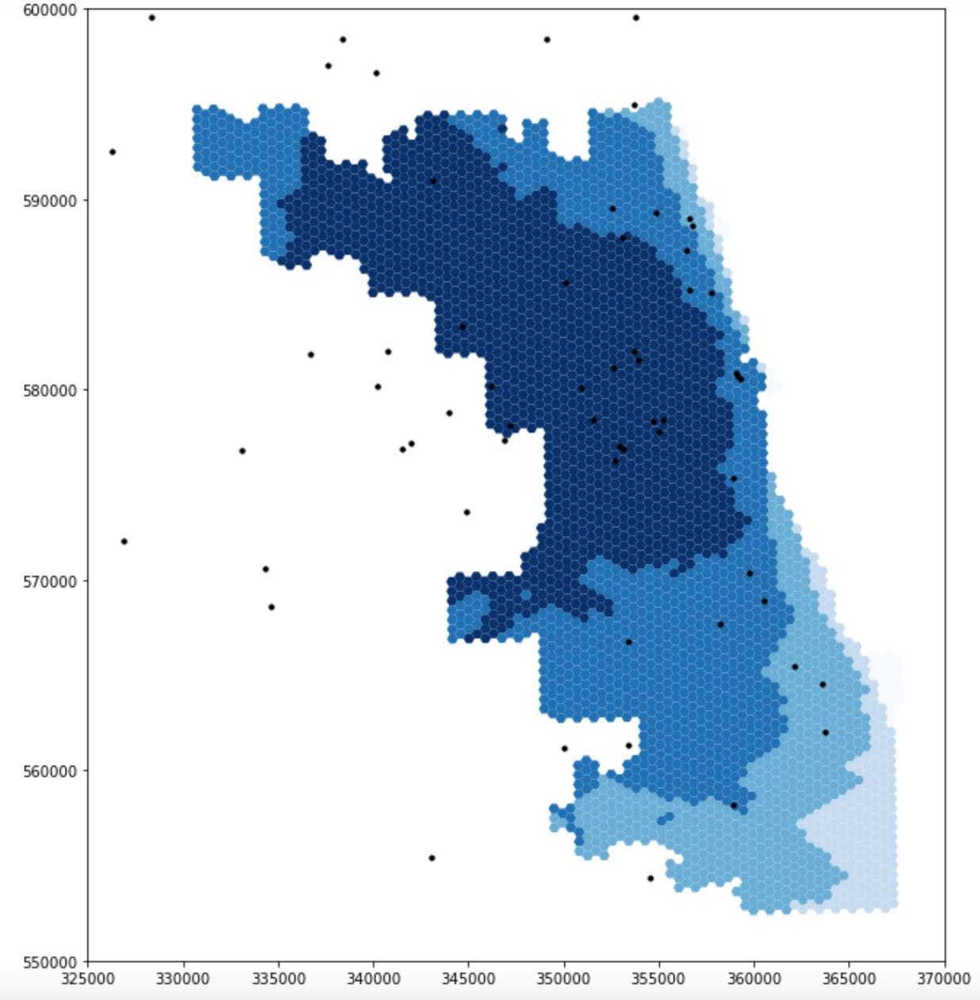
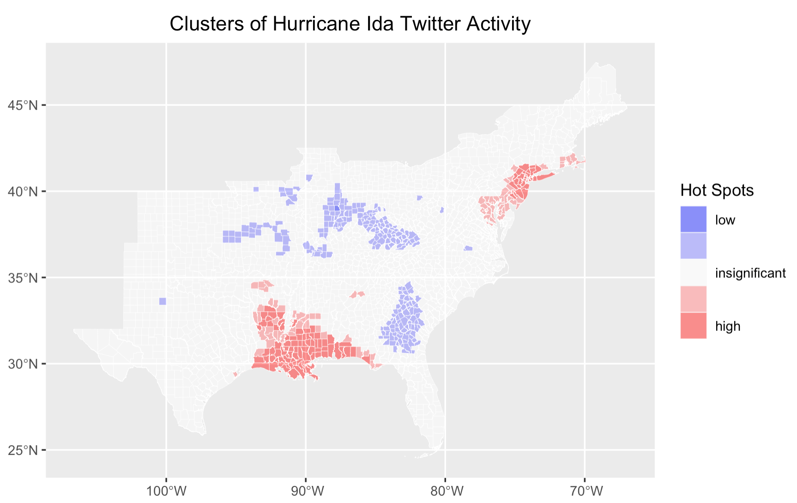

<!-- This is a comment to prevent the first line from being interpreted as a title -->
## [Spatial Estimation of Chronic Respiratory Disease With Geospatial Machine Learning - An Approach Using Earth-Engine-Based Remote Sensing Data and Air Quality Variables in the State of Pennsylvania](../musa-reports/PA-CRD-2024.html)

This project applies machine learning and remote sensing data to predict Chronic Respiratory Disease (CRD) hospitalizations in Pennsylvania, expanding on previous work by Alvarez-Mendoza et al. By integrating satellite imagery, air quality, and meteorological data across 5000x5000m grid cells, the analysis compares support vector regression, random forest regression, and multilayer perceptron models to identify key environmental predictors of CRD risk. The study improves on the original by incorporating spatial interpolation of air quality data, dividing Pennsylvania into uniform grid cells, and accounting for seasonal variations. The workflow emphasizes reproducibility with structured data processing and cross-validation techniques.

    

## [Water Amenity Access and Flood Hazard Vulnerability in Dar es Salaam, Tanzania](../dsm_analysis/dsm_report.md)

This project uses GIS to assess how flooding impacts water accessibility in Dar es Salaam, Tanzania. By analyzing spatial data on wards, water sources, flood extent, and residential buildings, the study identifies households whose access to water is compromised during floods. Using QGIS and PostgreSQL with PostGIS, the project maps service areas for water amenities and visualizes the spatial patterns of water insecurity at the ward level. The findings highlight the disproportionate impact of water access issues on vulnerable populations in informal settlements, supporting efforts to improve resource allocation and resilience planning in the city.

  

## [Reproduction of COVID-19 Healthcare Resources Spatial Accessibility in Chicago, Illinois](../RPr-Kang/re-analysis.md)

This project reproduces and refines Kang et al.'s (2020) study on Covid-19 healthcare accessibility in Illinois, using the enhanced two-step floating catchment area (E2SFCA) method. The original study identified spatial disparities in healthcare access, with a focus on Chicago. By sharing data and code openly via a Jupyter notebook, the study enabled reproducibility and further application to other regions. In this reproduction, the code was improved with clearer comments and more accurate catchment area calculations, emphasizing the technical importance of reproducibility. These efforts support better decision-making on healthcare resource allocation and demonstrate the value of transparent, replicable research in health geography.

  

## [Replication of Twitter Data Analysis for Natural Hazards](../RE-Ida/ida.md)

This project replicates and extends Wang et al.'s (2016) study on using Twitter data to analyze human responses to natural disasters, focusing on Hurricane Ida in 2021. By leveraging crowdsourced data from social media, the study performs spatial, temporal, and content analysis of tweets to assess public awareness and attitudes during the hurricane.Building on a previous replication of Wang’s work, the project introduces key modifications, including sentiment analysis and integration of demographic data to identify vulnerable populations. The entire workflow, compiled in R-Markdown and shared on GitHub, highlights the potential of volunteered geographic information (VGI) in disaster management and the challenges of interpreting social media data for understanding human behavior during hazard events.

    

## [Reproduction and Replication Analysis of Academic Information Patterns under COVID-19](../covidpattern/report.md)

This project reproduces and extends Homolak et al.'s analysis of COVID-19-related academic publications to assess the scientific community's response during the pandemic. The original study examined publication rates, author affiliations, and collaboration patterns using metadata from PubMed, Scopus, and BioRxiv, revealing early challenges with information velocity and collaboration. By replicating the study with updated article data and organizing the workflow into an R-Markdown document, this project verifies the original conclusions and assesses how academic information patterns have evolved over time. The reproducibility and open-access approach highlight the importance of collaboration and transparency in pandemic research.

    

