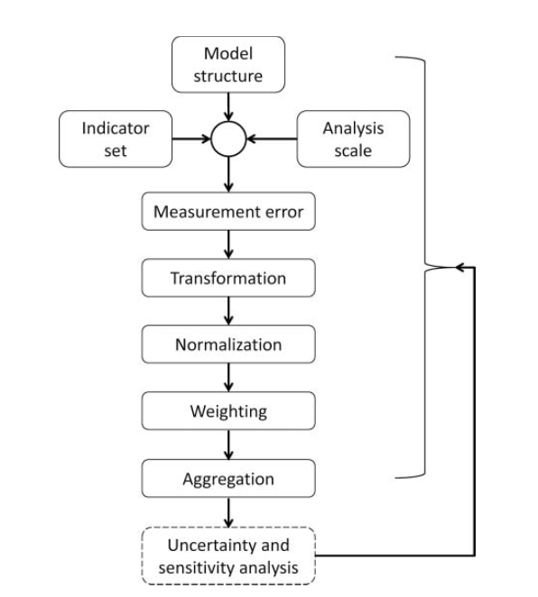
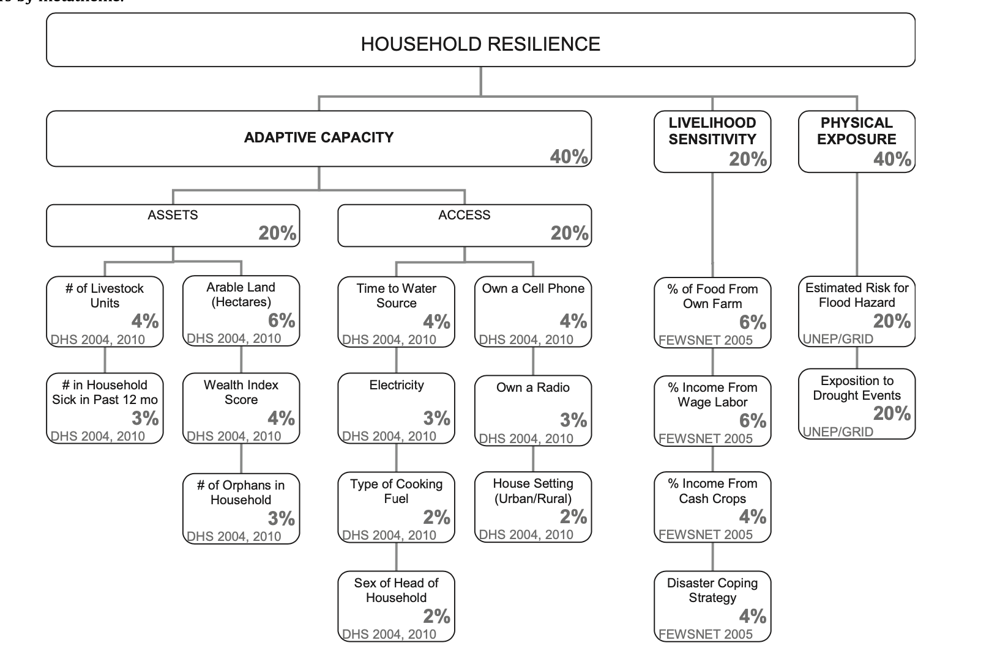

Uncertainty arises in the translation of real-world phenomenon into data for analysis and modeling. Recalling Longley et al (2008)’s conceptual view of uncertainty, in which he identifies three stages in academic research that would introduce new forms of uncertainty: **conception, measurement & representation, and analysis**. Each stage acts as a filter that distort the way in which complexity of the real word is conceived, measured, and represented. While Longley’s view concisely summarizes the accumulation of uncertainty, it omits the variations and possibilities of its emergence within each stage. The inherent complexity of our world makes it virtually impossible for uncertainty to arise following the same manner across different disciplines. Accordingly, to fully understand uncertainty requires us also to situate this concept specific to research methodology and practices. On top of that, given its ubiquity/inevitability and Longley’s mention of taking a positive approach to uncertainty, it is also important that we discuss how uncertainty itself could be analyzed, quantified, and evaluated as part of a research component. As such, this blog post builds on and enrich our previous discussions on errors and uncertainty by contextualizing it in “Vulnerability Modeling” research, using Malcomb et al (2014)’s study in Malawi as an example.

## Vulnerability Modeling and Uncertainty

Vulnerability modeling is a typical way of assessing the vulnerability levels of geographic areas with the aim of using those results for applied public policies on disaster risk management. A vulnerability index, which lies at the center of vulnerability modeling, captures a variety of factors, ranging from **adaptive capacity, sensitivity, to physical exposure**, based on their degree of impact on a region’s vulnerability. The modeling process, along with indices selection, however, has been criticized as an oversimplification and misrepresentation of reality. In the article “Uncertainty Analysis for a Social Vulnerability Index”, Tate (2013) details the sources of uncertainty following his articulation of the 9-step processes involved in vulnerability index construction (outlined below):

To elaborate on some important aspects of Tate’s framework, within the first phase, the **model structure** stage refers to researcher’s decision on whether to follow a *deductive, hierarchical, or inductive* design. The **indicator set** stage is where researchers would choose the indicators relevant to their model. This includes *deductive methods based on theory, normative methods based on value/judgments, indicative methods based on data characteristics, and practical methods that consider accessibility and affordability during indicator selection*. The **analysis scale** stage refers to the geographic unit of analysis. At the second phase, **measurements error** of input data or parameters is a potential source of uncertainty, and such error would propagate as one proceed through constructing their vulnerability index. Some good examples of this would be “census undercounts” or “missing values” that are prevalent in many data sets.

Proceed to **data transformation** phase, researchers need to decide how to modify their data into forms suitable for analysis. Questions to be considered at this phase, such as whether vulnerability should be represented with total or percentages, count or rate, are critical to the outcome of vulnerability modeling. **Data normalization** and **weighting** follow data transformation: in the former phase, researchers align all variables onto a common scale using *linear scaling or z-score standardization*, and in the latter, they assign a weight respective to the importance of each indicator using the *normative, deductive, inductive, equal weights* approach. Eventually, the **aggregation** phase would combine all normalized and weighted indicators into a single index, either through summation or multiplication (consider interactions between indicators).

## Malcomb et al's Approach

Under Tate’s framework, vulnerability index construction is contingent upon various decisions made at each phase, in which uncertainties could accumulate for each decision being made. In Malcomb et al ’s study, they used a *hierarchical model* structure to combine variables for modeling. The indicator set used for this hierarchy were mainly constructed through a combination of *deductive, normative, and practical* approach, since Malcomb et al have cited relevant literatures, consulted with residents and experts, and considered the accessibility of data throughout the study. The data collected were *normalized using 0-5, weighted via normative approach (expert opinions)*, and rasterized to be fitted into a synchronous layer. The final outputs were then aggregated to *Traditional Authorities (TA) level*, the scale of this analysis, using an *additive* approach.

Uncertainties would arise even before Malcomb et al start their analysis. For example, while it is common practice for researchers to follow a normative approach and seek for experts’ opinions, such knowledge obtained is subjective, especially when we do not know what questions researchers had asked and how they would interpret the answers provided by those experts. The data collected for this analysis further introduce uncertainty. The DHS household data only provides an estimated location of household, where each house is roughly represented if within 5km of a GPS point. Since data is aggregated to the level of TA, we could not ensure that all households being counted by this GPS point fall within certain TA. In addition, some of the survey questions appear problematic: indicators under livelihood sensitivity category ask local residents on their income from wage labor, but many of these people are unable to provide an accurate answer given that their source of income is diversified. On top of that, these indicators under livelihood sensitivity only focused on the poor households while the results of this analysis were intended for all households in Malawi. Moreover, the data chosen to represent drought exposure represents an estimation of population exposed to drought; rather than simply region’s exposition in drought in raster grids, which could overestimate/underestimate drought risk because of the influence of local population. As such, these all exemplifies how decisions made on analysis scale and data collection would already distort phenomena in the real world.

*Vulnerbility Index in Malcomb et al's research*

Uncertainties continue to propagate as Malcomb et al started to analyze the data. Decisions made at this stage, such has whether an indicator should be transformed to binary or categorical, qualitative or quantitative, would affect how they should be normalized. For example, Malcomb et al has chosen to represent cell phone and radio ownership as a binary variable, whereas it would be more practical to represent them as percentages who own a radio/cell phone, a quantitative variable. Besides these two indicators, there are several other binary indicators. To construct the vulnerability index, it is inevitable that Malcomb et al develop ways to normalize them on a scale of 0-5, which they did not explicitly allude to in their research paper, leaving us readers uncertain about their methodology. Likewise, the “disaster coping strategy” is a qualitative variable that also requires researchers to decide upon the normalization strategy. Into the weighting phase, since the authors adopted a normative approach to select weights and did not openly specify the logics behind their selection, it is difficult to assess the credibility and validity of those weights. Towards the end, Malcomb et al ’s decision on choosing additive aggregation to combine indicators means that they left each variable to stand on their own, ignoring interactions between them. Doing so would subject the model to such risk where the effect of a high-value indicator masking low value indicators.

*More about our approach to reproduce Malcomb's research (data + code) could be found [here](https://github.com/emilyzhou112/RPr-Malcomb-2014)*.

## Dealing with Uncertainty

Going back to Tate’s framework of uncertainty accumulation, many uncertainties inherent in Malcomb et al ’s study are epistemic, which stem from an incomplete or imprecise understanding of parameters or a misrepresentation of processes. Uncertainty arises from both the error in measurement of input data as well as the transformation of data into variables. Although methods in calculating indicators were somewhat defined by Malcomb et al in their paper, we have little knowledge on how data are brought in, what are the protocols of cleaning and pre-processing the data, how these indexes are developed, how different variables are normalized and interpreted, which could have a significant impact on the output of the study. This indicates that in addition to the number of shortcomings we have spotted, there could be much more underlying ones that would further lead to uncertainties. To reproduce the research would certainly address those uncertainties as whoever is reproducing this research needs to answer those questions unanswered by Malcomb et al. for their result to closely resemble that of the original research. However, subjectivity and bias still get introduced in this process.

Therefore, there are numerous ways in which a vulnerability model construction could entail uncertainty. Indeed, the shortcomings of Malcomb et al.’s research manifest possible sources uncertainty prevalent in all other vulnerability research and provide implications for dealing with uncertainty in academic research in general. Researchers ought to be cautious and aware of potential sources of uncertainty and develop strategies to minimize them. As Longley have asserted:  “Uncertainties are inevitable; we need to take a positive approach towards them.”

===

*Longley, P. A., M. F. Goodchild, D. J. Maguire, and D. W. Rhind. 2008. Geographical information systems and science 2nd ed. Chichester: Wiley. (only chapter 6: Uncertainty, pages 127-153)*

*Tate, E. 2013. Uncertainty Analysis for a Social Vulnerability Index. Annals of the Association of American Geographers 103 (3):526–543. [DOI:10.1080/00045608.2012.700616.](https://www.tandfonline.com/doi/full/10.1080/00045608.2012.700616)*

*Malcomb, D. W., E. A. Weaver, and A. R. Krakowka. 2014. Vulnerability modeling for sub-Saharan Africa: An operationalized approach in Malawi. Applied Geography 48:17–30. [DOI:10.1016/j.apgeog.2014.01.004](https://www.sciencedirect.com/science/article/abs/pii/S0143622814000058?via%3Dihub)*

===

*Chun'an, Zhejiang, China (06/03/21)*

> Life is a research full of uncertainty, but it's the uncertainty that opens up new possibilities ^
